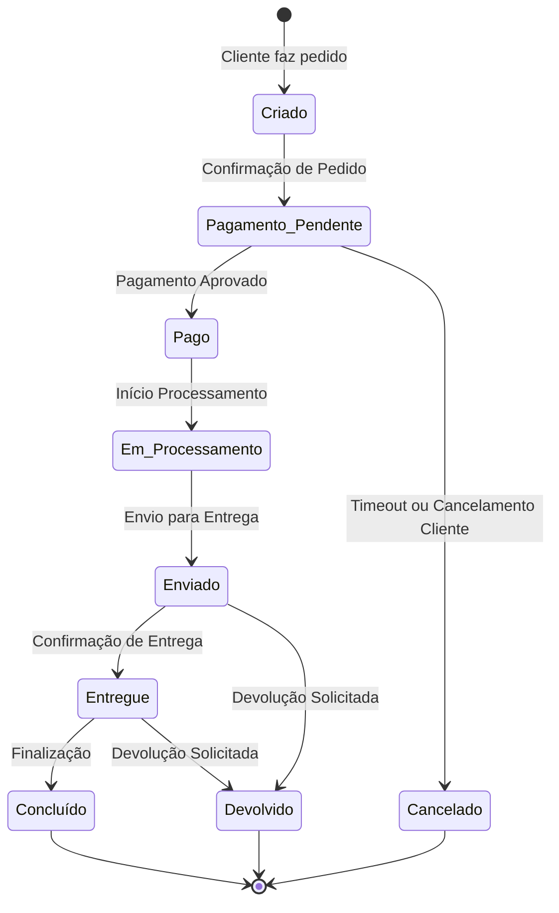
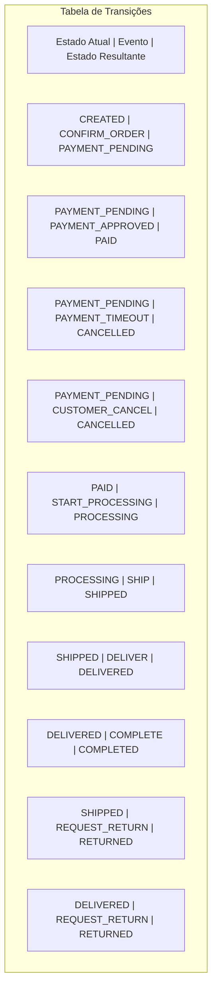

# Exemplo 1: Máquina de Estado Finito Básica

Uma Máquina de Estado Finito (FSM) é o modelo mais básico de máquina de estado, consistindo em um conjunto finito de estados, eventos, e transições. Este exemplo explora como implementar uma FSM básica para modelar o ciclo de vida de um pedido em um sistema de e-commerce.

## Definição do Problema

Um pedido em um sistema de e-commerce passa por vários estados desde sua criação até a conclusão:



## Modelagem da Máquina de Estado

### 1. Estados

```java
public enum OrderState {
    CREATED,
    PAYMENT_PENDING,
    PAID,
    PROCESSING,
    SHIPPED,
    DELIVERED,
    COMPLETED,
    CANCELLED,
    RETURNED
}
```

### 2. Eventos

```java
public enum OrderEvent {
    CONFIRM_ORDER,
    PAYMENT_APPROVED,
    PAYMENT_TIMEOUT,
    CUSTOMER_CANCEL,
    START_PROCESSING,
    SHIP,
    DELIVER,
    COMPLETE,
    REQUEST_RETURN
}
```

### 3. Transições



## Implementação em Java

### Implementação Básica com Enums e Switch-Case

```java
public class Order {
    private Long id;
    private OrderState currentState;
    private Customer customer;
    private List<OrderItem> items;
    private BigDecimal total;
    private LocalDateTime createdAt;
    private LocalDateTime lastUpdatedAt;

    public Order(Customer customer, List<OrderItem> items) {
        this.id = generateOrderId();
        this.currentState = OrderState.CREATED;
        this.customer = customer;
        this.items = items;
        this.total = calculateTotal(items);
        this.createdAt = LocalDateTime.now();
        this.lastUpdatedAt = this.createdAt;
    }

    public boolean processEvent(OrderEvent event) {
        OrderState nextState = getNextState(currentState, event);
        
        if (nextState == null) {
            // Transição inválida
            return false;
        }
        
        // Validar se a transição é permitida com base em regras de negócio
        if (!validateTransition(currentState, nextState, event)) {
            return false;
        }
        
        // Executar ações associadas à transição
        executeActions(currentState, nextState, event);
        
        // Atualizar estado
        OrderState oldState = currentState;
        currentState = nextState;
        lastUpdatedAt = LocalDateTime.now();
        
        // Registrar mudança de estado
        logStateChange(oldState, currentState, event);
        
        return true;
    }
    
    private OrderState getNextState(OrderState currentState, OrderEvent event) {
        switch (currentState) {
            case CREATED:
                if (event == OrderEvent.CONFIRM_ORDER) return OrderState.PAYMENT_PENDING;
                break;
                
            case PAYMENT_PENDING:
                if (event == OrderEvent.PAYMENT_APPROVED) return OrderState.PAID;
                if (event == OrderEvent.PAYMENT_TIMEOUT || event == OrderEvent.CUSTOMER_CANCEL) 
                    return OrderState.CANCELLED;
                break;
                
            case PAID:
                if (event == OrderEvent.START_PROCESSING) return OrderState.PROCESSING;
                break;
                
            case PROCESSING:
                if (event == OrderEvent.SHIP) return OrderState.SHIPPED;
                break;
                
            case SHIPPED:
                if (event == OrderEvent.DELIVER) return OrderState.DELIVERED;
                if (event == OrderEvent.REQUEST_RETURN) return OrderState.RETURNED;
                break;
                
            case DELIVERED:
                if (event == OrderEvent.COMPLETE) return OrderState.COMPLETED;
                if (event == OrderEvent.REQUEST_RETURN) return OrderState.RETURNED;
                break;
                
            default:
                // Estados terminais não têm transições
                break;
        }
        
        return null; // Transição não definida
    }
    
    private boolean validateTransition(OrderState current, OrderState next, OrderEvent event) {
        // Validações específicas de negócio
        switch (event) {
            case PAYMENT_APPROVED:
                // Verificar se o pagamento é válido
                return validatePayment();
                
            case SHIP:
                // Verificar se todos os itens estão disponíveis
                return validateInventory();
                
            case REQUEST_RETURN:
                // Verificar se está dentro do prazo de devolução
                return isWithinReturnPeriod();
                
            default:
                return true; // Outras transições não precisam de validação especial
        }
    }
    
    private void executeActions(OrderState current, OrderState next, OrderEvent event) {
        // Executar ações necessárias para a transição
        switch (event) {
            case CONFIRM_ORDER:
                sendOrderConfirmationEmail();
                break;
                
            case PAYMENT_APPROVED:
                generateInvoice();
                sendPaymentConfirmationEmail();
                break;
                
            case SHIP:
                generateShippingLabel();
                updateInventory();
                sendShippingNotification();
                break;
                
            case DELIVER:
                registerDeliveryCompletion();
                sendDeliveryConfirmationEmail();
                break;
                
            // ... outras ações
        }
    }
    
    // ... implementações dos métodos de validação e ação
    
    private void logStateChange(OrderState oldState, OrderState newState, OrderEvent event) {
        System.out.printf("Order %d: %s -> %s (Event: %s) at %s%n", 
                id, oldState, newState, event, lastUpdatedAt);
    }

    // Getters and setters...
}
```

## Implementação com State Pattern

O Pattern State é uma abordagem orientada a objetos para implementar máquinas de estado que encapsula comportamentos específicos de cada estado em classes separadas.

```java
// Interface para todos os estados
public interface OrderStateHandler {
    boolean handleEvent(Order order, OrderEvent event);
    Set<OrderEvent> getAllowedEvents();
}

// Implementação para o estado CREATED
public class CreatedState implements OrderStateHandler {
    @Override
    public boolean handleEvent(Order order, OrderEvent event) {
        if (event == OrderEvent.CONFIRM_ORDER) {
            // Executar ações específicas
            order.sendOrderConfirmationEmail();
            
            // Mudar para o próximo estado
            order.setCurrentState(OrderState.PAYMENT_PENDING);
            order.setStateHandler(new PaymentPendingState());
            
            return true;
        }
        return false; // Evento não aplicável neste estado
    }
    
    @Override
    public Set<OrderEvent> getAllowedEvents() {
        return Collections.singleton(OrderEvent.CONFIRM_ORDER);
    }
}

// Implementações similares para outros estados...

// Classe Order atualizada
public class Order {
    private OrderState currentState;
    private OrderStateHandler stateHandler;
    
    // Outros campos e construtor...
    
    public Order(Customer customer, List<OrderItem> items) {
        // Inicialização...
        this.currentState = OrderState.CREATED;
        this.stateHandler = new CreatedState();
    }
    
    public boolean processEvent(OrderEvent event) {
        OrderState oldState = currentState;
        boolean success = stateHandler.handleEvent(this, event);
        
        if (success) {
            logStateChange(oldState, currentState, event);
        }
        
        return success;
    }
    
    public Set<OrderEvent> getAllowedEvents() {
        return stateHandler.getAllowedEvents();
    }
    
    // Métodos auxiliares acessíveis para os handlers...
    // Getters e setters...
}
```

## Implementação com Framework de Máquina de Estado

Utilizando o Spring Statemachine para implementar a mesma lógica:

```java
@Configuration
@EnableStateMachine
public class OrderStateMachineConfig extends StateMachineConfigurerAdapter<OrderState, OrderEvent> {

    @Override
    public void configure(StateMachineStateConfigurer<OrderState, OrderEvent> states) throws Exception {
        states
            .withStates()
                .initial(OrderState.CREATED)
                .state(OrderState.PAYMENT_PENDING)
                .state(OrderState.PAID)
                .state(OrderState.PROCESSING)
                .state(OrderState.SHIPPED)
                .state(OrderState.DELIVERED)
                .end(OrderState.COMPLETED)
                .end(OrderState.CANCELLED)
                .end(OrderState.RETURNED);
    }

    @Override
    public void configure(StateMachineTransitionConfigurer<OrderState, OrderEvent> transitions) throws Exception {
        transitions
            .withExternal()
                .source(OrderState.CREATED)
                .target(OrderState.PAYMENT_PENDING)
                .event(OrderEvent.CONFIRM_ORDER)
                .action(confirmOrderAction())
                .and()
            .withExternal()
                .source(OrderState.PAYMENT_PENDING)
                .target(OrderState.PAID)
                .event(OrderEvent.PAYMENT_APPROVED)
                .action(paymentApprovedAction())
                .and()
            .withExternal()
                .source(OrderState.PAYMENT_PENDING)
                .target(OrderState.CANCELLED)
                .event(OrderEvent.PAYMENT_TIMEOUT)
                .action(paymentTimeoutAction())
                .and()
            // ... outras transições
    }
    
    @Bean
    public Action<OrderState, OrderEvent> confirmOrderAction() {
        return context -> {
            Order order = (Order) context.getExtendedState().getVariables().get("order");
            order.sendOrderConfirmationEmail();
        };
    }
    
    // Outros beans de ação...
}

// Serviço para usar a máquina de estado
@Service
public class OrderService {
    
    private final StateMachine<OrderState, OrderEvent> stateMachine;
    
    @Autowired
    public OrderService(StateMachineFactory<OrderState, OrderEvent> stateMachineFactory) {
        this.stateMachine = stateMachineFactory.getStateMachine();
    }
    
    public boolean processOrderEvent(Order order, OrderEvent event) {
        stateMachine.getExtendedState().getVariables().put("order", order);
        stateMachine.stop();
        stateMachine.getStateMachineAccessor().doWithAllRegions(accessor -> {
            accessor.resetStateMachine(new DefaultStateMachineContext<>(
                order.getCurrentState(), null, null, null));
        });
        stateMachine.start();
        return stateMachine.sendEvent(event);
    }
}
```

## Persistência de Estado

Em sistemas reais, é crucial persistir o estado da máquina:

```java
@Entity
@Table(name = "orders")
public class OrderEntity {
    @Id
    @GeneratedValue(strategy = GenerationType.IDENTITY)
    private Long id;
    
    @Enumerated(EnumType.STRING)
    private OrderState currentState;
    
    // Outros campos e relações
    
    @OneToMany(mappedBy = "order", cascade = CascadeType.ALL)
    private List<OrderStateTransition> stateTransitions = new ArrayList<>();
    
    // Métodos de negócio, getters, setters...
}

@Entity
@Table(name = "order_state_transitions")
public class OrderStateTransition {
    @Id
    @GeneratedValue(strategy = GenerationType.IDENTITY)
    private Long id;
    
    @ManyToOne
    @JoinColumn(name = "order_id")
    private OrderEntity order;
    
    @Enumerated(EnumType.STRING)
    private OrderState fromState;
    
    @Enumerated(EnumType.STRING)
    private OrderState toState;
    
    @Enumerated(EnumType.STRING)
    private OrderEvent event;
    
    private LocalDateTime transitionTime;
    
    // Getters, setters...
}
```

## Benefícios da Abordagem FSM

1. **Clareza**: O comportamento do sistema é explicitamente documentado
2. **Previsibilidade**: Todas as transições possíveis são definidas
3. **Verificabilidade**: Fácil de validar se o sistema está se comportando conforme esperado
4. **Auditoria**: Histórico completo de mudanças de estado
5. **Flexibilidade**: Fácil adicionar novos estados ou transições

## Considerações Adicionais

1. **Granularidade**: Escolha o nível adequado de detalhe para os estados
2. **Ações vs. Estados**: Evite modelar ações como estados
3. **Idempotência**: Garanta que processar o mesmo evento múltiplas vezes seja seguro
4. **Timeout e Evento Temporais**: Considere como lidar com eventos baseados em tempo
5. **Tratamento de Erros**: Defina comportamento para eventos inesperados ou falhas

## Conclusão

Máquinas de Estado Finito oferecem uma maneira clara e estruturada de modelar comportamentos complexos. No exemplo de ciclo de vida de pedidos, vimos como essa abordagem permite separar claramente a lógica de transição de estado das regras de negócio específicas, resultando em um código mais manutenível, testável e robusto.
