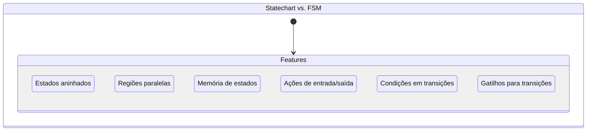
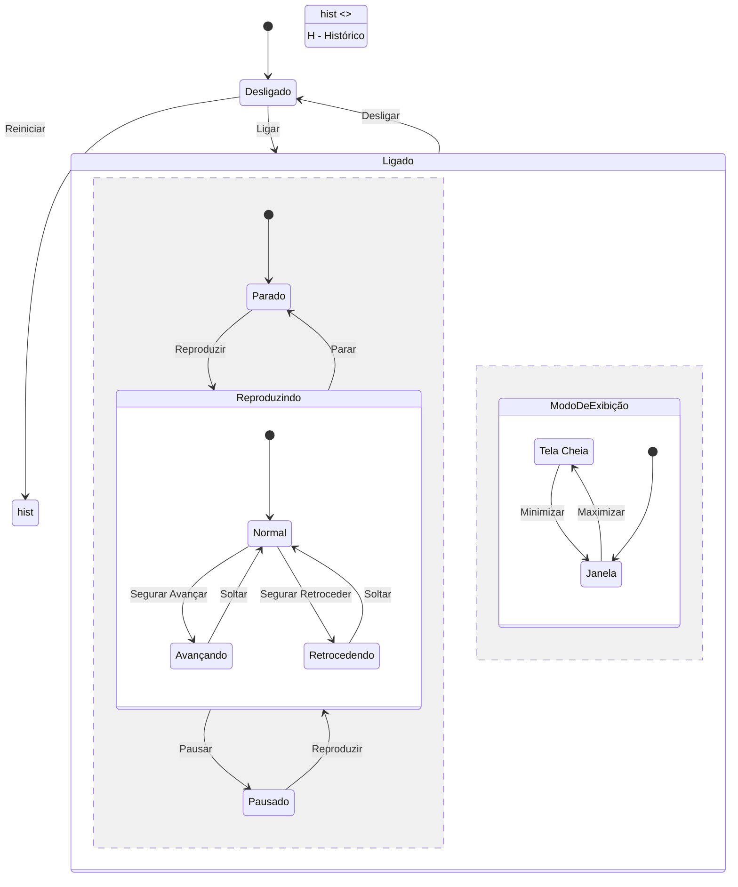
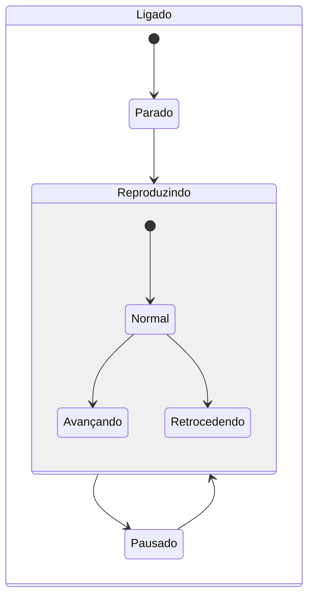
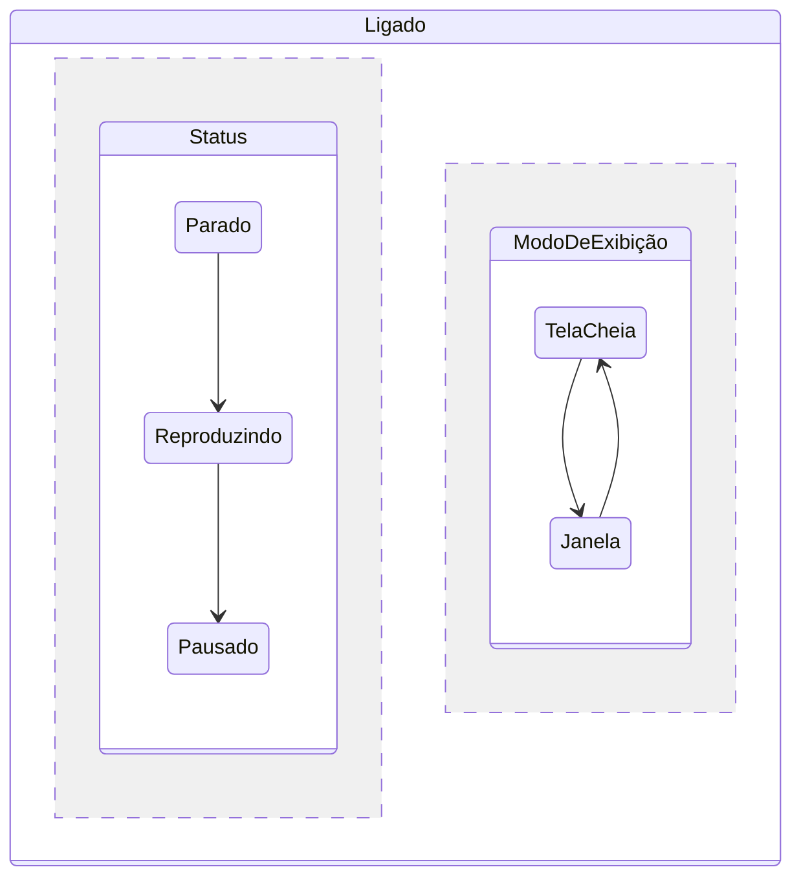
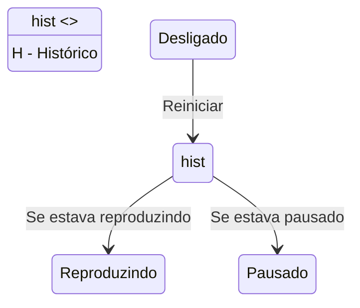
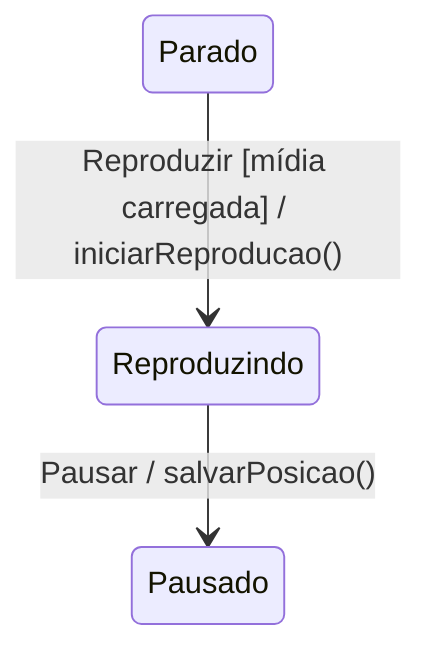
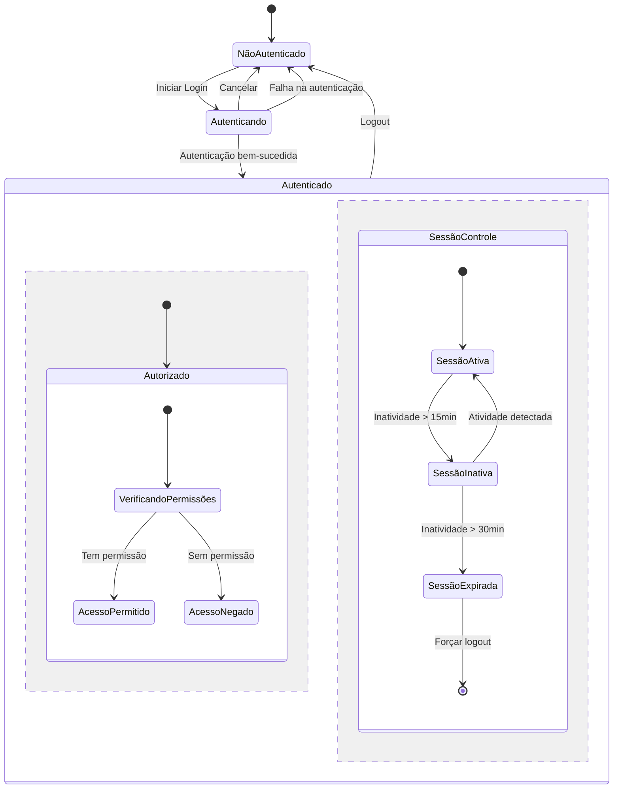
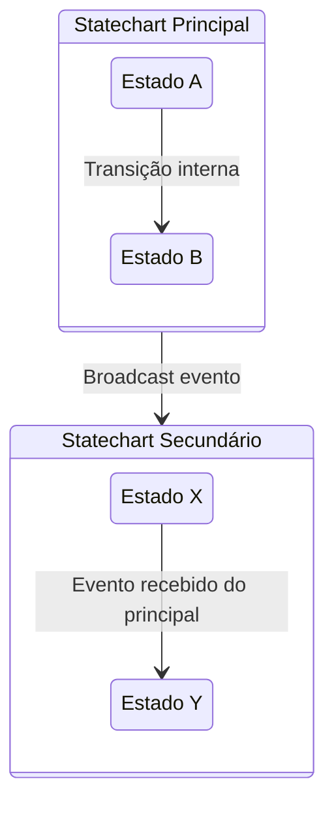

# Exemplo 2: Statecharts em UML

Os Statecharts (Diagramas de Estados) são uma extensão poderosa das Máquinas de Estado Finito tradicionais, introduzindo conceitos como hierarquia (estados aninhados), concorrência (estados paralelos) e comunicação. Definidos por David Harel em 1987 e posteriormente incorporados à UML, os statecharts permitem modelar sistemas complexos de forma mais concisa e compreensível.

## Conceitos Fundamentais de Statecharts



## Caso de Estudo: Sistema de Reprodução de Mídia

Vamos modelar um sistema de reprodução de mídia (player) usando statecharts. Este exemplo demonstra como modelar comportamentos complexos de forma elegante.

### Diagrama UML Completo



## Componentes Principais dos Statecharts

### 1. Estados Hierárquicos (Aninhados)

A hierarquia de estados permite agrupar estados relacionados, criando níveis de abstração e evitando duplicação.



### 2. Estados Ortogonais (Regiões Paralelas)

Permitem que um sistema esteja em múltiplos estados simultaneamente, cada um em uma região separada.



### 3. Pseudo-estados e História



### 4. Eventos, Guardas e Ações



## Implementação de Statecharts

### Representação em XML (SCXML - State Chart XML)

```xml
<scxml xmlns="http://www.w3.org/2005/07/scxml" version="1.0" initial="Desligado">
  <state id="Desligado">
    <transition event="Ligar" target="Ligado"/>
  </state>
  
  <state id="Ligado">
    <initial>
      <transition target="Parado"/>
    </initial>
    
    <state id="Parado">
      <transition event="Reproduzir" target="Reproduzindo">
        <guard cond="midia.carregada"/>
        <onentry>
          <script>iniciarReproducao();</script>
        </onentry>
      </transition>
    </state>
    
    <state id="Reproduzindo">
      <initial>
        <transition target="Normal"/>
      </initial>
      
      <transition event="Pausar" target="Pausado">
        <onentry>
          <script>salvarPosicao();</script>
        </onentry>
      </transition>
      
      <transition event="Parar" target="Parado"/>
      
      <state id="Normal">
        <transition event="SegurarAvancar" target="Avancando"/>
        <transition event="SegurarRetroceder" target="Retrocedendo"/>
      </state>
      
      <state id="Avancando">
        <transition event="Soltar" target="Normal"/>
      </state>
      
      <state id="Retrocedendo">
        <transition event="Soltar" target="Normal"/>
      </state>
    </state>
    
    <state id="Pausado">
      <transition event="Reproduzir" target="Reproduzindo"/>
    </state>
    
    <parallel id="ModosParalelos">
      <state id="ModoDeExibicao">
        <initial>
          <transition target="Janela"/>
        </initial>
        
        <state id="TelaCheia">
          <transition event="Minimizar" target="Janela"/>
        </state>
        
        <state id="Janela">
          <transition event="Maximizar" target="TelaCheia"/>
        </state>
      </state>
    </parallel>
    
    <transition event="Desligar" target="Desligado"/>
  </state>
  
  <history id="Historico" type="deep">
    <transition event="Reiniciar" target="Ligado"/>
  </history>
</scxml>
```

### Implementação com Biblioteca XState (JavaScript)

```javascript
import { createMachine, interpret } from 'xstate';

const playerMachine = createMachine({
  id: 'player',
  initial: 'desligado',
  states: {
    desligado: {
      on: { LIGAR: 'ligado' }
    },
    ligado: {
      type: 'compound',
      initial: 'parado',
      states: {
        parado: {
          on: { 
            REPRODUZIR: {
              target: 'reproduzindo',
              cond: (context) => context.midiaCarregada,
              actions: 'iniciarReproducao'
            }
          }
        },
        reproduzindo: {
          initial: 'normal',
          states: {
            normal: {
              on: {
                SEGURAR_AVANCAR: 'avancando',
                SEGURAR_RETROCEDER: 'retrocedendo'
              }
            },
            avancando: {
              on: { SOLTAR: 'normal' }
            },
            retrocedendo: {
              on: { SOLTAR: 'normal' }
            },
            history: {
              type: 'history',
              history: 'deep'
            }
          },
          on: {
            PAUSAR: {
              target: 'pausado',
              actions: 'salvarPosicao'
            },
            PARAR: 'parado'
          }
        },
        pausado: {
          on: { REPRODUZIR: 'reproduzindo' }
        },
        modoHistorico: {
          type: 'history',
          history: 'deep'
        }
      },
      type: 'parallel',
      regions: {
        modoExibicao: {
          initial: 'janela',
          states: {
            telaCheia: {
              on: { MINIMIZAR: 'janela' }
            },
            janela: {
              on: { MAXIMIZAR: 'telaCheia' }
            }
          }
        }
      },
      on: { DESLIGAR: 'desligado' }
    }
  },
  on: {
    REINICIAR: '.ligado.modoHistorico'
  }
});

// Implementação do serviço
const playerService = interpret(playerMachine)
  .onTransition(state => console.log('Estado atual:', state.value))
  .start();

// Envio de eventos
playerService.send('LIGAR');
playerService.send('REPRODUZIR');
playerService.send('PAUSAR');
```

### Implementação Usando a Biblioteca StatechartJS em Java

```java
import statechartjs.StateMachine;
import statechartjs.parser.SCXMLParser;

public class MediaPlayerStatechart {
    private StateMachine stateMachine;
    private MediaPlayer mediaPlayer;
    
    public MediaPlayerStatechart(MediaPlayer mediaPlayer) {
        this.mediaPlayer = mediaPlayer;
        
        // Carregar SCXML de arquivo ou recurso
        SCXMLParser parser = new SCXMLParser();
        this.stateMachine = parser.parse("media_player.scxml");
        
        // Configurar manipuladores de ação
        setupActionHandlers();
        
        // Iniciar a máquina de estado
        this.stateMachine.start();
    }
    
    private void setupActionHandlers() {
        // Registrar ações que serão executadas na transição de estados
        stateMachine.registerActionHandler("iniciarReproducao", event -> {
            mediaPlayer.play();
        });
        
        stateMachine.registerActionHandler("salvarPosicao", event -> {
            mediaPlayer.savePosition();
        });
        
        // Registrar guardas (condições)
        stateMachine.registerGuard("midia.carregada", () -> mediaPlayer.isMediaLoaded());
    }
    
    public void handleEvent(String eventName) {
        stateMachine.processEvent(eventName);
    }
    
    public String getCurrentState() {
        return stateMachine.getCurrentState().getId();
    }
}
```

## Modelando Sistemas Complexos com Statecharts

### Exemplo: Sistema de Controle de Acesso



### Comunicação Entre Statecharts

Em sistemas complexos, statecharts podem se comunicar através de eventos:



## Benefícios dos Statecharts em UML

1. **Redução de Complexidade**: Estados aninhados reduzem significativamente o número de transições explícitas
2. **Visualização Clara**: A representação hierárquica facilita a compreensão
3. **Paralelismo**: Modelagem natural de comportamentos simultâneos 
4. **Comportamento Previsível**: Transições explicitamente definidas e verificáveis
5. **Manutenibilidade**: Facilidade para modificar comportamentos sem afetar todo o sistema

## Comparação: FSM vs. Statechart

| Característica | FSM Tradicional | Statechart |
|----------------|----------------|------------|
| Estados Aninhados | Não | Sim |
| Estados Paralelos | Não | Sim |
| Memória de Estado | Não | Sim (História) |
| Ações em Entrada/Saída | Limitado | Completo |
| Guardas em Transições | Limitado | Completo |
| Escala para sistemas complexos | Difícil | Boa |
| Facilidade de manutenção | Baixa para sistemas grandes | Alta |

## Ferramentas e Notações

### Ferramentas de Modelagem

1. **Enterprise Architect**: Ferramenta de modelagem UML completa
2. **Visual Paradigm**: Suporte a diagramas de estado UML
3. **MagicDraw**: Ferramenta abrangente de modelagem UML
4. **Yakindu Statechart Tools**: IDE dedicada para statecharts
5. **StatelyAI**: Ferramenta de modelagem visual online

### Frameworks de Implementação

1. **XState (JavaScript)**: Biblioteca para máquinas de estado e statecharts
2. **Spring Statemachine (Java)**: Implementação para o ecossistema Spring
3. **SCION (JavaScript)**: Interpretador de SCXML
4. **Boost MSM (C++)**: Biblioteca para máquina de estado meta
5. **Sismic (Python)**: Biblioteca de interpretação e execução de statecharts

## Melhores Práticas

1. **Use Hierarquia Adequadamente**: Crie subestados quando houver comportamentos relacionados
2. **Evite Excesso de Estados**: Prefira guardas e variáveis a criar muitos estados distintos
3. **Mantenha Ações Simples**: As ações nas transições devem ser concisas e focadas
4. **Documente Guardas**: Torne explícitas as condições para transições
5. **Use Estados Ortogonais** quando aspectos do sistema são independentes
6. **Teste Todas as Transições**: Certifique-se de que todas as transições são testáveis
7. **Atenção aos Estados Terminais**: Verifique se todos os fluxos podem terminar adequadamente
8. **Considere Persistência**: Em sistemas de longa duração, projete pensando na persistência de estado

## Conclusão

Os Statecharts em UML oferecem uma poderosa ferramenta para modelar sistemas complexos, permitindo abstração e visualização clara de estados e transições. Através da hierarquia, paralelismo e outros recursos avançados, os statecharts superam muitas limitações das máquinas de estado tradicionais. Para desenvolvedores de software, dominar this técnica de modelagem facilita a criação de sistemas mais robustos, manuteníveis e verificáveis.
