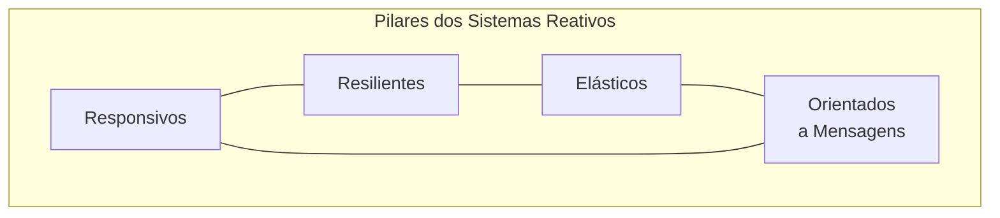
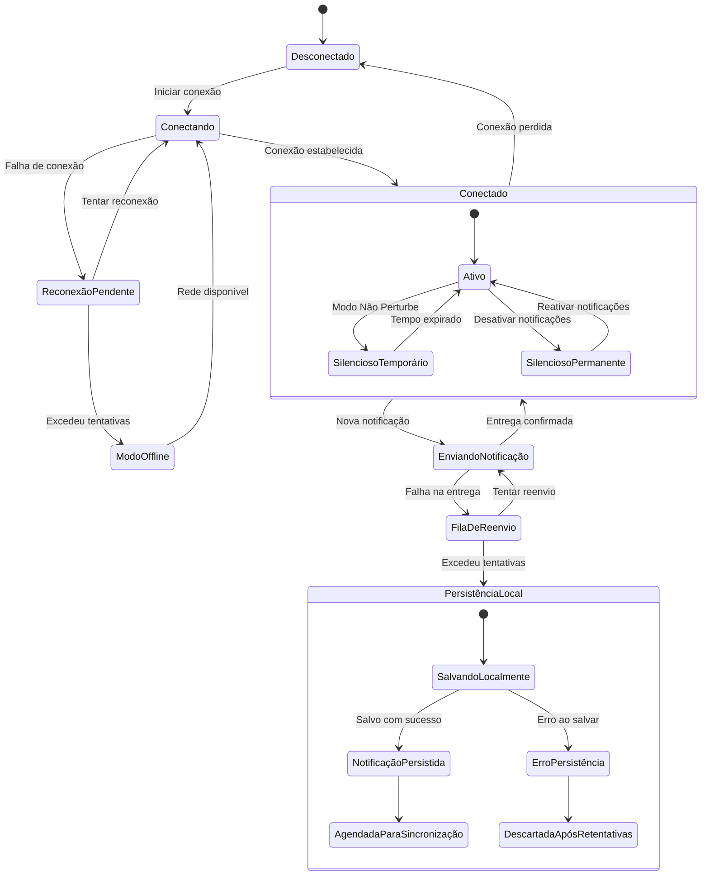
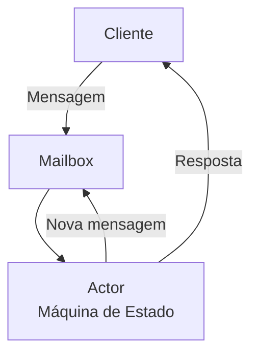

# Exemplo 3: Máquinas de Estado em Sistemas Reativos

Os sistemas reativos são projetados para responder continuamente a eventos e estímulos externos, mantendo interação constante com seu ambiente. Máquinas de estado são particularmente valiosas nestes sistemas, fornecendo um modelo formal para gerenciar comportamentos complexos dirigidos por eventos.

## Características de Sistemas Reativos



1. **Responsivos**: Respondem em tempo hábil, garantindo qualidade de serviço consistente
2. **Resilientes**: Permanecem responsivos mesmo em situações de falha
3. **Elásticos**: Adaptam-se automaticamente à carga de trabalho
4. **Orientados a Mensagens**: Utilizam comunicação assíncrona para acoplamento fraco

## Caso de Estudo: Sistema de Notificação Reativo

Vamos implementar um sistema de notificação reativo para um aplicativo móvel, gerenciando estados de conexão, tentativas de entrega e modos de funcionamento.

### Diagrama da Máquina de Estado



## Implementação em Programação Reativa

### Implementação com Reactor (Java)

```java
public class NotificationSystem {
    
    // Estados possíveis
    public enum State {
        DISCONNECTED,
        CONNECTING,
        CONNECTED,
        RECONNECTION_PENDING, 
        OFFLINE_MODE,
        SENDING_NOTIFICATION,
        REQUEUE_DELIVERY,
        LOCAL_PERSISTENCE
    }
    
    // Eventos do sistema
    public enum Event {
        START_CONNECTION,
        CONNECTION_ESTABLISHED,
        CONNECTION_FAILED,
        CONNECTION_LOST,
        TRY_RECONNECT,
        MAX_RETRIES_EXCEEDED,
        NETWORK_AVAILABLE,
        NEW_NOTIFICATION,
        DELIVERY_CONFIRMED,
        DELIVERY_FAILED,
        RETRY_DELIVERY
    }
    
    private final FluxProcessor<Event, State> stateProcessor;
    private final FluxSink<Event> eventSink;
    private final AtomicReference<State> currentState = new AtomicReference<>(State.DISCONNECTED);
    private final AtomicInteger reconnectionAttempts = new AtomicInteger(0);
    private final AtomicInteger deliveryAttempts = new AtomicInteger(0);
    
    private static final int MAX_RECONNECTION_ATTEMPTS = 5;
    private static final int MAX_DELIVERY_ATTEMPTS = 3;
    
    public NotificationSystem() {
        EmitterProcessor<Event> processor = EmitterProcessor.create();
        this.stateProcessor = processor;
        this.eventSink = processor.sink();
        
        // Define a lógica de transição
        setupStateMachine();
    }
    
    private void setupStateMachine() {
        stateProcessor
            .publishOn(Schedulers.parallel())
            .subscribe(newState -> {
                State oldState = currentState.getAndSet(newState);
                if (oldState != newState) {
                    log.info("State transition: {} -> {}", oldState, newState);
                    executeStateActions(newState);
                }
            });
    }
    
    public void sendEvent(Event event) {
        log.debug("Received event: {}", event);
        
        State state = currentState.get();
        State newState = calculateNextState(state, event);
        
        if (newState != null) {
            log.debug("Transitioning to state: {}", newState);
            eventSink.next(newState);
        } else {
            log.warn("Event {} ignored in state {}", event, state);
        }
    }
    
    private State calculateNextState(State currentState, Event event) {
        switch (currentState) {
            case DISCONNECTED:
                if (event == Event.START_CONNECTION) {
                    return State.CONNECTING;
                }
                break;
                
            case CONNECTING:
                if (event == Event.CONNECTION_ESTABLISHED) {
                    reconnectionAttempts.set(0);
                    return State.CONNECTED;
                } else if (event == Event.CONNECTION_FAILED) {
                    return State.RECONNECTION_PENDING;
                }
                break;
                
            case CONNECTED:
                if (event == Event.CONNECTION_LOST) {
                    return State.DISCONNECTED;
                } else if (event == Event.NEW_NOTIFICATION) {
                    deliveryAttempts.set(0);
                    return State.SENDING_NOTIFICATION;
                }
                break;
                
            case RECONNECTION_PENDING:
                if (event == Event.TRY_RECONNECT) {
                    if (reconnectionAttempts.incrementAndGet() <= MAX_RECONNECTION_ATTEMPTS) {
                        return State.CONNECTING;
                    } else {
                        reconnectionAttempts.set(0);
                        return State.OFFLINE_MODE;
                    }
                }
                break;
                
            case OFFLINE_MODE:
                if (event == Event.NETWORK_AVAILABLE) {
                    return State.CONNECTING;
                }
                break;
                
            case SENDING_NOTIFICATION:
                if (event == Event.DELIVERY_CONFIRMED) {
                    return State.CONNECTED;
                } else if (event == Event.DELIVERY_FAILED) {
                    return State.REQUEUE_DELIVERY;
                }
                break;
                
            case REQUEUE_DELIVERY:
                if (event == Event.RETRY_DELIVERY) {
                    if (deliveryAttempts.incrementAndGet() <= MAX_DELIVERY_ATTEMPTS) {
                        return State.SENDING_NOTIFICATION;
                    } else {
                        deliveryAttempts.set(0);
                        return State.LOCAL_PERSISTENCE;
                    }
                }
                break;
                
            case LOCAL_PERSISTENCE:
                // Estados terminais implementados com submáquinas
                break;
        }
        
        return null; // Sem transição
    }
    
    private void executeStateActions(State state) {
        switch (state) {
            case CONNECTING:
                establishConnection()
                    .subscribe(
                        success -> sendEvent(Event.CONNECTION_ESTABLISHED),
                        error -> sendEvent(Event.CONNECTION_FAILED)
                    );
                break;
                
            case RECONNECTION_PENDING:
                // Espera antes de tentar novamente
                Mono.delay(Duration.ofSeconds(calculateBackoff(reconnectionAttempts.get())))
                    .subscribe(i -> sendEvent(Event.TRY_RECONNECT));
                break;
                
            case SENDING_NOTIFICATION:
                deliverNotification()
                    .subscribe(
                        success -> sendEvent(Event.DELIVERY_CONFIRMED),
                        error -> sendEvent(Event.DELIVERY_FAILED)
                    );
                break;
                
            case REQUEUE_DELIVERY:
                // Espera antes de tentar enviar novamente
                Mono.delay(Duration.ofSeconds(calculateBackoff(deliveryAttempts.get())))
                    .subscribe(i -> sendEvent(Event.RETRY_DELIVERY));
                break;
                
            case LOCAL_PERSISTENCE:
                persistNotificationLocally()
                    .subscribe(
                        success -> log.info("Notification persisted locally"),
                        error -> log.error("Failed to persist notification: {}", error.getMessage())
                    );
                break;
        }
    }
    
    // Métodos auxiliares para implementar comportamento específico
    private Mono<Boolean> establishConnection() {
        // Lógica para estabelecer conexão com servidor de notificações
        return Mono.fromCallable(() -> {
            // Simulação: 80% de chance de sucesso na conexão
            boolean success = Math.random() > 0.2;
            log.debug("Connection attempt result: {}", success);
            return success;
        })
        .subscribeOn(Schedulers.boundedElastic());
    }
    
    private Mono<Boolean> deliverNotification() {
        // Lógica para entregar notificação
        return Mono.fromCallable(() -> {
            // Simulação: 90% de chance de entrega bem-sucedida
            boolean success = Math.random() > 0.1;
            log.debug("Notification delivery attempt result: {}", success);
            return success;
        })
        .subscribeOn(Schedulers.boundedElastic());
    }
    
    private Mono<Boolean> persistNotificationLocally() {
        // Lógica para salvar notificação localmente para sincronização futura
        return Mono.fromCallable(() -> {
            // Simulação: 95% de chance de persistência bem-sucedida
            boolean success = Math.random() > 0.05;
            log.debug("Local persistence result: {}", success);
            return success;
        })
        .subscribeOn(Schedulers.boundedElastic());
    }
    
    private int calculateBackoff(int attempts) {
        // Implementa exponential backoff
        return (int) Math.min(30, Math.pow(2, attempts));
    }
    
    // Método para iniciar o sistema
    public void start() {
        sendEvent(Event.START_CONNECTION);
    }
    
    // Método para observar alterações de estado
    public Flux<State> observeStateChanges() {
        return stateProcessor;
    }
}
```

### Implementação com RxJS (TypeScript)

```typescript
// Definição de estados e eventos
export enum NotificationState {
  DISCONNECTED = 'disconnected',
  CONNECTING = 'connecting',
  CONNECTED = 'connected',
  RECONNECTION_PENDING = 'reconnectionPending',
  OFFLINE_MODE = 'offlineMode',
  SENDING_NOTIFICATION = 'sendingNotification',
  REQUEUE_DELIVERY = 'requeueDelivery',
  LOCAL_PERSISTENCE = 'localPersistence'
}

export enum NotificationEvent {
  START_CONNECTION = 'startConnection',
  CONNECTION_ESTABLISHED = 'connectionEstablished',
  CONNECTION_FAILED = 'connectionFailed',
  CONNECTION_LOST = 'connectionLost',
  TRY_RECONNECT = 'tryReconnect',
  MAX_RETRIES_EXCEEDED = 'maxRetriesExceeded',
  NETWORK_AVAILABLE = 'networkAvailable',
  NEW_NOTIFICATION = 'newNotification',
  DELIVERY_CONFIRMED = 'deliveryConfirmed',
  DELIVERY_FAILED = 'deliveryFailed',
  RETRY_DELIVERY = 'retryDelivery'
}

// Implementação da máquina de estado
export class ReactiveNotificationSystem {
  private stateSubject = new BehaviorSubject<NotificationState>(NotificationState.DISCONNECTED);
  private eventSubject = new Subject<NotificationEvent>();
  private reconnectionAttempts = 0;
  private deliveryAttempts = 0;
  
  private readonly MAX_RECONNECTION_ATTEMPTS = 5;
  private readonly MAX_DELIVERY_ATTEMPTS = 3;

  constructor() {
    // Configura lógica de transição de estado baseada em eventos
    this.eventSubject.pipe(
      tap(event => console.log(`Received event: ${event}`)),
      withLatestFrom(this.stateSubject),
      map(([event, currentState]) => this.calculateNextState(currentState, event)),
      filter(newState => newState !== null)
    ).subscribe(newState => {
      this.stateSubject.next(newState);
      this.executeStateActions(newState);
    });
    
    // Monitora mudanças de estado
    this.stateSubject.pipe(
      distinctUntilChanged(),
      tap(state => console.log(`State changed to: ${state}`))
    ).subscribe();
  }

  public sendEvent(event: NotificationEvent): void {
    this.eventSubject.next(event);
  }

  public observeState(): Observable<NotificationState> {
    return this.stateSubject.asObservable();
  }

  private calculateNextState(
    currentState: NotificationState, 
    event: NotificationEvent
  ): NotificationState | null {
    switch (currentState) {
      case NotificationState.DISCONNECTED:
        if (event === NotificationEvent.START_CONNECTION) {
          return NotificationState.CONNECTING;
        }
        break;

      case NotificationState.CONNECTING:
        if (event === NotificationEvent.CONNECTION_ESTABLISHED) {
          this.reconnectionAttempts = 0;
          return NotificationState.CONNECTED;
        } else if (event === NotificationEvent.CONNECTION_FAILED) {
          return NotificationState.RECONNECTION_PENDING;
        }
        break;

      // Demais transições de estado

      // ...
    }

    return null; // Sem transição
  }

  private executeStateActions(state: NotificationState): void {
    switch (state) {
      case NotificationState.CONNECTING:
        this.establishConnection().pipe(
          tap(success => console.log(`Connection attempt result: ${success}`)),
        ).subscribe({
          next: success => this.sendEvent(NotificationEvent.CONNECTION_ESTABLISHED),
          error: () => this.sendEvent(NotificationEvent.CONNECTION_FAILED)
        });
        break;

      case NotificationState.RECONNECTION_PENDING:
        const backoffSeconds = this.calculateBackoff(this.reconnectionAttempts);
        console.log(`Reconnection attempt ${this.reconnectionAttempts + 1} scheduled in ${backoffSeconds}s`);
        
        timer(backoffSeconds * 1000).pipe(
          tap(() => this.sendEvent(NotificationEvent.TRY_RECONNECT))
        ).subscribe();
        break;

      // Demais ações de estado
      
      // ...
    }
  }

  private establishConnection(): Observable<boolean> {
    // Simulação de conexão
    return of(Math.random() > 0.2).pipe(
      delay(1000)
    );
  }

  private calculateBackoff(attempts: number): number {
    // Implementa exponential backoff
    return Math.min(30, Math.pow(2, attempts));
  }

  public start(): void {
    this.sendEvent(NotificationEvent.START_CONNECTION);
  }
}
```

## Monitor Reativo com Observabilidade

Podemos implementar um monitor para a máquina de estado que observe e registre as transições:

```typescript
export class NotificationStateMonitor {
  private transitionLog: Array<{
    timestamp: Date;
    from: NotificationState;
    to: NotificationState;
    event: NotificationEvent;
  }> = [];

  constructor(private notificationSystem: ReactiveNotificationSystem) {
    let previousState: NotificationState = null;
    
    // Registra todas as transições
    this.notificationSystem.observeState().pipe(
      tap(newState => {
        if (previousState !== null && newState !== previousState) {
          this.transitionLog.push({
            timestamp: new Date(),
            from: previousState,
            to: newState,
            event: this.getLastEvent() // método para obter último evento
          });
        }
        previousState = newState;
      })
    ).subscribe();
  }

  public getTransitionHistory(): Array<any> {
    return [...this.transitionLog];
  }

  public getStateDurations(): Map<NotificationState, number> {
    // Calcula quanto tempo o sistema passou em cada estado
    // ...
  }

  public getFailureRates(): Map<string, number> {
    // Analisa taxas de falha para diferentes transições
    // ...
  }
}
```

## Testando Máquinas de Estado em Sistemas Reativos

### Teste com Marble Diagrams

```typescript
describe('ReactiveNotificationSystem', () => {
  let scheduler: TestScheduler;
  let notificationSystem: ReactiveNotificationSystem;

  beforeEach(() => {
    scheduler = new TestScheduler((actual, expected) => {
      expect(actual).toEqual(expected);
    });
    
    notificationSystem = new ReactiveNotificationSystem();
  });

  it('should transition from DISCONNECTED to CONNECTED on successful connection', () => {
    scheduler.run(({ expectObservable }) => {
      // Arrange
      const expectedStates = '(ab)';
      const expectedValues = {
        a: NotificationState.DISCONNECTED,
        b: NotificationState.CONNECTING,
        c: NotificationState.CONNECTED
      };
      
      // Mock connection success
      spyOn(notificationSystem as any, 'establishConnection').and.returnValue(
        of(true).pipe(delay(1))
      );
      
      // Act
      notificationSystem.start();
      
      // Assert
      expectObservable(notificationSystem.observeState()).toBe(
        expectedStates, 
        expectedValues
      );
    });
  });

  // Mais testes...
});
```

## Benefícios das Máquinas de Estado em Sistemas Reativos

1. **Previsibilidade**: Comportamento determinístico mesmo em sistemas assíncronos
2. **Localização de Falhas**: Facilita isolamento de problemas em sistemas complexos
3. **Resiliência**: Recuperação de falhas transitórias através de estados explícitos
4. **Testabilidade**: Estados finitos facilitam testes unitários e de integração
5. **Hot Reload**: Possibilidade de reconstruir estado em execução
6. **Debugabilidade**: Estados explícitos facilitam depuração de sistemas assíncronos

## Padrões Reativos com Máquinas de Estado

### Circuit Breaker Reativo

```mermaid
stateDiagram-v2
    [*] --> Fechado
    Fechado --> Aberto: falhas > limite
    Aberto --> Semi-Aberto: timeout
    Semi-Aberto --> Fechado: sucesso
    Semi-Aberto --> Aberto: falha
```

### Actor Model com Máquinas de Estado



## Considerações para Implementação

1. **Backpressure**: Implemente estratégias para lidar com sobrecarga
2. **Hot vs Cold Streams**: Entenda as diferenças ao projetar sua máquina de estado
3. **Cancelamento**: Garanta limpeza correta de recursos em cancelamentos
4. **Composition**: Projete estados e eventos para permitir composição
5. **Efeitos Colaterais**: Mantenha ações de side-effect isoladas para facilitar testes
6. **Deadlocks**: Evite situações onde estados se bloqueiam mutuamente

## Conclusão

As máquinas de estado fornecem um modelo formal poderoso para sistemas reativos, permitindo representar, implementar e verificar comportamentos complexos orientados a eventos. Ao combinar o modelo mental claro das máquinas de estado com as capacidades de processamento assíncrono dos frameworks reativos, podemos criar sistemas resilientes, responsivos e manuteníveis que se adaptam a condições dinâmicas e lidam naturalmente com falhas.
