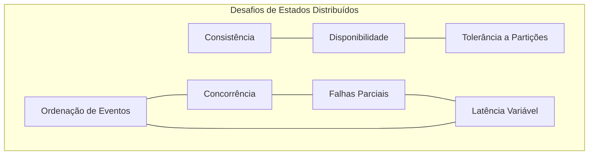
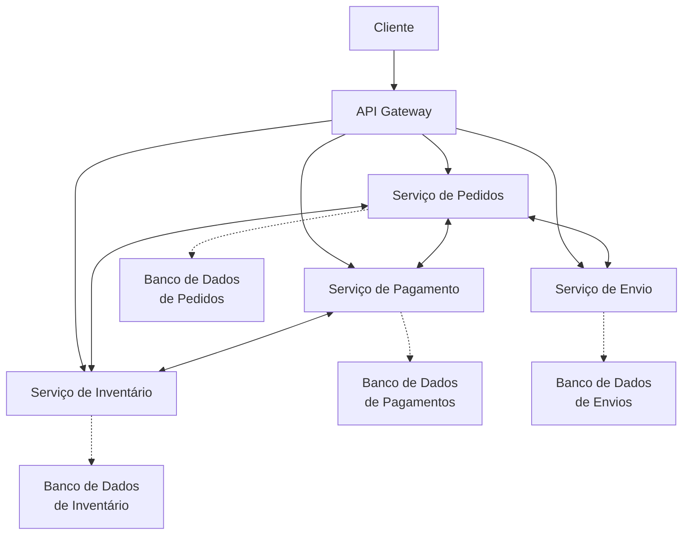
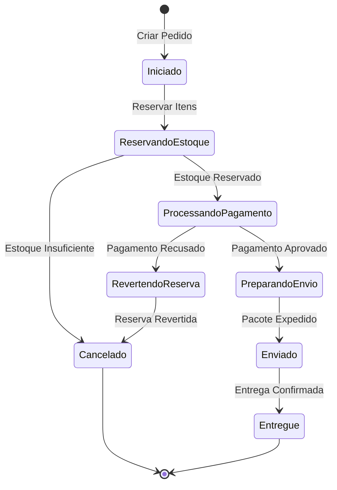
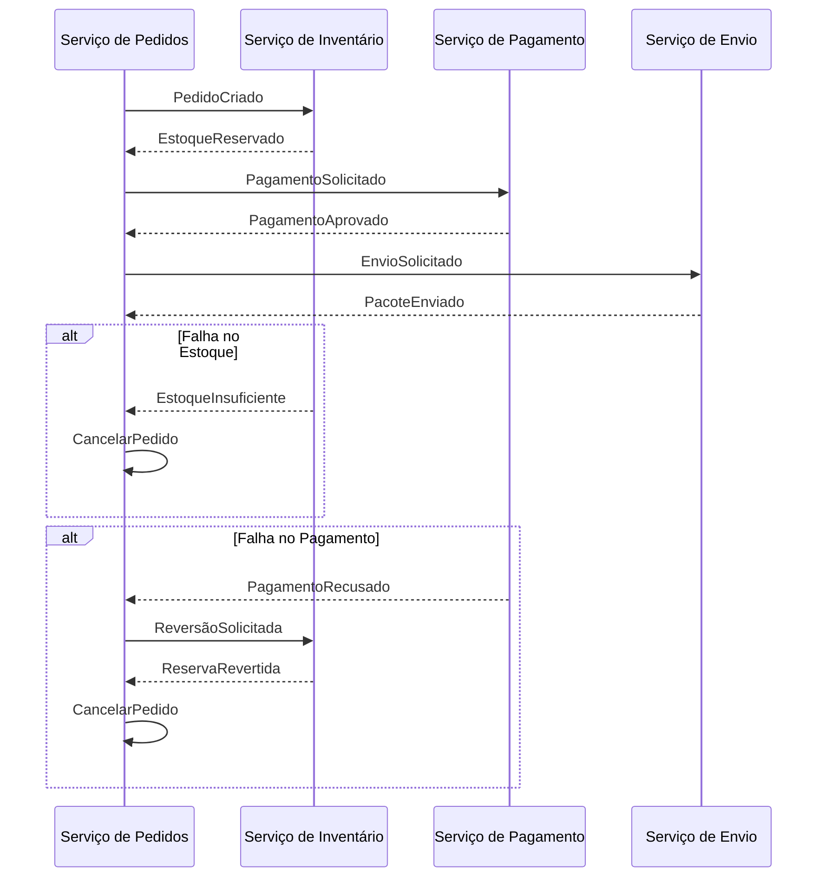
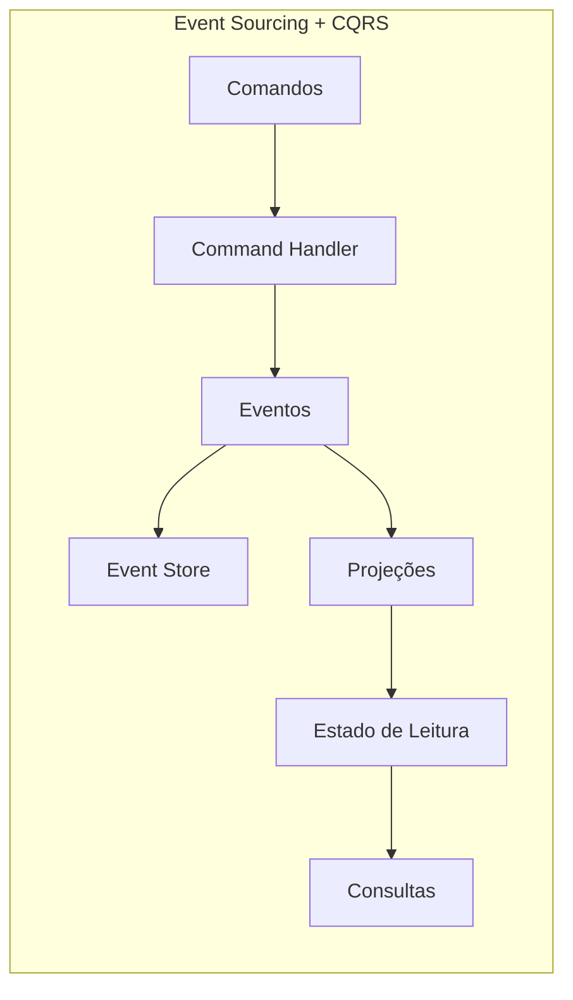
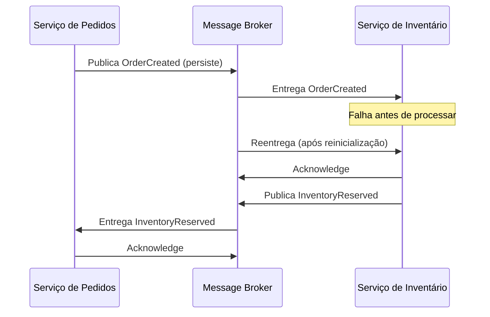
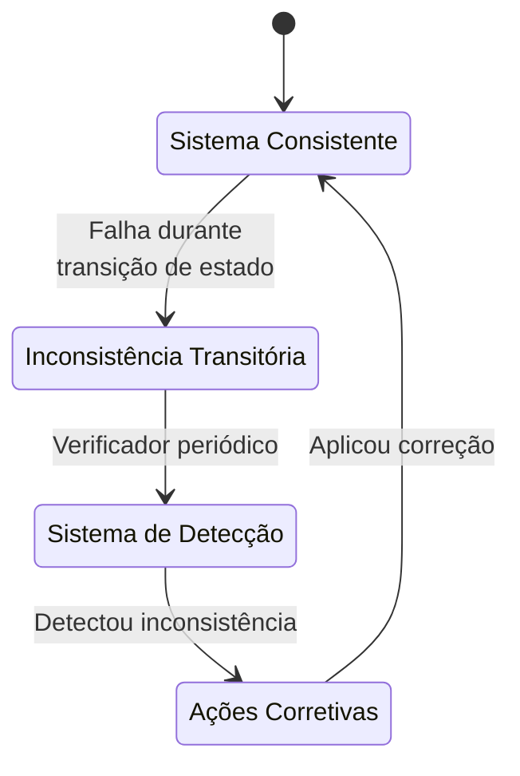

# Exemplo 4: Gerenciamento de Estado Distribuído

Em sistemas distribuídos, manter a consistência e a coerência do estado entre múltiplos componentes é um desafio crítico. As máquinas de estado fornecem um modelo formal que ajuda a coordenar esses estados distribuídos, garantindo comportamentos previsíveis mesmo em face de falhas parciais, latência de rede e processamento assíncrono.

## Desafios do Estado Distribuído



## Modelo de Sistema Distribuído

Considere um sistema de e-commerce distribuído onde diferentes serviços gerenciam aspectos distintos de um pedido:



## Máquina de Estado Distribuída

### Abordagem com Orquestração



### Abordagem com Coreografia 

Em vez de um orquestrador central, cada serviço reage a eventos:



## Implementação com Saga Pattern

O padrão Saga é um padrão de design para gerenciar transações distribuídas e estados em sistemas distribuídos.

```java
// Definições de estado para um pedido
public enum OrderState {
    INITIATED,
    INVENTORY_RESERVING,
    INVENTORY_RESERVED,
    PAYMENT_PROCESSING,
    PAYMENT_APPROVED,
    PREPARING_SHIPMENT,
    SHIPPED,
    DELIVERED,
    REVERTING_RESERVATION,
    CANCELED
}

// Eventos de transição de estado
public interface OrderEvent {
    String getOrderId();
    String getEventType();
    Instant getTimestamp();
}

// Evento específico
public class InventoryReservedEvent implements OrderEvent {
    private final String orderId;
    private final List<String> reservedItems;
    private final Instant timestamp;
    
    // Implementação...
}

// Saga para coordenação do pedido
@Service
public class OrderSaga {
    private final KafkaTemplate<String, OrderEvent> eventPublisher;
    private final OrderRepository orderRepository;
    
    private static final Map<OrderState, Set<String>> VALID_TRANSITIONS = Map.of(
        OrderState.INITIATED, Set.of("RESERVE_INVENTORY"),
        OrderState.INVENTORY_RESERVING, Set.of("INVENTORY_RESERVED", "INVENTORY_FAILED"),
        OrderState.INVENTORY_RESERVED, Set.of("PROCESS_PAYMENT"),
        OrderState.PAYMENT_PROCESSING, Set.of("PAYMENT_APPROVED", "PAYMENT_REFUSED"),
        // outras transições...
    );
    
    // Início da transação Saga
    @Transactional
    public void createOrder(OrderCreateCommand command) {
        Order order = new Order(UUID.randomUUID().toString(), command.getCustomerId(), command.getItems());
        order.setState(OrderState.INITIATED);
        
        orderRepository.save(order);
        
        // Publica evento para início da Saga
        publishEvent(new OrderCreatedEvent(order.getId(), order.getItems(), Instant.now()));
        
        // Tenta reservar o inventário
        publishEvent(new ReserveInventoryCommand(order.getId(), order.getItems(), Instant.now()));
        
        order.setState(OrderState.INVENTORY_RESERVING);
        orderRepository.save(order);
    }
    
    // Manipuladores de eventos para continuar a Saga
    @KafkaListener(topics = "inventory-events")
    public void handleInventoryEvent(InventoryEvent event) {
        Order order = orderRepository.findById(event.getOrderId())
            .orElseThrow(() -> new OrderNotFoundException(event.getOrderId()));
        
        if (event instanceof InventoryReservedEvent) {
            // Verifica se a transição é válida
            validateTransition(order.getState(), "INVENTORY_RESERVED");
            
            // Atualiza estado
            order.setState(OrderState.INVENTORY_RESERVED);
            orderRepository.save(order);
            
            // Continua para o próximo passo
            publishEvent(new ProcessPaymentCommand(order.getId(), order.getTotal(), Instant.now()));
            
            order.setState(OrderState.PAYMENT_PROCESSING);
            orderRepository.save(order);
        } else if (event instanceof InventoryFailedEvent) {
            // Trata falha
            handleInventoryFailure(order, (InventoryFailedEvent) event);
        }
    }
    
    // Manipulador para eventos de pagamento
    @KafkaListener(topics = "payment-events")
    public void handlePaymentEvent(PaymentEvent event) {
        Order order = orderRepository.findById(event.getOrderId())
            .orElseThrow(() -> new OrderNotFoundException(event.getOrderId()));
        
        if (event instanceof PaymentApprovedEvent) {
            validateTransition(order.getState(), "PAYMENT_APPROVED");
            
            order.setState(OrderState.PAYMENT_APPROVED);
            orderRepository.save(order);
            
            // Continua para preparação de envio
            publishEvent(new PrepareShipmentCommand(order.getId(), order.getShippingDetails(), Instant.now()));
            
            order.setState(OrderState.PREPARING_SHIPMENT);
            orderRepository.save(order);
        } else if (event instanceof PaymentRefusedEvent) {
            // Inicia compensação - reverte a reserva de inventário
            handlePaymentFailure(order, (PaymentRefusedEvent) event);
        }
    }
    
    // Método para validar transições
    private void validateTransition(OrderState currentState, String event) {
        if (!VALID_TRANSITIONS.containsKey(currentState) || 
            !VALID_TRANSITIONS.get(currentState).contains(event)) {
            throw new InvalidStateTransitionException(currentState, event);
        }
    }
    
    // Métodos para tratamento de falhas (compensação)
    private void handleInventoryFailure(Order order, InventoryFailedEvent event) {
        order.setState(OrderState.CANCELED);
        order.setFailureReason(event.getReason());
        orderRepository.save(order);
        
        publishEvent(new OrderCanceledEvent(order.getId(), "Inventory unavailable: " + event.getReason(), Instant.now()));
    }
    
    private void handlePaymentFailure(Order order, PaymentRefusedEvent event) {
        order.setState(OrderState.REVERTING_RESERVATION);
        orderRepository.save(order);
        
        // Comando para reverter a reserva de inventário
        publishEvent(new ReleaseInventoryCommand(order.getId(), order.getItems(), Instant.now()));
    }
    
    // Manipulador para eventos de liberação de inventário
    @KafkaListener(topics = "inventory-release-events")
    public void handleInventoryReleaseEvent(InventoryReleasedEvent event) {
        Order order = orderRepository.findById(event.getOrderId())
            .orElseThrow(() -> new OrderNotFoundException(event.getOrderId()));
        
        order.setState(OrderState.CANCELED);
        order.setFailureReason("Payment refused: " + event.getReason());
        orderRepository.save(order);
        
        publishEvent(new OrderCanceledEvent(order.getId(), "Payment refused: " + event.getReason(), Instant.now()));
    }
    
    private void publishEvent(OrderEvent event) {
        eventPublisher.send("order-events", event.getOrderId(), event);
    }
}
```

## Event Sourcing e CQRS para Estados Distribuídos

O Event Sourcing mantém o histórico completo de alterações de estado como uma sequência de eventos, permitindo reconstruir o estado a qualquer momento.



### Implementação com Axon Framework

```java
@Aggregate
public class OrderAggregate {
    @AggregateIdentifier
    private String orderId;
    private OrderState state;
    private List<OrderItem> items;
    private String customerId;
    private Money totalAmount;
    
    @CommandHandler
    public OrderAggregate(CreateOrderCommand command) {
        // Validações de regras de negócio
        if (command.getItems().isEmpty()) {
            throw new IllegalArgumentException("Order must have at least one item");
        }
        
        // Aplica evento
        apply(new OrderCreatedEvent(
            command.getOrderId(),
            command.getCustomerId(),
            command.getItems()
        ));
    }
    
    @EventSourcingHandler
    public void on(OrderCreatedEvent event) {
        this.orderId = event.getOrderId();
        this.customerId = event.getCustomerId();
        this.items = event.getItems();
        this.state = OrderState.INITIATED;
        this.totalAmount = calculateTotal(event.getItems());
    }
    
    @CommandHandler
    public void handle(ReserveInventoryCommand command) {
        if (state != OrderState.INITIATED) {
            throw new IllegalStateException("Cannot reserve inventory for order in state: " + state);
        }
        
        apply(new InventoryReservationRequestedEvent(
            orderId,
            items
        ));
    }
    
    @EventSourcingHandler
    public void on(InventoryReservationRequestedEvent event) {
        this.state = OrderState.INVENTORY_RESERVING;
    }
    
    @CommandHandler
    public void handle(ConfirmInventoryReservedCommand command) {
        if (state != OrderState.INVENTORY_RESERVING) {
            throw new IllegalStateException("Cannot confirm inventory for order in state: " + state);
        }
        
        apply(new InventoryReservedEvent(
            orderId,
            command.getReservationId()
        ));
    }
    
    @EventSourcingHandler
    public void on(InventoryReservedEvent event) {
        this.state = OrderState.INVENTORY_RESERVED;
    }
    
    // Mais comandos e eventos para estados subsequentes...
    
    // Queries using projections would be in separate query model services
}

// Projeção para consultas de pedidos
@Component
public class OrderProjection {
    private final OrderRepository orderRepository;
    
    @EventHandler
    public void on(OrderCreatedEvent event) {
        OrderEntity order = new OrderEntity();
        order.setOrderId(event.getOrderId());
        order.setCustomerId(event.getCustomerId());
        order.setState(OrderState.INITIATED);
        // mais mapeamentos...
        
        orderRepository.save(order);
    }
    
    @EventHandler
    public void on(InventoryReservationRequestedEvent event) {
        OrderEntity order = orderRepository.findById(event.getOrderId())
            .orElseThrow(() -> new OrderNotFoundException(event.getOrderId()));
        
        order.setState(OrderState.INVENTORY_RESERVING);
        orderRepository.save(order);
    }
    
    // Mais manipuladores de eventos para atualizar a visão de leitura...
}
```

## TLA+ para Verificação Formal

A especificação a seguir modela o sistema de pedido e verifica propriedades importantes:

```
---- MODULE DistributedOrderProcess ----
EXTENDS Integers, Sequences, FiniteSets

\* Define estados possíveis
STATES == {"INITIATED", "INVENTORY_RESERVING", "INVENTORY_RESERVED", 
           "PAYMENT_PROCESSING", "PAYMENT_APPROVED", "PREPARING_SHIPMENT", 
           "SHIPPED", "DELIVERED", "REVERTING_RESERVATION", "CANCELED"}

\* Define transições válidas
ValidTransitions == [
    "INITIATED" |-> {"INVENTORY_RESERVING"},
    "INVENTORY_RESERVING" |-> {"INVENTORY_RESERVED", "CANCELED"},
    "INVENTORY_RESERVED" |-> {"PAYMENT_PROCESSING"},
    "PAYMENT_PROCESSING" |-> {"PAYMENT_APPROVED", "REVERTING_RESERVATION"},
    "PAYMENT_APPROVED" |-> {"PREPARING_SHIPMENT"},
    "PREPARING_SHIPMENT" |-> {"SHIPPED"},
    "SHIPPED" |-> {"DELIVERED"},
    "REVERTING_RESERVATION" |-> {"CANCELED"},
    "CANCELED" |-> {},
    "DELIVERED" |-> {}
]

\* Variáveis do modelo
VARIABLES
    orderState,      \* Estado atual do pedido
    inventoryOk,     \* Flag: inventário disponível?
    paymentOk,       \* Flag: pagamento aprovado?
    eventQueue       \* Fila de eventos no sistema

\* Invariantes
TypeInvariant ==
    /\ orderState \in STATES
    /\ inventoryOk \in BOOLEAN
    /\ paymentOk \in BOOLEAN
    /\ eventQueue \in Seq(STRING)

\* Inicialização
Init ==
    /\ orderState = "INITIATED"
    /\ inventoryOk \in BOOLEAN  \* Não determinístico
    /\ paymentOk \in BOOLEAN    \* Não determinístico
    /\ eventQueue = <<>>

\* Ações
ReserveInventory ==
    /\ orderState = "INITIATED"
    /\ orderState' = "INVENTORY_RESERVING"
    /\ eventQueue' = Append(eventQueue, "RESERVE_INVENTORY")
    /\ UNCHANGED <<inventoryOk, paymentOk>>

InventoryReserved ==
    /\ orderState = "INVENTORY_RESERVING"
    /\ inventoryOk = TRUE
    /\ orderState' = "INVENTORY_RESERVED"
    /\ eventQueue' = Append(eventQueue, "INVENTORY_RESERVED")
    /\ UNCHANGED <<inventoryOk, paymentOk>>

InventoryFailed ==
    /\ orderState = "INVENTORY_RESERVING"
    /\ inventoryOk = FALSE
    /\ orderState' = "CANCELED"
    /\ eventQueue' = Append(eventQueue, "INVENTORY_FAILED")
    /\ UNCHANGED <<inventoryOk, paymentOk>>

ProcessPayment ==
    /\ orderState = "INVENTORY_RESERVED"
    /\ orderState' = "PAYMENT_PROCESSING"
    /\ eventQueue' = Append(eventQueue, "PROCESS_PAYMENT")
    /\ UNCHANGED <<inventoryOk, paymentOk>>

PaymentApproved ==
    /\ orderState = "PAYMENT_PROCESSING"
    /\ paymentOk = TRUE
    /\ orderState' = "PAYMENT_APPROVED"
    /\ eventQueue' = Append(eventQueue, "PAYMENT_APPROVED")
    /\ UNCHANGED <<inventoryOk, paymentOk>>

PaymentRefused ==
    /\ orderState = "PAYMENT_PROCESSING"
    /\ paymentOk = FALSE
    /\ orderState' = "REVERTING_RESERVATION"
    /\ eventQueue' = Append(eventQueue, "PAYMENT_REFUSED")
    /\ UNCHANGED <<inventoryOk, paymentOk>>

RevertInventory ==
    /\ orderState = "REVERTING_RESERVATION"
    /\ orderState' = "CANCELED"
    /\ eventQueue' = Append(eventQueue, "INVENTORY_REVERTED")
    /\ UNCHANGED <<inventoryOk, paymentOk>>

PrepareShipment ==
    /\ orderState = "PAYMENT_APPROVED"
    /\ orderState' = "PREPARING_SHIPMENT"
    /\ eventQueue' = Append(eventQueue, "PREPARE_SHIPMENT")
    /\ UNCHANGED <<inventoryOk, paymentOk>>

ShipOrder ==
    /\ orderState = "PREPARING_SHIPMENT"
    /\ orderState' = "SHIPPED"
    /\ eventQueue' = Append(eventQueue, "ORDER_SHIPPED")
    /\ UNCHANGED <<inventoryOk, paymentOk>>

DeliverOrder ==
    /\ orderState = "SHIPPED"
    /\ orderState' = "DELIVERED"
    /\ eventQueue' = Append(eventQueue, "ORDER_DELIVERED")
    /\ UNCHANGED <<inventoryOk, paymentOk>>

\* Próximo estado
Next ==
    \/ ReserveInventory
    \/ InventoryReserved
    \/ InventoryFailed
    \/ ProcessPayment
    \/ PaymentApproved
    \/ PaymentRefused
    \/ RevertInventory
    \/ PrepareShipment
    \/ ShipOrder
    \/ DeliverOrder

\* Propriedades a verificar
ValidStateTransitions ==
    [](orderState' # orderState => orderState' \in ValidTransitions[orderState])

EventuallyTerminates ==
    <>(orderState \in {"DELIVERED", "CANCELED"})

CompensationWorks ==
    []((orderState = "PAYMENT_PROCESSING" /\ paymentOk = FALSE) => 
       <>(orderState = "CANCELED"))

InventoryConsistency ==
    []((orderState = "INVENTORY_RESERVING" /\ inventoryOk = FALSE) => 
       <>(orderState = "CANCELED"))

\* Especificação completa
Spec == Init /\ [][Next]_<<orderState, inventoryOk, paymentOk, eventQueue>>

\* Propriedades para verificação
THEOREM Spec => [](TypeInvariant /\ ValidStateTransitions)
THEOREM Spec => EventuallyTerminates
THEOREM Spec => CompensationWorks
THEOREM Spec => InventoryConsistency

====
```

## Técnicas de Sincronização de Estado

### Usando Mensageria com Garantias de Entrega



### Eventual Consistency com Compensação



## Considerações de Design

1. **Idempotência**: Serviços devem garantir que o processamento do mesmo evento múltiplas vezes seja seguro.
2. **Compensação**: Sempre projete ações para reverter efeitos parciais em caso de falhas.
3. **Ordem de Eventos**: Considere se a ordem dos eventos é crucial e implement mecanismos para garantir a ordem quando necessário.
4. **Persistência de Estado**: Persista transições e estado atual para permitir recuperação.
5. **Timeout e Retry**: Implemente políticas adequadas para lidar com componentes temporariamente indisponíveis.
6. **Monitoramento**: Mantenha visibilidade do estado global através de dashboards e alertas.

## Padrões Relacionados

- **Saga Pattern**: Para gerenciar transações distribuídas através de serviços
- **Event Sourcing**: Para manter histórico completo de alterações de estado
- **CQRS**: Para separar modelos de leitura e escrita
- **Outbox Pattern**: Para garantir consistência entre atualizações de banco de dados e publicação de eventos
- **Compensating Transactions**: Para reverter mudanças quando parte de uma transação distribuída falha

## Conclusão

O gerenciamento de estado distribuído é um dos desafios mais complexos em arquiteturas modernas. Máquinas de estado, combinadas com padrões como Saga, Event Sourcing e CQRS, fornecem um framework sólido para modelar, implementar e verificar comportamentos distribuídos. Ao aplicar essas técnicas, podemos construir sistemas que são:

1. **Resilientes**: Continuam funcionando mesmo com falhas parciais
2. **Consistentes**: Mantêm integridade de dados através de fronteiras de serviços
3. **Rastreáveis**: Permitem auditoria completa de transições de estado
4. **Manuteníveis**: Facilitam compreensão e evolução do sistema
5. **Escaláveis**: Permitem crescimento horizontal de componentes independentes

Apesar da complexidade adicional, estes padrões são essenciais para sistemas distribuídos robustos e devem fazer parte do toolkit de qualquer arquiteto de software moderno.
