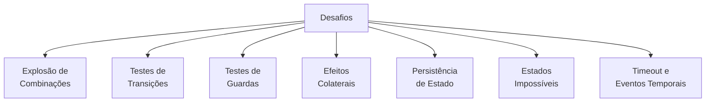

# Exemplo 5: Testes com Máquinas de Estado

Testar sistemas baseados em máquinas de estado apresenta desafios e oportunidades únicos. Por um lado, a natureza formal e determinística das máquinas de estado facilita a criação de testes abrangentes. Por outro lado, a quantidade de possíveis caminhos e combinações de estados pode tornar o teste exaustivo impraticável sem abordagens estruturadas.

## Desafios nos Testes de Máquinas de Estado



## Estratégias de Teste

### 1. Teste de Transições Individuais

O primeiro nível de teste é verificar se cada transição individual funciona corretamente:

```java
@Test
public void testOrderCreatedToPaymentPending() {
    // Arrange
    Order order = new Order();
    order.setState(OrderState.CREATED);
    
    // Act
    boolean result = order.processEvent(OrderEvent.CONFIRM_ORDER);
    
    // Assert
    assertTrue(result);
    assertEquals(OrderState.PAYMENT_PENDING, order.getState());
    verify(mockNotificationService).sendConfirmationEmail(order.getId());
}
```

### 2. Teste de Caminho Completo (Happy Path)

Testar sequências completas de eventos que levam do início ao fim:

```java
@Test
public void testOrderFullLifecycle() {
    // Arrange
    Order order = new Order();
    
    // Act & Assert: Sequência completa de eventos
    assertTrue(order.processEvent(OrderEvent.CONFIRM_ORDER));
    assertEquals(OrderState.PAYMENT_PENDING, order.getState());
    
    assertTrue(order.processEvent(OrderEvent.PAYMENT_APPROVED));
    assertEquals(OrderState.PAID, order.getState());
    
    assertTrue(order.processEvent(OrderEvent.START_PROCESSING));
    assertEquals(OrderState.PROCESSING, order.getState());
    
    assertTrue(order.processEvent(OrderEvent.SHIP));
    assertEquals(OrderState.SHIPPED, order.getState());
    
    assertTrue(order.processEvent(OrderEvent.DELIVER));
    assertEquals(OrderState.DELIVERED, order.getState());
    
    assertTrue(order.processEvent(OrderEvent.COMPLETE));
    assertEquals(OrderState.COMPLETED, order.getState());
}
```

### 3. Teste de Transições Inválidas

É importante verificar que eventos inválidos são rejeitados no estado atual:

```java
@Test
public void testInvalidTransitions() {
    // Arrange
    Order order = new Order();
    order.setState(OrderState.CREATED);
    
    // Act & Assert
    assertFalse(order.processEvent(OrderEvent.PAYMENT_APPROVED));
    assertEquals(OrderState.CREATED, order.getState()); // Estado não mudou
    
    assertFalse(order.processEvent(OrderEvent.SHIP));
    assertEquals(OrderState.CREATED, order.getState());
    
    // Verifica que outros eventos inválidos são rejeitados
    Arrays.stream(OrderEvent.values())
        .filter(event -> event != OrderEvent.CONFIRM_ORDER)
        .forEach(event -> {
            assertFalse("Event " + event + " should be rejected in CREATED state",
                      order.processEvent(event));
        });
}
```

### 4. Testes de Guardas

Testar condições que podem permitir ou bloquear transições:

```java
@Test
public void testGuardConditions() {
    // Arrange
    Order order = new Order();
    order.setState(OrderState.PAYMENT_PENDING);
    
    // Caso 1: Pagamento com cartão com fundos suficientes
    PaymentDetails validPayment = new PaymentDetails("CREDIT_CARD", "4111111111111111", true);
    order.setPaymentDetails(validPayment);
    
    // Act & Assert
    assertTrue(order.processEvent(OrderEvent.PAYMENT_APPROVED));
    assertEquals(OrderState.PAID, order.getState());
    
    // Caso 2: Reset e teste com cartão sem fundos
    order.setState(OrderState.PAYMENT_PENDING);
    PaymentDetails invalidPayment = new PaymentDetails("CREDIT_CARD", "4111111111111111", false);
    order.setPaymentDetails(invalidPayment);
    
    // A guarda deve impedir a transição
    assertFalse(order.processEvent(OrderEvent.PAYMENT_APPROVED));
    assertEquals(OrderState.PAYMENT_PENDING, order.getState());
}
```

### 5. Testes de Ações

Verificar se as ações associadas às transições são executadas corretamente:

```java
@Test
public void testStateEntryActions() {
    // Arrange
    OrderEmailService mockEmailService = mock(OrderEmailService.class);
    OrderInventoryService mockInventoryService = mock(OrderInventoryService.class);
    
    Order order = new Order();
    order.setEmailService(mockEmailService);
    order.setInventoryService(mockInventoryService);
    order.setState(OrderState.PAYMENT_PENDING);
    
    // Act
    order.processEvent(OrderEvent.PAYMENT_APPROVED);
    
    // Assert
    assertEquals(OrderState.PAID, order.getState());
    
    // Verifica se as ações foram executadas
    verify(mockEmailService).sendPaymentConfirmationEmail(order.getId());
    verify(mockInventoryService).reserveItems(order.getItems());
}
```

## Teste com Property-Based Testing

Uma abordagem poderosa para testar máquinas de estado é o Property-Based Testing, que gera automaticamente cenários de teste:

```java
@Property
void invariantsArePreservedThroughTransitions(
        @ForAll("validStates") OrderState initialState,
        @ForAll("validEvents") OrderEvent event) {
    
    // Arrange
    Order order = new Order();
    order.setState(initialState);
    OrderState originalState = order.getState();
    
    // Act
    boolean transitionOccurred = order.processEvent(event);
    OrderState newState = order.getState();
    
    // Assert invariants
    if (transitionOccurred) {
        // 1. Se houve transição, o novo estado deve ser diferente do original
        assertNotEquals(originalState, newState);
        
        // 2. O novo estado deve estar na tabela de transições válidas
        assertTrue(VALID_TRANSITIONS.get(originalState).contains(newState));
        
        // 3. A transição deve preservar invariantes de negócio
        assertTrue(businessRulesAreValid(order));
    } else {
        // Se não houve transição, o estado deve permanecer o mesmo
        assertEquals(originalState, newState);
    }
}

// Gerador de estados válidos
@Provide
Arbitrary<OrderState> validStates() {
    return Arbitraries.of(OrderState.class);
}

// Gerador de eventos válidos
@Provide
Arbitrary<OrderEvent> validEvents() {
    return Arbitraries.of(OrderEvent.class);
}
```

## Testes de Estado com Máquinas Baseadas em Tabelas

Para máquinas de estado definidas por tabelas, podemos automatizar o teste de todas as transições:

```java
@Test
public void testAllDefinedTransitions() {
    // Tabela de transições definida como:
    // Map<CurrentState, Map<Event, TargetState>>
    Map<OrderState, Map<OrderEvent, OrderState>> transitions = orderStateMachine.getTransitionTable();
    
    transitions.forEach((currentState, eventMap) -> {
        eventMap.forEach((event, targetState) -> {
            // Teste cada transição definida
            Order order = new Order();
            order.setState(currentState);
            
            boolean result = order.processEvent(event);
            
            assertTrue(result, 
                "Transition from " + currentState + " via " + event + " failed");
            assertEquals(targetState, order.getState(),
                "Transition to wrong state from " + currentState + " via " + event);
        });
    });
}
```

## Testes de Cobertura de Estados e Transições

Além dos testes funcionais, é importante medir e garantir a cobertura de estados e transições:

```java
@Test
public void testStateAndTransitionCoverage() {
    // Arrange
    StateCoverageTracker tracker = new StateCoverageTracker();
    
    // Registrar o rastreador na máquina de estado
    OrderStateMachine stateMachine = new OrderStateMachine(tracker);
    
    // Executar casos de teste (cobre todos os estados e transições)
    runAllTestScenarios(stateMachine);
    
    // Assert
    Set<OrderState> coveredStates = tracker.getCoveredStates();
    Set<Pair<OrderState, OrderState>> coveredTransitions = tracker.getCoveredTransitions();
    
    // Verificar cobertura de estados
    assertEquals(EnumSet.allOf(OrderState.class), coveredStates,
        "Not all states were covered. Missing: " +
        EnumSet.allOf(OrderState.class).stream()
            .filter(s -> !coveredStates.contains(s))
            .collect(Collectors.toSet()));
    
    // Verificar cobertura de transições
    Set<Pair<OrderState, OrderState>> allTransitions = getAllPossibleTransitions();
    assertEquals(allTransitions, coveredTransitions,
        "Not all transitions were covered. Missing: " +
        allTransitions.stream()
            .filter(t -> !coveredTransitions.contains(t))
            .collect(Collectors.toSet()));
}

class StateCoverageTracker implements StateChangeListener {
    private Set<OrderState> coveredStates = new HashSet<>();
    private Set<Pair<OrderState, OrderState>> coveredTransitions = new HashSet<>();
    
    @Override
    public void onStateChange(OrderState from, OrderState to) {
        coveredStates.add(from);
        coveredStates.add(to);
        coveredTransitions.add(new Pair<>(from, to));
    }
    
    // Getters
    public Set<OrderState> getCoveredStates() {
        return Collections.unmodifiableSet(coveredStates);
    }
    
    public Set<Pair<OrderState, OrderState>> getCoveredTransitions() {
        return Collections.unmodifiableSet(coveredTransitions);
    }
}
```

## Testes com Model Checking

Para sistemas críticos, é possível usar verificadores de modelo para provar propriedades de máquinas de estado:

```java
@Test
public void testNoDeadlocks() {
    // Usar biblioteca de model checking
    ModelChecker checker = new JPFModelChecker();
    OrderStateMachineModel model = new OrderStateMachineModel();
    
    // Verificar ausência de deadlocks
    PropertyViolation violation = checker.checkProperty(model, "deadlock");
    assertNull(violation, "Found deadlock: " + violation);
}

@Test
public void testEventuallyReachesTerminalState() {
    ModelChecker checker = new JPFModelChecker();
    OrderStateMachineModel model = new OrderStateMachineModel();
    
    // Verificar que sempre eventualmente chega a um estado terminal
    PropertyVerifier verifier = new LTLVerifier();
    LTLProperty property = verifier.eventually(
        state -> state == OrderState.COMPLETED || 
                 state == OrderState.CANCELLED);
    
    PropertyViolation violation = checker.checkProperty(model, property);
    assertNull(violation, "Property violation: " + violation);
}
```

## Testes com Time e Eventos Temporizados

Testar timeouts e eventos baseados em tempo requer controle sobre o relógio:

```java
@Test
public void testTimeoutEvent() {
    // Arrange
    TestClock testClock = new TestClock();
    Order order = new Order(testClock);
    order.setState(OrderState.PAYMENT_PENDING);
    
    // Act: Avança o relógio para além do timeout de pagamento
    testClock.advanceBy(Duration.ofMinutes(31)); // Timeout é 30 min
    
    // Assert: O sistema deve ter cancelado automaticamente
    assertEquals(OrderState.CANCELLED, order.getState());
    assertEquals("Payment timeout", order.getCancellationReason());
}

class TestClock implements Clock {
    private Instant current = Instant.now();
    
    @Override
    public Instant instant() {
        return current;
    }
    
    public void advanceBy(Duration duration) {
        current = current.plus(duration);
    }
    
    // Outros métodos da interface Clock
    @Override
    public ZoneId getZone() {
        return ZoneId.systemDefault();
    }
    
    @Override
    public Clock withZone(ZoneId zone) {
        return this;
    }
}
```

## Testes de Performance e Stress

Para máquinas de estado de alto desempenho, testes de performance são cruciais:

```java
@Test
public void testPerformanceUnderLoad() {
    // Arrange
    HighPerformanceStateMachine stateMachine = new HighPerformanceStateMachine();
    int numEvents = 1_000_000;
    List<OrderEvent> events = generateRandomEvents(numEvents);
    
    // Act
    long startTime = System.nanoTime();
    for (OrderEvent event : events) {
        stateMachine.processEvent(event);
    }
    long endTime = System.nanoTime();
    
    // Assert
    long durationMs = TimeUnit.NANOSECONDS.toMillis(endTime - startTime);
    long eventsPerSecond = numEvents * 1000L / durationMs;
    
    // Verifica se atende requisito de performance (500K eventos/seg)
    assertTrue(eventsPerSecond >= 500_000,
        "Performance below threshold: " + eventsPerSecond + " events/second");
}
```

## Testes de Integração com Persistência

Testar a persistência de estado entre reinicializações:

```java
@Test
public void testStatePersistenceAndRecovery() {
    // Arrange
    Order order = new Order();
    order.setState(OrderState.PAID);
    
    // Act: Persiste e depois recupera
    orderRepository.save(order);
    
    // Simula reinício do sistema
    Long orderId = order.getId();
    Order recoveredOrder = orderRepository.findById(orderId).orElseThrow();
    
    // Assert
    assertEquals(OrderState.PAID, recoveredOrder.getState());
    
    // Verifica se pode continuar a processar eventos
    assertTrue(recoveredOrder.processEvent(OrderEvent.START_PROCESSING));
    assertEquals(OrderState.PROCESSING, recoveredOrder.getState());
}
```

## Abordagem BDD para Testes de Máquinas de Estado

Usando Cucumber para descrever comportamentos de máquinas de estado:

```gherkin
Feature: Order State Machine

  Scenario: Complete order lifecycle
    Given a new order is created
    When the order is confirmed
    Then the order state should be "PAYMENT_PENDING"
    
    When payment is approved
    Then the order state should be "PAID"
    
    When processing is started
    Then the order state should be "PROCESSING"
    
    When the order is shipped
    Then the order state should be "SHIPPED"
    
    When the order is delivered
    Then the order state should be "DELIVERED"
    
    When the order is completed
    Then the order state should be "COMPLETED"
  
  Scenario: Cancellation due to payment failure
    Given a new order is created
    When the order is confirmed
    Then the order state should be "PAYMENT_PENDING"
    
    When payment is refused
    Then the order state should be "CANCELLED"
    And the cancellation reason should be "Payment refused"
```

## Testes em Ambientes Distribuídos

Para máquinas de estado distribuídas, é importante testar a coordenação:

```java
@Test
public void testDistributedStateCoordination() {
    // Arrange: Inicia nós do sistema distribuído
    DistributedNode node1 = new DistributedNode("node1", messageQueue);
    DistributedNode node2 = new DistributedNode("node2", messageQueue);
    DistributedNode node3 = new DistributedNode("node3", messageQueue);
    
    // Todos os nós conhecem o mesmo pedido, mas apenas node1 é o coordenador atual
    String orderId = "order-123";
    node1.createOrder(orderId);
    
    // Act: Node1 avança o estado
    node1.processOrderEvent(orderId, OrderEvent.CONFIRM_ORDER);
    
    // Espera propagação
    Thread.sleep(100);
    
    // Assert: Todos os nós devem ver o mesmo estado
    assertEquals(OrderState.PAYMENT_PENDING, node1.getOrderState(orderId));
    assertEquals(OrderState.PAYMENT_PENDING, node2.getOrderState(orderId));
    assertEquals(OrderState.PAYMENT_PENDING, node3.getOrderState(orderId));
    
    // Simula falha no coordenador
    node1.simulateCrash();
    
    // Node2 assume coordenação e continua processamento
    node2.becomeCoordinator(orderId);
    node2.processOrderEvent(orderId, OrderEvent.PAYMENT_APPROVED);
    
    // Espera propagação
    Thread.sleep(100);
    
    // Node3 deve ver o novo estado
    assertEquals(OrderState.PAID, node3.getOrderState(orderId));
    
    // Node1 volta online e sincroniza
    node1.recover();
    Thread.sleep(100);
    
    assertEquals(OrderState.PAID, node1.getOrderState(orderId));
}
```

## Ferramentas e Frameworks

### Para Teste Unitário
- JUnit, TestNG, NUnit
- Mockito, EasyMock (para mocking)
- jqwik, QuickCheck (property-based testing)

### Para Model Checking
- TLA+ e PlusCal
- Java Pathfinder
- SPIN Model Checker

### Para BDD
- Cucumber, SpecFlow, JBehave
- Gherkin (linguagem de especificação)

### Para Testes de Integração
- Arquillian
- TestContainers
- Spring Test

## Melhores Práticas

1. **Teste Estadual Completo**: Garanta que todos os estados são atingidos
2. **Teste Transicional Completo**: Verifique todas as transições válidas
3. **Teste de Guarda**: Verifique condições de transição
4. **Separação de Concerns**: Isole lógica de transição, guardas e ações para facilitar teste unitário
5. **Injeção de Dependências**: Use DI para substituir componentes reais por mocks
6. **Controle de Tempo**: Use clocks substituíveis para testes de timeout
7. **Teste de Propriedades**: Verifique invariantes que devem ser mantidos
8. **Log de Transições**: Implemente logging abrangente para diagnóstico
9. **Cobertura**: Meça e garanta alta cobertura de estados e transições

## Conclusão

Testar máquinas de estado efetivamente requer uma combinação de abordagens:

1. **Testes Unitários**: Para lógica de transição e ações
2. **Testes de Propriedades**: Para invariantes e comportamentos gerais
3. **Testes de Integração**: Para interação com outros componentes
4. **Testes de Cobertura**: Para garantir que todos os estados e transições foram exercitados
5. **Verificação Formal**: Para provar propriedades críticas do sistema

Com essa abordagem abrangente, podemos ter alta confiança de que nossas máquinas de estado funcionarão corretamente, mesmo em cenários complexos, tornando os sistemas mais previsíveis, robustos e manuteníveis.
