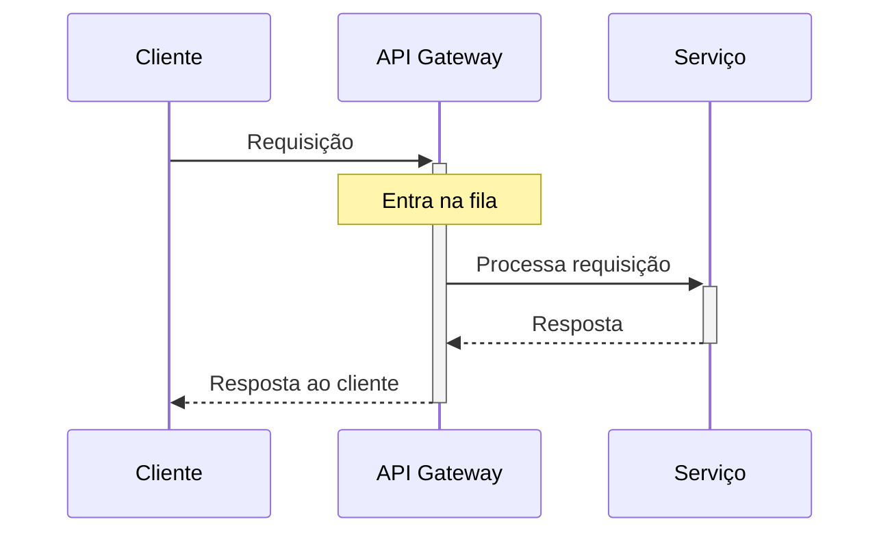

# Exemplo 1: Modelo de Fila Simples (M/M/1)

O modelo M/M/1 é o mais básico na teoria das filas, representando um sistema com:
- Uma única fila
- Um único servidor
- Chegadas seguindo distribuição de Poisson (aleatórias)
- Tempos de serviço com distribuição exponencial
- Disciplina FIFO (First-In-First-Out)

## Diagrama do Sistema


## Parâmetros Principais

- **λ (lambda)**: Taxa média de chegada (requisições por unidade de tempo)
- **μ (mu)**: Taxa média de serviço (requisições processadas por unidade de tempo)
- **ρ (rho)**: Fator de utilização do servidor (ρ = λ/μ)

## Métricas Fundamentais

Para um sistema M/M/1 estável (λ < μ), temos:

- **Utilização**: ρ = λ/μ
- **Número médio na fila**: Lq = ρ²/(1-ρ)
- **Número médio no sistema**: L = ρ/(1-ρ)
- **Tempo médio na fila**: Wq = ρ/(μ-λ)
- **Tempo médio no sistema**: W = 1/(μ-λ)
- **Probabilidade do sistema vazio**: P₀ = 1-ρ

## Aplicação na Arquitetura de Software: API Gateway

Um cenário comum em arquiteturas modernas é o API Gateway que roteia requisições para microsserviços.



## Implementação na Prática

Para um API Gateway, podemos modelar as seguintes características:

```mermaid
graph TD
    subgraph "Modelo M/M/1 no API Gateway"
    A[Chegadas: <br> Taxa média de 200 req/s] -->|Enfileiradas| B[Fila: <br> Tamanho máximo 500]
    B --> C[Processamento: <br> Capacidade 250 req/s]
    C --> D[Saída: <br> Requisições completas]
    
    E[Análise: <br> ρ = 200/250 = 0.8]
    F[Tempo médio de espera: <br> W = 1/(250-200) = 0.02s = 20ms]
    G[Tamanho médio da fila: <br> Lq = (0.8)²/(1-0.8) = 3.2 requisições]
    end
```

## Considerações de Design

1. **Estabilidade**: O sistema só é estável se λ < μ (utilização < 100%)
2. **Dimensionamento**: Quando ρ se aproxima de 1, o tempo de espera cresce exponencialmente
3. **Timeout**: Defina timeouts baseados no tempo esperado W = 1/(μ-λ)
4. **Monitoramento**: Observe a utilização (ρ) e comprimento da fila
5. **Elasticidade**: Adicione capacidade quando ρ > 0.7 para evitar degradação

## Código para Simulação

Para simular o comportamento de uma fila M/M/1 em um API Gateway:

```python
import numpy as np
import matplotlib.pyplot as plt
from collections import deque

def simulate_mm1(arrival_rate, service_rate, simulation_time):
    # Inicialização
    queue = deque()
    current_time = 0
    server_busy_until = 0
    
    # Métricas
    wait_times = []
    queue_lengths = []
    
    # Gere os tempos de chegada (distribuição exponencial)
    arrivals = []
    next_arrival = 0
    while next_arrival < simulation_time:
        next_arrival += np.random.exponential(1/arrival_rate)
        arrivals.append(next_arrival)
    
    # Simulação
    for arrival_time in arrivals:
        # Avance o tempo
        current_time = arrival_time
        
        # Registre comprimento da fila
        queue_lengths.append(len(queue))
        
        # Adicione à fila
        queue.append(arrival_time)
        
        # Se o servidor estiver livre, processe imediatamente
        if current_time >= server_busy_until:
            # Pegue o próximo da fila
            request_time = queue.popleft()
            
            # Registre tempo de espera
            wait_time = current_time - request_time
            wait_times.append(wait_time)
            
            # Gere tempo de serviço
            service_time = np.random.exponential(1/service_rate)
            
            # Atualize quando o servidor estará livre
            server_busy_until = current_time + service_time
    
    return np.mean(wait_times), np.mean(queue_lengths)
```

## Conclusão

O modelo M/M/1 fornece insights valiosos para dimensionar componentes como API Gateways, serviços web e bancos de dados. Embora seja simplificado, ele permite:

1. Estimar tempos de resposta sob diferentes cargas
2. Calcular a capacidade necessária para atender SLAs
3. Predizer comportamento sob picos de tráfego
4. Analisar riscos de saturação do sistema

Em sistemas reais, as chegadas nem sempre seguem distribuição de Poisson e os tempos de serviço podem variar, mas o modelo M/M/1 continua sendo uma boa aproximação inicial para muitos cenários de arquitetura de software.
