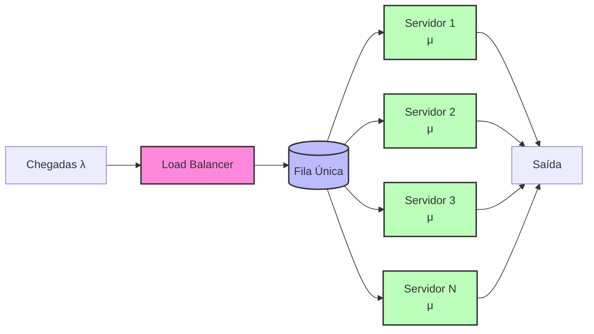
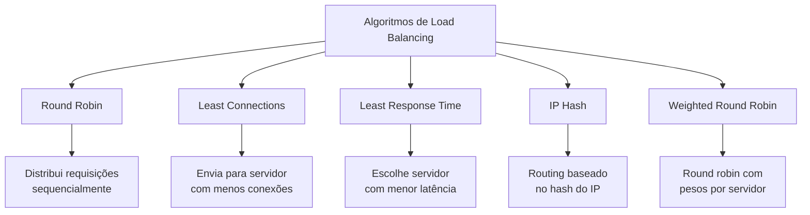
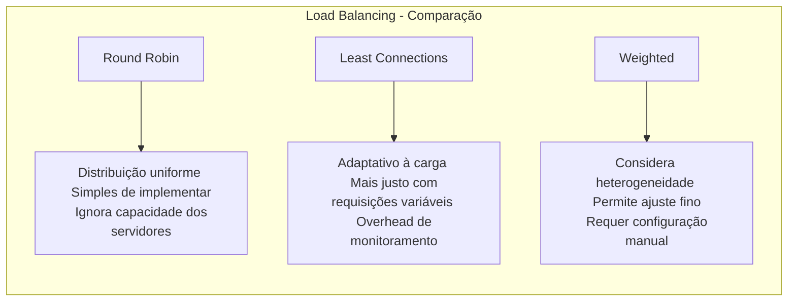
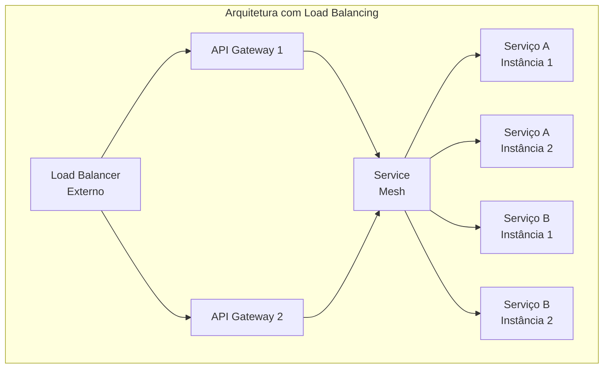
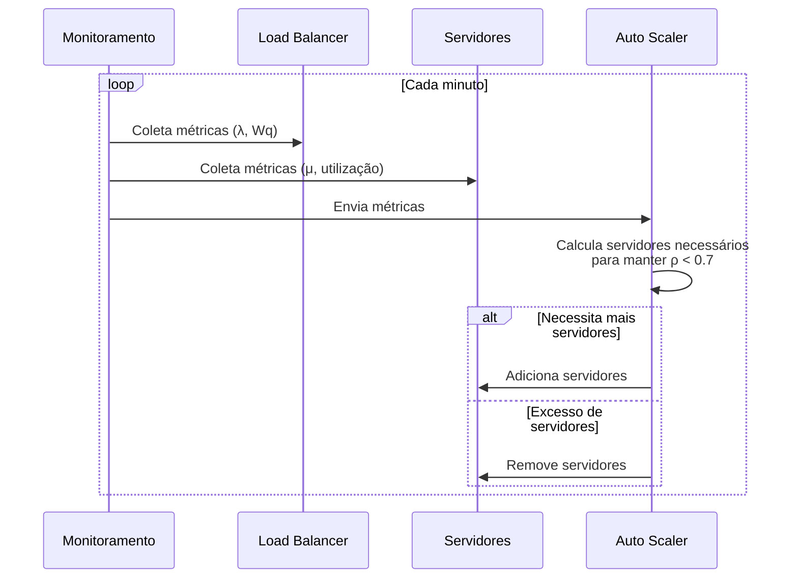

# Exemplo 2: Load Balancing com Múltiplos Servidores

O balanceamento de carga (load balancing) é uma técnica fundamental em arquiteturas distribuídas que utiliza conceitos da teoria das filas para otimizar a distribuição de requisições entre múltiplos servidores ou workers.

## Modelo de Filas M/M/c

O load balancing pode ser modelado como um sistema M/M/c, onde:
- Uma única fila de entrada
- Múltiplos servidores (c > 1)
- Chegadas com distribuição de Poisson (taxa λ)
- Tempos de serviço com distribuição exponencial (taxa μ por servidor)

## Diagrama do Sistema



## Algoritmos de Balanceamento

Existem diversos algoritmos para distribuir a carga, cada um com características específicas:



## Comparação de Performance dos Algoritmos

A escolha do algoritmo de balanceamento impacta diretamente o desempenho do sistema:



## Implementação Prática em Arquitetura de Microserviços

Em uma arquitetura de microserviços, o balanceamento ocorre em múltiplas camadas:



## Análise Matemática do Modelo M/M/c

Para um sistema com:
- Taxa de chegada: λ
- Taxa de serviço por servidor: μ
- Número de servidores: c
- Utilização: ρ = λ/(c·μ)

Quando ρ < 1, temos as seguintes métricas:

- **Probabilidade do sistema vazio**:  
  P₀ = [Σ(k=0 to c-1) (λ/μ)^k/k! + (λ/μ)^c/(c!·(1-ρ))]^(-1)

- **Tempo médio de espera na fila**:  
  Wq = P₀·(λ/μ)^c/(c!·c·μ·(1-ρ)^2)

- **Comprimento médio da fila**:  
  Lq = λ·Wq

- **Tempo médio no sistema**:  
  W = Wq + 1/μ

- **Número médio no sistema**:  
  L = Lq + λ/μ

## Comparação M/M/1 vs M/M/c

```mermaid
graph TD
    subgraph "Comparação de Modelos"
    
    A[M/M/1 <br> Um único servidor] --> A1[Utilização: ρ = λ/μ]
    A --> A2[Tempo de espera: <br> W = 1/(μ-λ)]
    
    B[M/M/c <br> c servidores] --> B1[Utilização: ρ = λ/(c·μ)]
    B --> B2[Tempo de espera: menor <br> escala quase linearmente com c]
    
    C[Ganho de Eficiência] --> C1[Redução de variância <br> Maior resiliência <br> Melhor utilização de recursos]
    end
```

## Caso de Estudo: Sistema Web com Auto-scaling

Considere um sistema web que implementa auto-scaling baseado em teoria das filas:



## Código para Implementação

Exemplo de implementação de um algoritmo de Least Connections em um load balancer:

```java
public class LeastConnectionsLoadBalancer {
    private List<Server> servers = new ArrayList<>();
    
    public synchronized Server getNextServer() {
        if (servers.isEmpty()) {
            throw new NoServersAvailableException();
        }
        
        // Encontra o servidor com menos conexões
        Server leastLoadedServer = servers.get(0);
        for (Server server : servers) {
            if (server.getActiveConnections() < leastLoadedServer.getActiveConnections()) {
                leastLoadedServer = server;
            }
        }
        
        // Incrementa o contador de conexões
        leastLoadedServer.incrementConnections();
        return leastLoadedServer;
    }
    
    public synchronized void releaseConnection(Server server) {
        server.decrementConnections();
    }
    
    public synchronized void addServer(Server server) {
        servers.add(server);
    }
    
    public synchronized void removeServer(Server server) {
        servers.remove(server);
    }
}
```

## Conclusão

O load balancing baseado na teoria das filas oferece benefícios substanciais:

1. **Maior throughput**: Processamento paralelo aumenta a capacidade total
2. **Menor latência**: Tempos de espera reduzidos significativamente
3. **Alta disponibilidade**: Falha em um servidor não compromete o sistema
4. **Escalabilidade horizontal**: Adição de servidores para atender demanda
5. **Uso eficiente de recursos**: Distribuição apropriada de carga

A teoria das filas fornece o embasamento matemático para dimensionar o número de servidores, escolher os algoritmos adequados de balanceamento e estabelecer políticas de auto-scaling eficientes em arquiteturas de software modernas.
