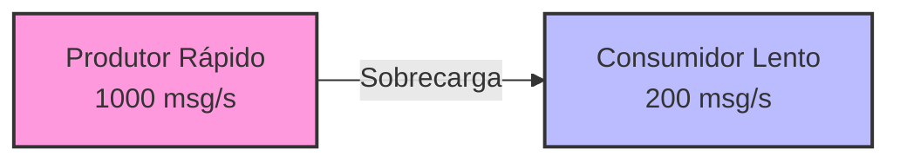
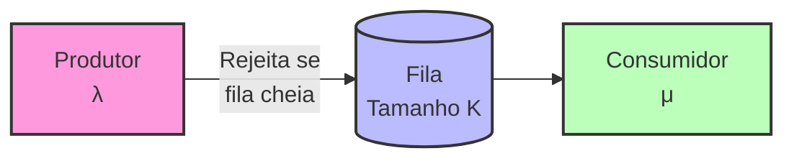
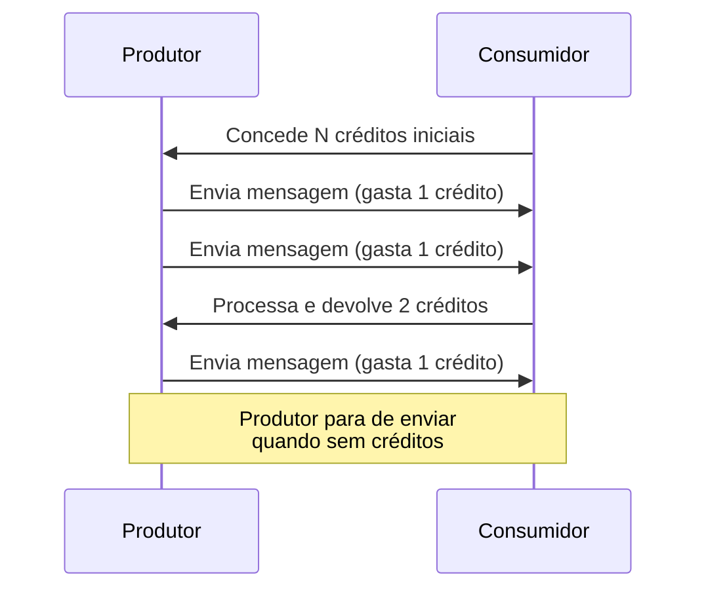
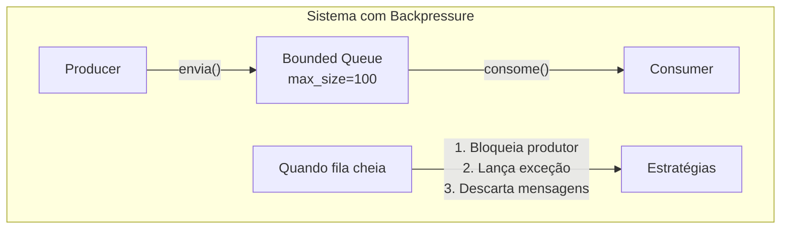
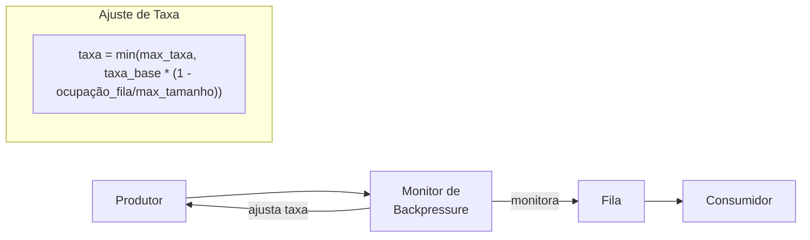
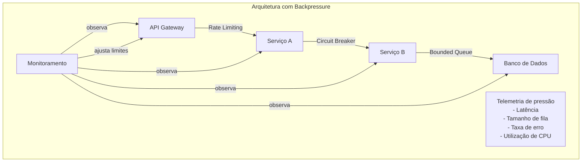
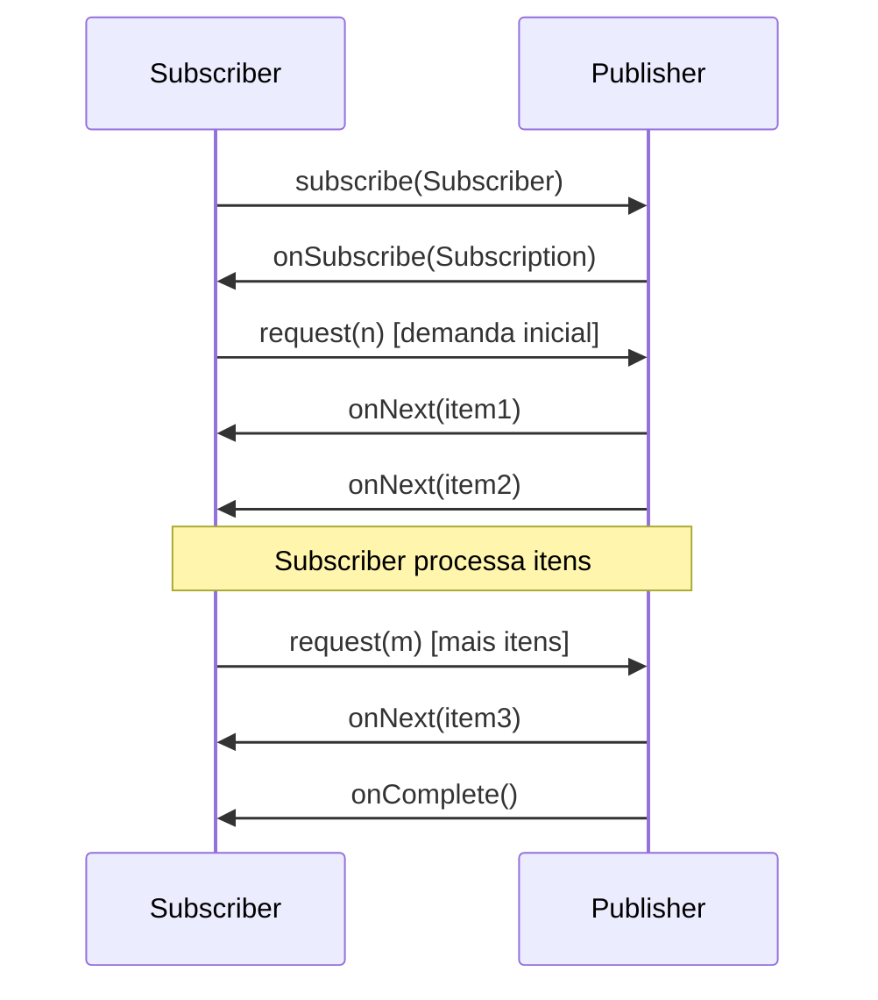
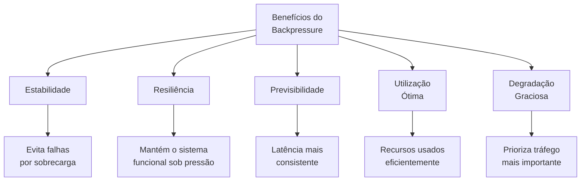

# Exemplo 3: Backpressure em Sistemas Distribuídos

Backpressure (contrapressão) é um mecanismo fundamental de controle de fluxo em sistemas distribuídos, derivado diretamente dos princípios da teoria das filas. Este mecanismo permite que componentes mais lentos sinalizem para componentes mais rápidos que diminuam a taxa de envio de mensagens ou requisições.

## O Problema da Diferença de Capacidade

Em sistemas distribuídos, é comum que diferentes componentes operem em velocidades diferentes:



Sem backpressure, o consumidor lento será sobrecarregado, levando a:
- Crescimento ilimitado da fila
- Aumento do uso de memória
- Timeout em requisições
- Eventual falha do sistema

## Modelagem com Teoria das Filas

O backpressure pode ser modelado como um sistema de filas com capacidade limitada (M/M/1/K):



Quando a fila atinge sua capacidade máxima (K), o sistema aplica contrapressão:
1. **Rejeição**: Recusa novas requisições
2. **Throttling**: Limita a taxa de envio do produtor
3. **Sinalização**: Informa o produtor para reduzir a taxa

## Técnicas de Implementação

### 1. Controle baseado em créditos



### 2. Filas com Capacidade Limitada



### 3. Taxa Adaptativa



## Aplicação em Arquiteturas de Microsserviços

O backpressure é essencial em microsserviços para preservar a estabilidade do sistema:



## Exemplo Prático: Reactive Streams

A especificação Reactive Streams implementa backpressure de forma padronizada:



## Exemplo de Código: Implementação em Reactive Streams

```java
public class BackpressureExample {
    public static void main(String[] args) {
        // Criando um fluxo de 1000 inteiros com backpressure
        Flowable<Integer> source = Flowable.range(1, 1000)
            .doOnNext(i -> System.out.println("Emitido: " + i));
            
        // Consumidor lento que processa cada item em 100ms
        source.observeOn(Schedulers.io())
              .subscribe(new Subscriber<Integer>() {
                  private Subscription subscription;
                  
                  @Override
                  public void onSubscribe(Subscription s) {
                      this.subscription = s;
                      // Solicita inicialmente apenas 5 itens
                      subscription.request(5);
                  }
                  
                  @Override
                  public void onNext(Integer item) {
                      System.out.println("Recebido: " + item);
                      try {
                          // Simula processamento lento
                          Thread.sleep(100);
                      } catch (InterruptedException e) {
                          e.printStackTrace();
                      }
                      
                      // Solicita mais um item após o processamento
                      subscription.request(1);
                  }
                  
                  @Override
                  public void onError(Throwable t) {
                      t.printStackTrace();
                  }
                  
                  @Override
                  public void onComplete() {
                      System.out.println("Concluído!");
                  }
              });
              
        // Mantém o programa rodando
        try {
            Thread.sleep(60000);
        } catch (InterruptedException e) {
            e.printStackTrace();
        }
    }
}
```

## Análise Matemática

Para um sistema com backpressure modelado como M/M/1/K:

- **Taxa efetiva de chegada (λ')**:  
  λ' = λ × (1 - PK) onde PK é a probabilidade da fila estar cheia

- **Probabilidade de rejeição (PK)**:  
  PK = (1-ρ)ρᴷ/(1-ρᴷ⁺¹) onde ρ = λ/μ

- **Throughput máximo**:  
  T = μ × (1 - P₀) onde P₀ é a probabilidade do sistema estar vazio

## Benefícios do Backpressure



## Conclusão

O backpressure baseado em teoria das filas é um padrão essencial para sistemas distribuídos, garantindo:

1. **Robustez**: Proteção contra sobrecarga
2. **Estabilidade**: Evita cascata de falhas 
3. **Performance**: Otimização de recursos
4. **Escalabilidade**: Adaptação automática à carga

Arquiteturas modernas como microsserviços, stream processing e sistemas reativos dependem fundamentalmente do backpressure para manter a integridade operacional do sistema sob condições variáveis de carga.
