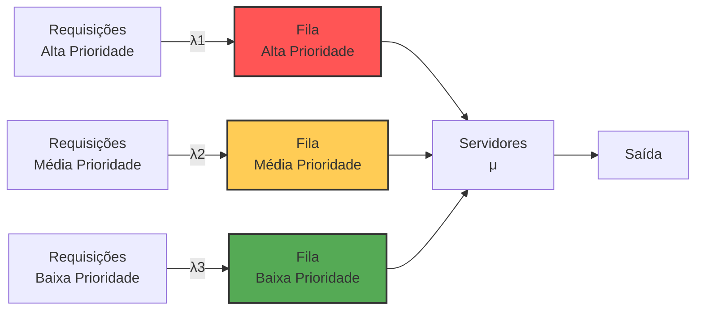
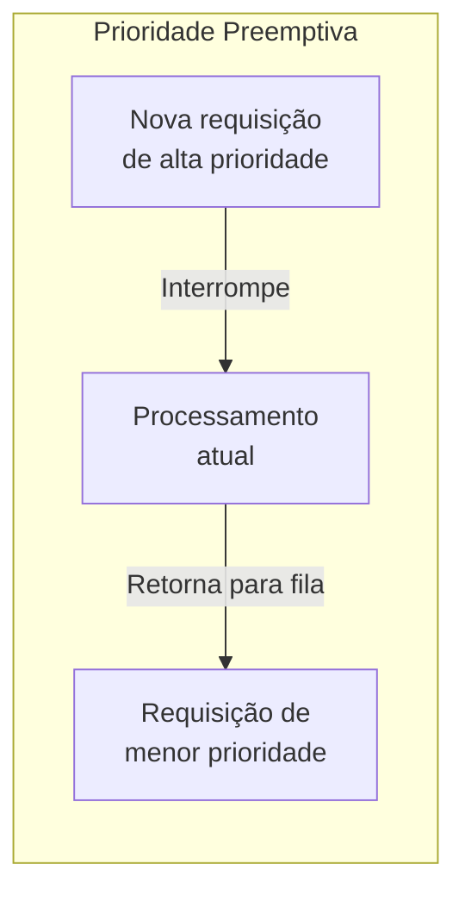
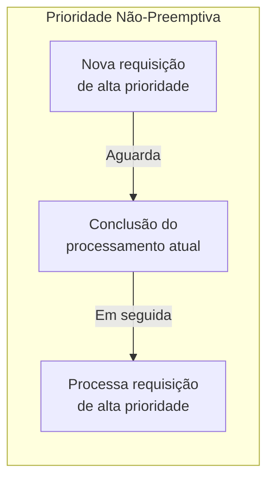
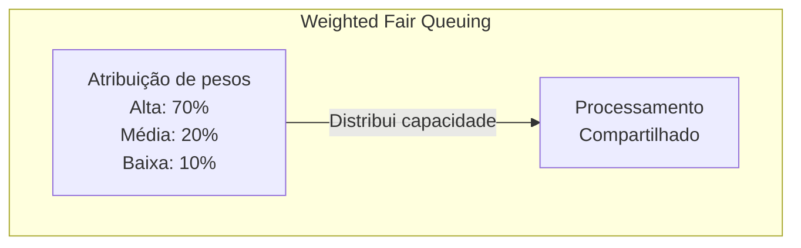
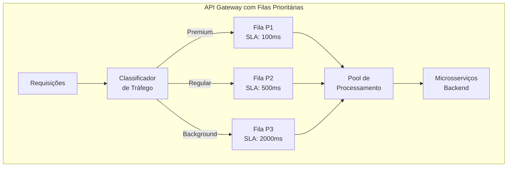
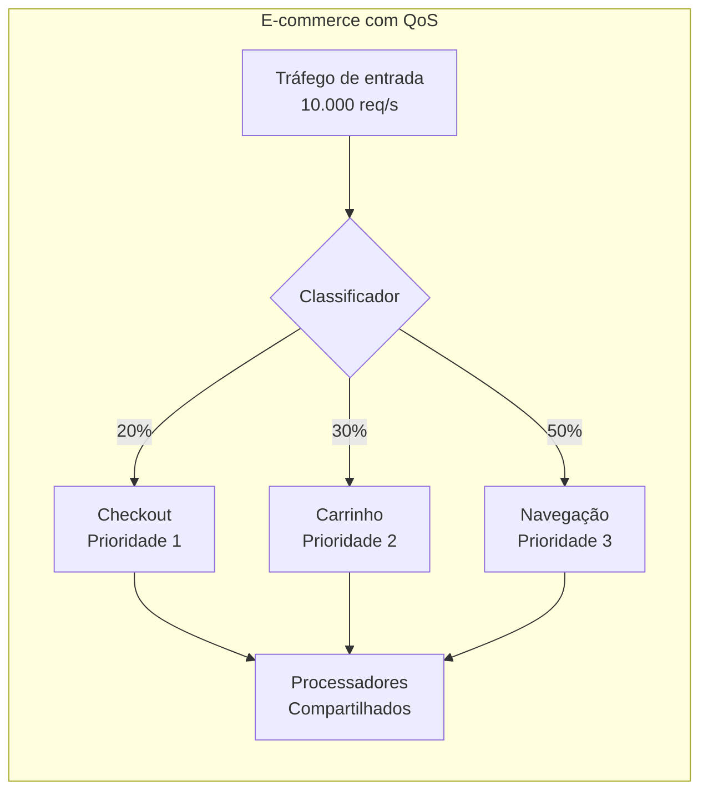
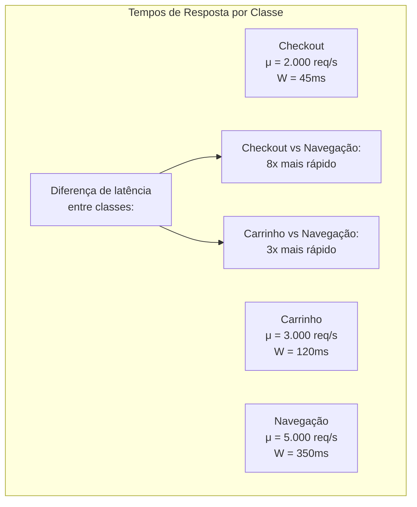
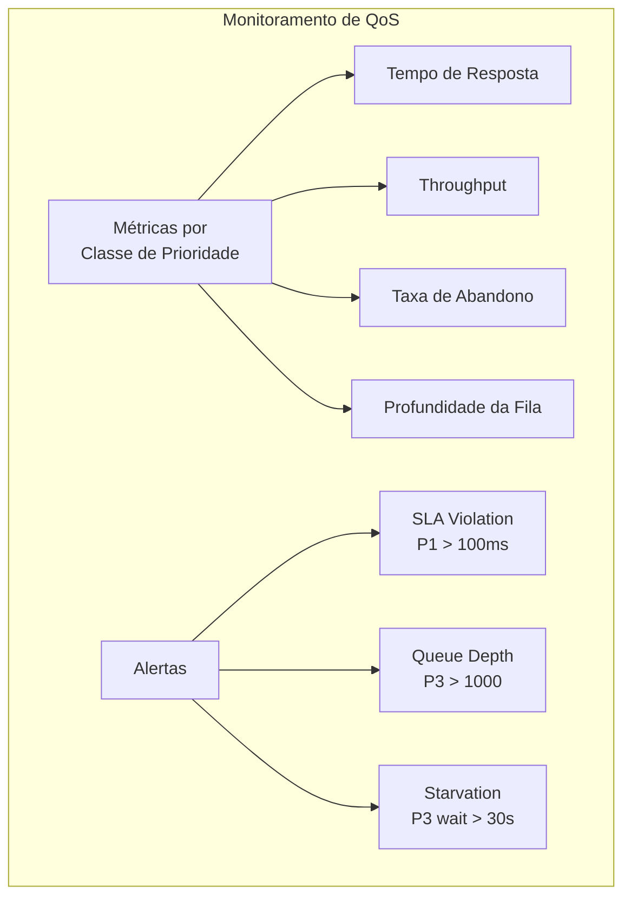
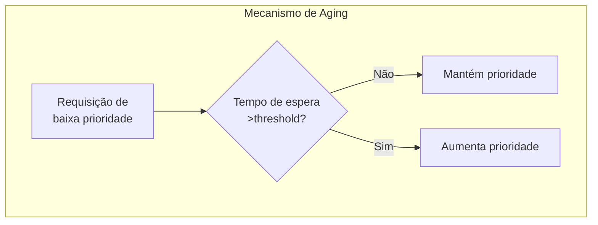
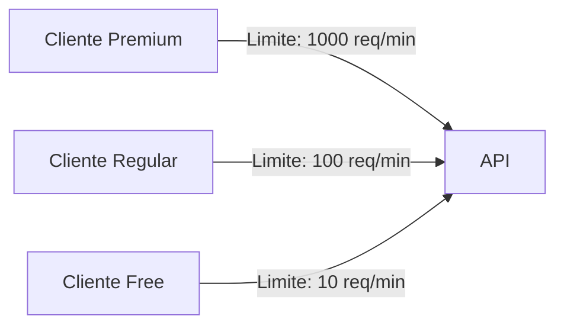

# Exemplo 4: Filas Prioritárias para QoS

Filas prioritárias (Priority Queues) são estruturas fundamentais para implementar Quality of Service (QoS) em sistemas distribuídos. Aplicando conceitos da teoria das filas, elas permitem que requisições mais críticas sejam processadas antes de requisições menos importantes, mesmo que estas tenham chegado anteriormente.

## Modelo de Filas Prioritárias

O modelo de filas prioritárias estende os modelos tradicionais associando classes de prioridade às requisições:



## Disciplinas de Atendimento

Existem diferentes estratégias para implementar a priorização:

### 1. Prioridade Estrita (Preemptiva)



### 2. Prioridade Não-Preemptiva



### 3. Weighted Fair Queuing



## Análise Matemática

Para um sistema com N classes de prioridade (não preemptivo):

- **Taxa de chegada total**: λ = λ₁ + λ₂ + ... + λₙ
- **Utilização**: ρ = λ/μ
- **Utilização por classe**: ρᵢ = λᵢ/μ

O tempo médio de espera para cada classe de prioridade é:

```
W₁ = (ρ/μ)/(1-ρ₁)
W₂ = (ρ/μ)/((1-ρ₁)(1-ρ₁-ρ₂))
...
Wᵢ = (ρ/μ)/((1-ρ₁-...-ρᵢ₋₁)(1-ρ₁-...-ρᵢ))
```

Observe que o tempo de espera aumenta consideravelmente para prioridades mais baixas conforme a utilização do sistema cresce.

## Implementação em Arquiteturas de Microserviços



## Caso de Estudo: Sistema E-commerce

Considere um sistema de e-commerce durante uma promoção especial:



### Análise de Desempenho

Com uma capacidade de processamento de 12.000 req/s:



## Código: Implementação de Filas Prioritárias

### Exemplo em Java com ThreadPoolExecutor

```java
import java.util.concurrent.*;

public class PriorityQueueService {
    // Define prioridades
    public enum RequestPriority {
        HIGH(0),
        MEDIUM(5),
        LOW(10);
        
        private final int value;
        
        RequestPriority(int value) {
            this.value = value;
        }
        
        public int getValue() {
            return value;
        }
    }
    
    // Requisição com prioridade
    public static class PriorityRequest implements Runnable, Comparable<PriorityRequest> {
        private final Runnable task;
        private final RequestPriority priority;
        private final long timestamp;
        
        public PriorityRequest(Runnable task, RequestPriority priority) {
            this.task = task;
            this.priority = priority;
            this.timestamp = System.currentTimeMillis();
        }
        
        @Override
        public void run() {
            task.run();
        }
        
        @Override
        public int compareTo(PriorityRequest other) {
            // Primeiro compara por prioridade
            int priorityCompare = Integer.compare(priority.getValue(), other.priority.getValue());
            if (priorityCompare != 0) {
                return priorityCompare;
            }
            // Para mesma prioridade, usa FIFO
            return Long.compare(timestamp, other.timestamp);
        }
    }
    
    // Executor com fila de prioridades
    private final ThreadPoolExecutor executor;
    
    public PriorityQueueService(int corePoolSize, int maxPoolSize) {
        // Usa PriorityBlockingQueue para ordenar por prioridade
        BlockingQueue<Runnable> queue = new PriorityBlockingQueue<>();
        executor = new ThreadPoolExecutor(
            corePoolSize, 
            maxPoolSize,
            60L, TimeUnit.SECONDS,
            queue
        );
    }
    
    public void submit(Runnable task, RequestPriority priority) {
        executor.execute(new PriorityRequest(task, priority));
    }
    
    public void shutdown() {
        executor.shutdown();
    }
}
```

## Monitoramento e Métricas

Para garantir que as filas prioritárias estejam funcionando adequadamente:



## Estratégias Avançadas

### Aging (Envelhecimento)

Para evitar starvation de requisições de baixa prioridade:



### Rate Limiting por Classe



## Considerações de Design e Pitfalls

1. **Head-of-Line Blocking**: Em sistemas de alta carga, requisições de baixa prioridade podem nunca ser atendidas
2. **Complexidade**: O sistema de priorização adiciona overhead
3. **Propagação de Prioridade**: Em sistemas distribuídos, a prioridade deve ser propagada através de toda a cadeia de serviços
4. **Deadlocks**: Requisições de alta prioridade podem depender de recursos bloqueados por requisições de baixa prioridade

## Conclusão

Filas prioritárias são essenciais para sistemas que precisam fornecer diferentes níveis de serviço. A teoria das filas fornece o embasamento matemático para dimensionar e configurar esses sistemas corretamente, garantindo:

1. **Previsibilidade**: SLAs consistentes para diferentes categorias de usuários/requisições
2. **Resiliência**: Proteção de funcionalidades críticas durante picos de carga
3. **Otimização de Recursos**: Uso mais eficiente da capacidade disponível
4. **Diferenciação de Serviço**: Capacidade de oferecer diferentes níveis de qualidade

Em arquiteturas de software modernas, filas prioritárias são implementadas em múltiplas camadas, desde load balancers e API gateways até sistemas de mensageria e pools de threads internos.
