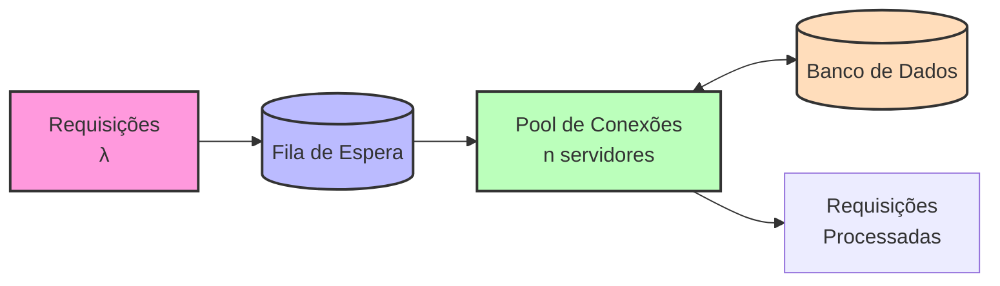
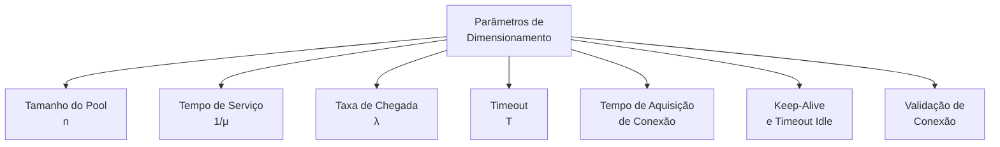
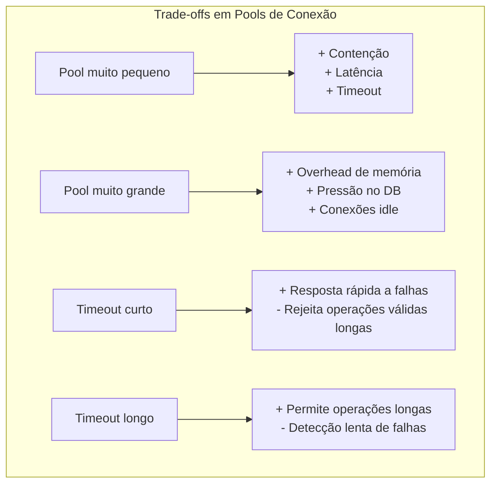
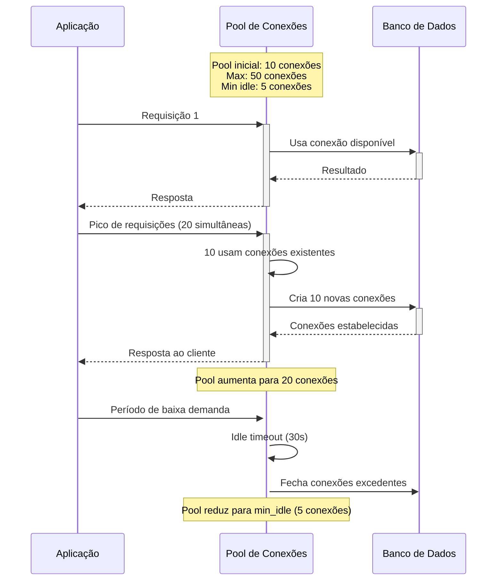
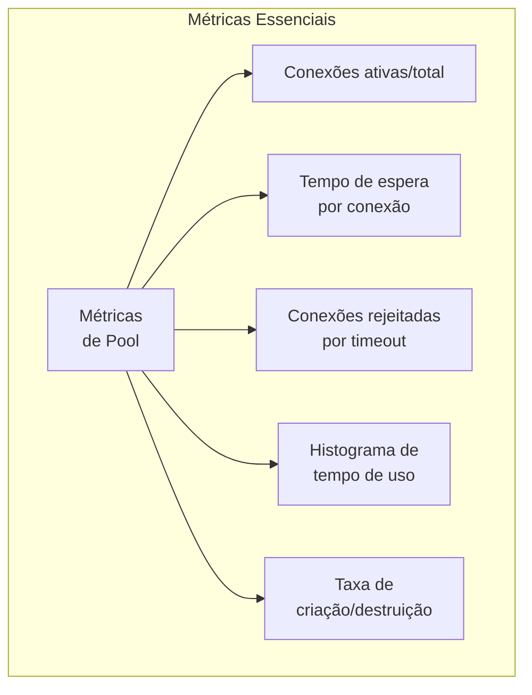
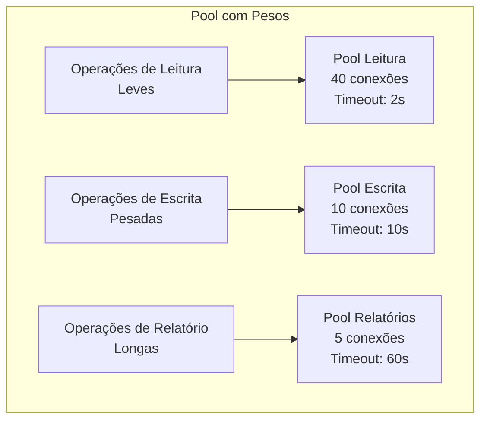
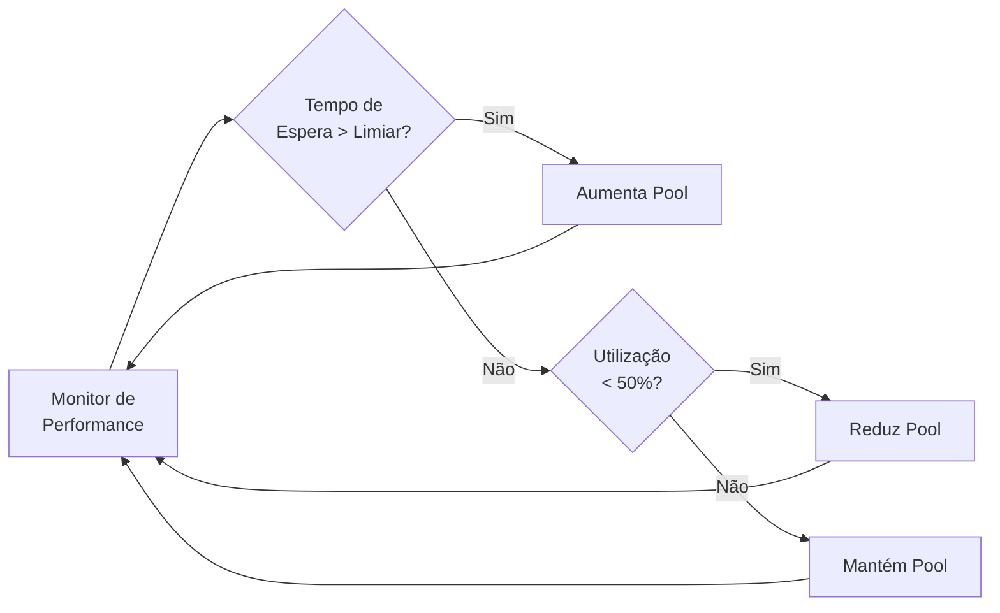
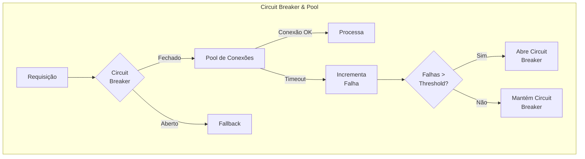
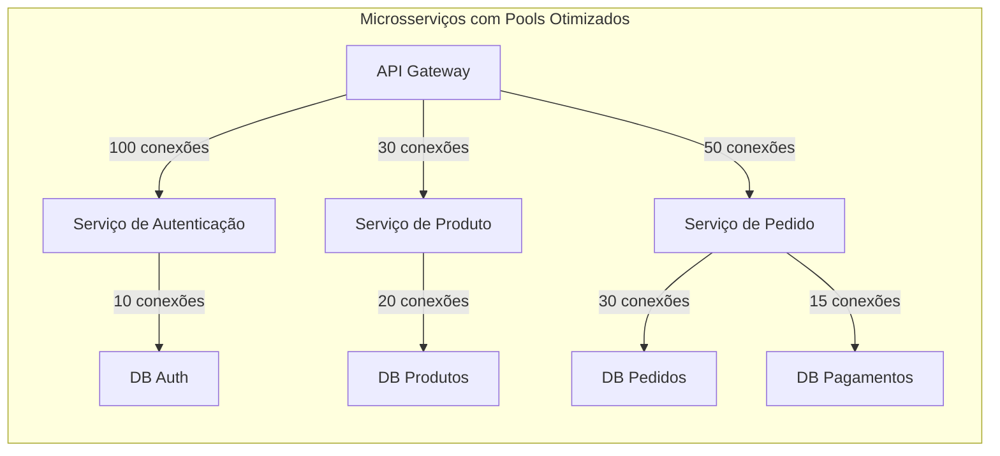
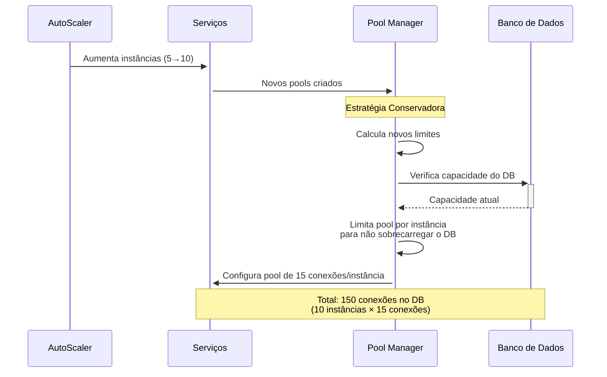

# Exemplo 5: Dimensionamento de Pools de Conexão

Pools de conexão são recursos fundamentais em sistemas distribuídos modernos, utilizados para gerenciar conexões reutilizáveis com bancos de dados, serviços web e outros recursos externos. O dimensionamento adequado desses pools é um problema clássico de teoria das filas que impacta diretamente na performance, escalabilidade e resiliência do sistema.

## Modelo de Filas para Pools de Conexão

O pool de conexões pode ser modelado como um sistema de filas com servidores limitados:



## Parâmetros Críticos

No dimensionamento de pools de conexão, diversos parâmetros precisam ser considerados:



## Análise Matemática

Para um sistema M/M/n (n conexões no pool):

- **Utilização**: ρ = λ/(n·μ)
- **Probabilidade de espera**: Pw = (n·ρ)^n / (n! * (1-ρ) * ∑₀ⁿ (n·ρ)ⁱ/i!)
- **Tempo médio de espera**: Wq = Pw / (n·μ·(1-ρ))
- **Comprimento médio da fila**: Lq = λ·Wq
- **Conexões necessárias para throughput T**:  
  n ≥ T · (tempo médio de serviço + overhead de conexão)

## Desafios e Trade-offs



## Caso de Estudo: Aplicação Web com Banco de Dados

Considere uma aplicação web com os seguintes parâmetros:

```mermaid
graph LR
    subgraph "Pool de Conexões DB"
    A[Taxa de pico: 300 req/s] --> B[Tempo médio de consulta: 50ms]
    C[Overhead de conexão: 10ms] --> D[Desired max wait: 20ms]
    
    E[Cálculo de conexões mínimas<br>n ≥ 300 * (0.05 + 0.01) = 18 conexões]
    F[Fator de segurança: 1.5x<br>n_recomendado = 27 conexões]
    end
```

## Comportamento sob Carga



## Métricas de Monitoramento

Para avaliar a eficácia do dimensionamento do pool:



## Código: HikariCP Configuration

HikariCP é uma das bibliotecas mais eficientes para pools de conexão em Java:

```java
import com.zaxxer.hikari.HikariConfig;
import com.zaxxer.hikari.HikariDataSource;

public class ConnectionPoolConfig {
    
    public static HikariDataSource configurePool() {
        HikariConfig config = new HikariConfig();
        
        // Configurações básicas
        config.setJdbcUrl("jdbc:postgresql://localhost:5432/mydb");
        config.setUsername("username");
        config.setPassword("password");
        
        // Dimensionamento do pool
        config.setMinimumIdle(5);                // Mínimo de conexões ociosas
        config.setMaximumPoolSize(30);           // Máximo de conexões no pool
        
        // Timeouts críticos
        config.setConnectionTimeout(5000);       // 5 segundos para timeout de aquisição
        config.setIdleTimeout(300000);           // 5 minutos para timeout de idle
        config.setMaxLifetime(1800000);          // 30 minutos de vida máxima da conexão
        
        // Validação de conexões
        config.setValidationTimeout(3000);       // 3 segundos para timeout de validação
        config.setConnectionTestQuery("SELECT 1"); // Query para testar conexão
        
        // Configurações de performance
        config.addDataSourceProperty("cachePrepStmts", "true");
        config.addDataSourceProperty("prepStmtCacheSize", "250");
        config.addDataSourceProperty("prepStmtCacheSqlLimit", "2048");
        
        return new HikariDataSource(config);
    }
    
    // Exemplo de uso com métricas
    public static void monitorPool(HikariDataSource dataSource) {
        // Coleta métricas a cada 60 segundos
        new Thread(() -> {
            while(true) {
                try {
                    int activeConnections = dataSource.getHikariPoolMXBean().getActiveConnections();
                    int totalConnections = dataSource.getHikariPoolMXBean().getTotalConnections();
                    int threadsAwaitingConnection = dataSource.getHikariPoolMXBean().getThreadsAwaitingConnection();
                    
                    System.out.printf("Pool stats: active=%d, total=%d, waiting=%d, usage=%.2f%%%n",
                        activeConnections,
                        totalConnections,
                        threadsAwaitingConnection,
                        (activeConnections * 100.0) / totalConnections);
                    
                    Thread.sleep(60000);
                } catch (Exception e) {
                    e.printStackTrace();
                }
            }
        }).start();
    }
}
```

## Estratégias Avançadas

### Conexões com Pesos

Para sistemas com diferentes tipos de operações:



### Auto-scaling Dinâmico



## Interações com Circuit Breaker

Em sistemas resilientes, o pool de conexões interage com padrões de circuit breaker:



## Exemplo Prático: Dimensionamento para Microsserviços

Em uma arquitetura de microsserviços, diferentes serviços têm necessidades distintas:



## Considerações de Elasticidade na Nuvem

Para ambientes elásticos de cloud, pools precisam se adaptar:



## Fórmulas para Dimensionamento Prático

Para aplicações reais, as seguintes fórmulas são úteis:

1. **Máximo teórico de conexões concorrentes**:  
   `Connections = Threads × (DB Operations per Request)`

2. **Tamanho de pool baseado em latência**:  
   `Pool Size = Throughput × (Service Time + Latency Overhead)`

3. **Tamanho de pool por instância em arquitetura elástica**:  
   `Instance Pool Size = Total Desired Connections / Number of Instances`

4. **Utilização ótima**:  
   Para evitar contenção significativa, mantenha ρ < 0.8

## Problemas Comuns e Soluções

| Problema | Sintoma | Causa Provável | Solução |
|----------|---------|----------------|---------|
| Connection Starvation | Timeouts de conexão | Pool subdimensionado | Aumentar pool ou reduzir tempo de uso por conexão |
| Connection Leaks | Pool esgota gradualmente | Conexões não devolvidas | Implementar validação e timeout de abandonamento |
| DB Overload | Erros no banco de dados | Pool superdimensionado | Limitar tamanho máximo do pool |
| High Latency Spikes | Períodos de resposta lenta | Revalidação de conexões | Ajustar estratégia de teste de conexão |
| Cycling Under Load | Criação/destruição frequente | Min/max muito próximos | Aumentar mínimo de conexões ociosas |

## Conclusão

O dimensionamento adequado de pools de conexão é uma aplicação direta da teoria das filas que equilibra múltiplos fatores:

1. **Performance**: Minimizando tempo de espera e maximizando throughput
2. **Resiliência**: Garantindo recuperação sob falhas e picos de carga
3. **Eficiência**: Otimizando uso de recursos valiosos como memória e conexões DB
4. **Previsibilidade**: Estabelecendo comportamento consistente sob condições variáveis

Em sistemas modernos, os pools de conexão são frequentemente autoadaptativos, ajustando-se dinamicamente às condições de carga e disponibilidade de recursos, sempre utilizando os princípios da teoria das filas como fundamento para essas decisões.
