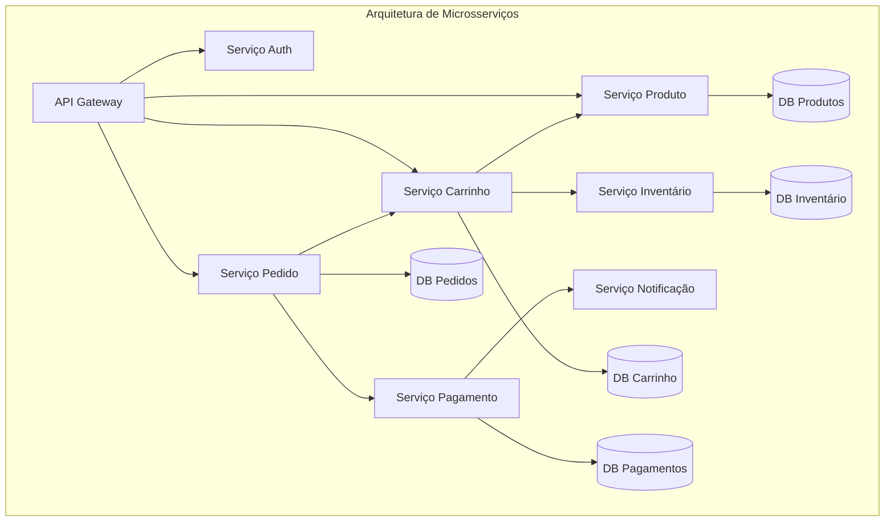
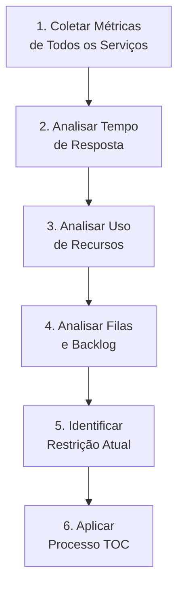
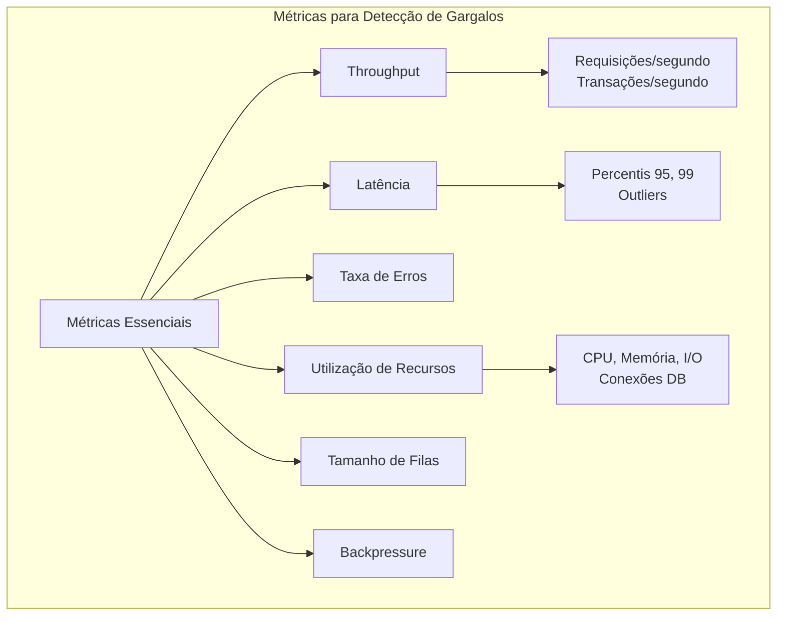
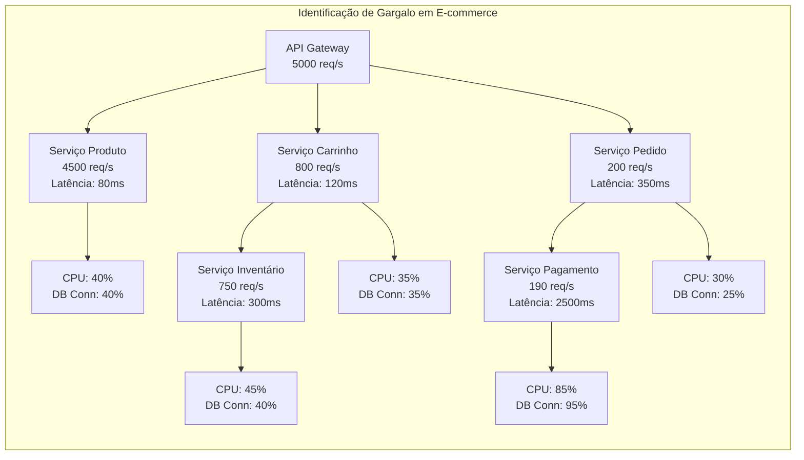
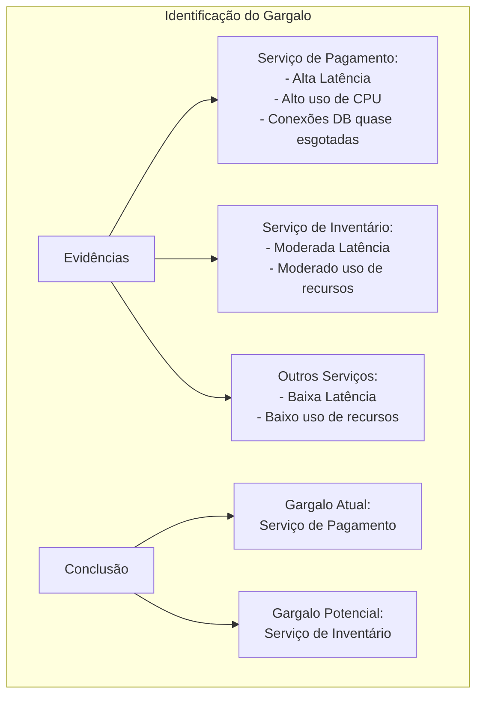
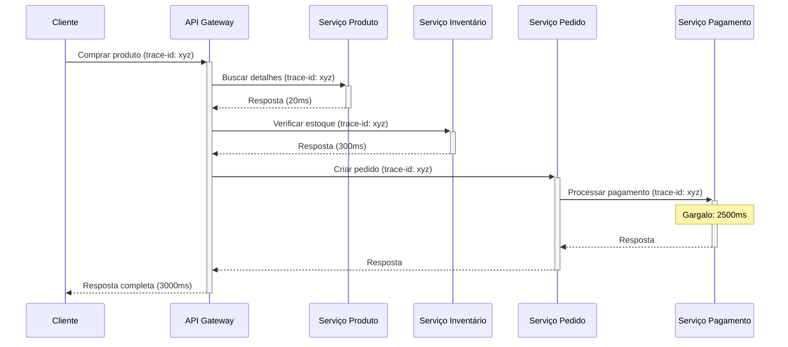
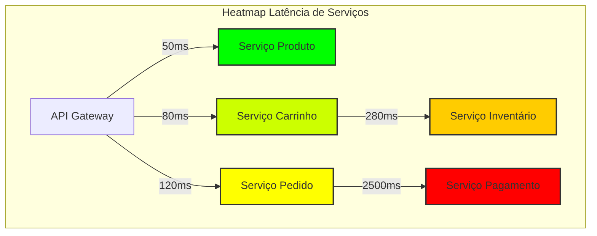
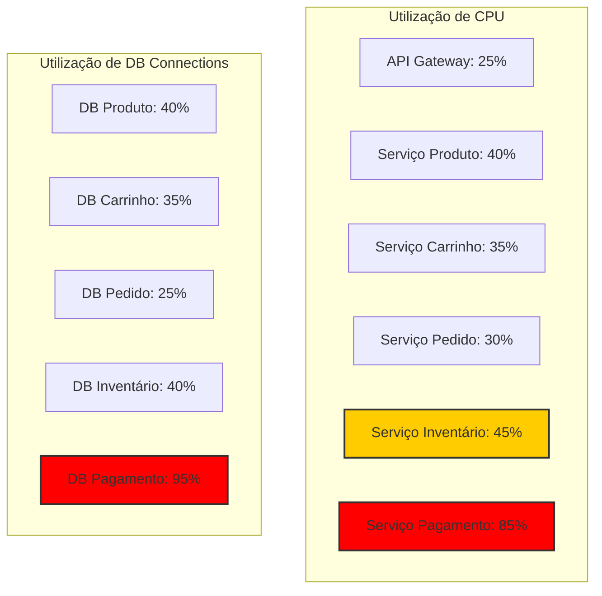
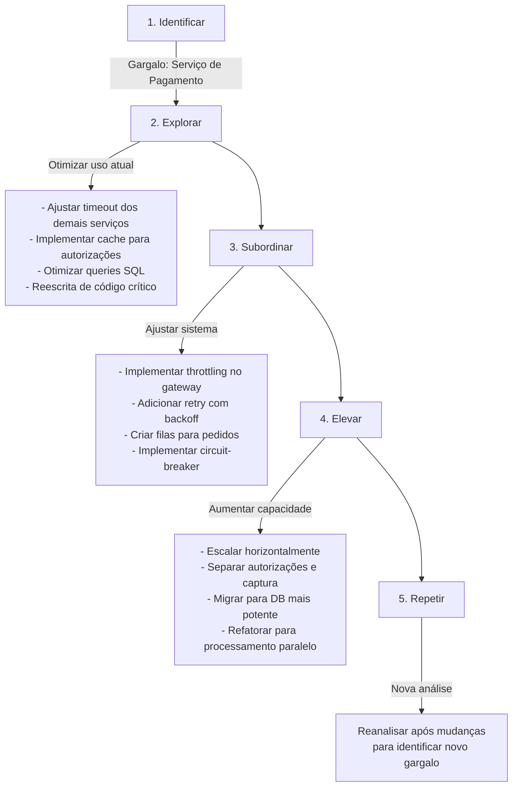

# Exemplo 1: Identificação de Gargalos em Microsserviços

A identificação de gargalos (restrições) é o primeiro e mais crucial passo na aplicação da Teoria das Restrições em arquiteturas de software. Em sistemas de microsserviços, essa identificação se torna particularmente desafiadora devido à distribuição e complexidade das interações entre componentes.

## O Problema dos Gargalos Ocultos

Em arquiteturas de microsserviços, o gargalo frequentemente não é óbvio:



## Abordagem Sistemática para Identificação

A TOC propõe uma abordagem sistemática para identificar gargalos:



## Métricas Críticas para Identificação



## Caso de Estudo: E-commerce sob Carga

Considere um sistema de e-commerce durante uma promoção de Black Friday:



### Análise de Throughput

Analisando o diagrama acima, observamos:

1. O throughput vai diminuindo à medida que percorremos o fluxo
2. O Serviço de Pagamento tem alta latência (2500ms) e alto uso de recursos
3. Existe grande discrepância entre o volume de requisições nos serviços iniciais e finais do fluxo

### Conclusão da Análise



## Ferramentas para Identificação

### 1. Tracing Distribuído



### 2. Heatmaps de Latência



### 3. Monitoramento de Recursos



## Código para Identificação Automática

Implementação simplificada de detecção automática de gargalos:

```java
public class BottleneckDetector {
    private final Map<String, ServiceMetrics> serviceMetricsMap = new HashMap<>();
    private static final double CPU_THRESHOLD = 0.8;  // 80%
    private static final double DB_CONN_THRESHOLD = 0.9;  // 90%
    private static final double LATENCY_THRESHOLD_FACTOR = 2.0;  // 2x da média

    // Classe que armazena métricas de um serviço
    @Data
    public static class ServiceMetrics {
        private String serviceName;
        private double cpuUsage;
        private double dbConnectionUsage;
        private double averageLatencyMs;
        private double throughputRps;
        private int queueSize;
    }

    // Atualiza métricas para um serviço
    public void updateMetrics(String serviceName, double cpuUsage, 
                              double dbConnectionUsage, double latencyMs, 
                              double throughputRps, int queueSize) {
        ServiceMetrics metrics = new ServiceMetrics();
        metrics.setServiceName(serviceName);
        metrics.setCpuUsage(cpuUsage);
        metrics.setDbConnectionUsage(dbConnectionUsage);
        metrics.setAverageLatencyMs(latencyMs);
        metrics.setThroughputRps(throughputRps);
        metrics.setQueueSize(queueSize);
        
        serviceMetricsMap.put(serviceName, metrics);
    }

    // Detecta possíveis gargalos
    public List<String> detectBottlenecks() {
        List<String> bottlenecks = new ArrayList<>();
        double totalLatency = 0;
        int serviceCount = serviceMetricsMap.size();
        
        // Calcula a média de latência do sistema
        for (ServiceMetrics metrics : serviceMetricsMap.values()) {
            totalLatency += metrics.getAverageLatencyMs();
        }
        double averageSystemLatency = totalLatency / serviceCount;
        
        // Avalia cada serviço pelos múltiplos critérios
        for (ServiceMetrics metrics : serviceMetricsMap.values()) {
            boolean isBottleneck = false;
            List<String> reasons = new ArrayList<>();
            
            // Verifica CPU
            if (metrics.getCpuUsage() > CPU_THRESHOLD) {
                isBottleneck = true;
                reasons.add(String.format("CPU usage high (%.1f%%)", metrics.getCpuUsage() * 100));
            }
            
            // Verifica uso de conexões DB
            if (metrics.getDbConnectionUsage() > DB_CONN_THRESHOLD) {
                isBottleneck = true;
                reasons.add(String.format("DB connection usage high (%.1f%%)", 
                                         metrics.getDbConnectionUsage() * 100));
            }
            
            // Verifica latência em relação à média
            if (metrics.getAverageLatencyMs() > averageSystemLatency * LATENCY_THRESHOLD_FACTOR) {
                isBottleneck = true;
                reasons.add(String.format("Latency high (%.1fms vs system avg %.1fms)", 
                                          metrics.getAverageLatencyMs(), averageSystemLatency));
            }
            
            // Verifica tamanho da fila
            if (metrics.getQueueSize() > metrics.getThroughputRps()) {
                isBottleneck = true;
                reasons.add(String.format("Queue size (%d) exceeds throughput (%.1f req/s)", 
                                          metrics.getQueueSize(), metrics.getThroughputRps()));
            }
            
            // Se for um gargalo, adiciona à lista com as razões
            if (isBottleneck) {
                String bottleneckInfo = metrics.getServiceName() + " - Reasons: " + String.join(", ", reasons);
                bottlenecks.add(bottleneckInfo);
            }
        }
        
        return bottlenecks;
    }
    
    // Método para obter o serviço com maior uso relativo de recursos
    public String getPrimaryBottleneck() {
        String primaryBottleneck = null;
        double highestConstraintFactor = 0;
        
        for (ServiceMetrics metrics : serviceMetricsMap.values()) {
            // Calcula fator combinado de restrição
            double constraintFactor = Math.max(metrics.getCpuUsage(), metrics.getDbConnectionUsage());
            
            if (constraintFactor > highestConstraintFactor) {
                highestConstraintFactor = constraintFactor;
                primaryBottleneck = metrics.getServiceName();
            }
        }
        
        return primaryBottleneck;
    }
}
```

## Próximos Passos: Aplicando TOC

Após identificar que o Serviço de Pagamento é o gargalo principal:



## Considerações Práticas

1. **O gargalo se move**: Após resolver uma restrição, outra emerge como limitante
2. **Falsos positivos**: Uma "explosão" temporária pode não ser o verdadeiro gargalo sistêmico
3. **Restrições sazonais**: Diferentes serviços podem se tornar gargalos em diferentes padrões de uso
4. **Restrições políticas**: Alguns gargalos existem por políticas ou limitações contratuais (ex: quotas API)
5. **Análise holística**: A identificação deve considerar todo o sistema, não apenas componentes isolados

## Conclusão

A identificação precisa de gargalos é a base para a aplicação efetiva da Teoria das Restrições em arquiteturas de microsserviços. Utilizando uma combinação de:

- Monitoramento sistemático de métricas-chave
- Tracing distribuído para análise de fluxos completos
- Ferramentas de visualização para identificação rápida
- Análise automatizada para detecção contínua

É possível localizar os verdadeiros limitantes do sistema e concentrar os esforços de otimização onde eles produzirão o maior impacto, seguindo o princípio fundamental da TOC: "A resistência de uma corrente é determinada por seu elo mais fraco."
