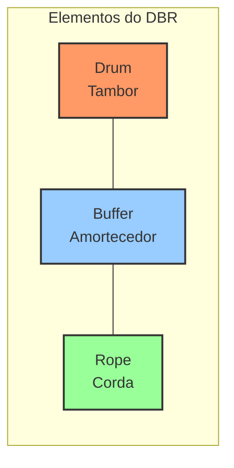
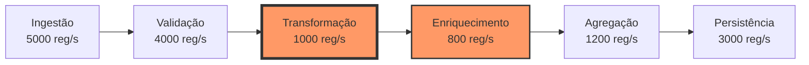
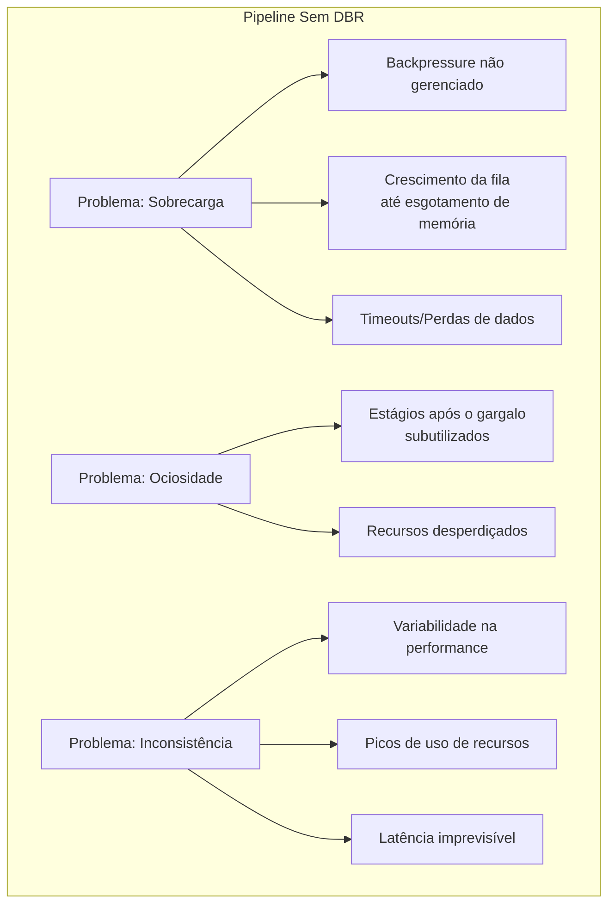
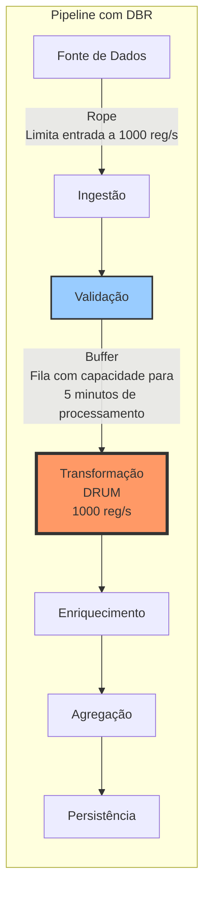
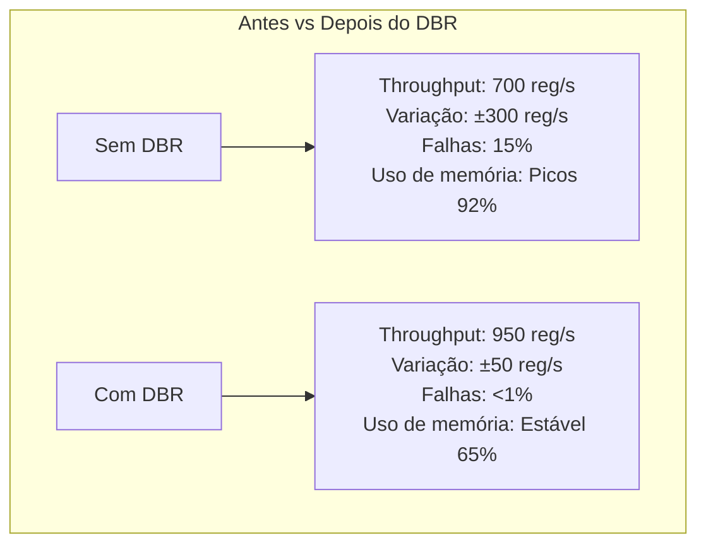
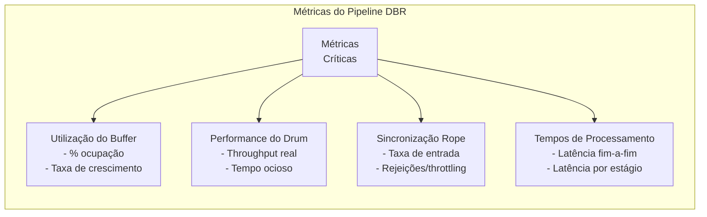
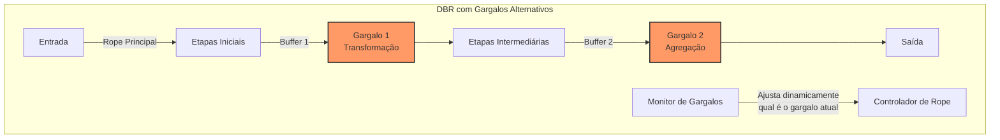
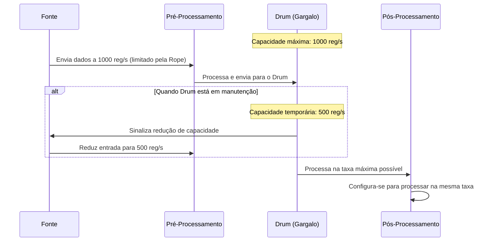

# Exemplo 2: Drum-Buffer-Rope em Pipelines de Dados

O modelo Drum-Buffer-Rope (DBR) é uma das aplicações mais práticas da Teoria das Restrições (TOC) para gerenciar fluxos de trabalho. Em arquiteturas de software modernas, este conceito é particularmente valioso para pipelines de processamento de dados, onde diversos estágios com capacidades diferentes precisam trabalhar de forma sincronizada.

## Conceito Drum-Buffer-Rope (DBR)



Onde:

- **Drum (Tambor)**: O recurso restritivo (gargalo) que dita o ritmo de todo o sistema
- **Buffer (Amortecedor)**: Proteção de tempo/capacidade antes do gargalo para garantir que nunca fique ocioso
- **Rope (Corda)**: Mecanismo de sincronização que limita a entrada de trabalho de acordo com a capacidade do gargalo

## Aplicação em Pipelines de Dados

Considere um pipeline de processamento de dados com as seguintes etapas:



Neste pipeline, a etapa de **Transformação** é o gargalo (Drum), com capacidade de apenas 1000 registros/segundo.

## Problemas Sem DBR

Sem um mecanismo DBR, o pipeline enfrentará vários problemas:



## Implementando DBR no Pipeline

Aplicando o modelo DBR:



### Implementação Detalhada

1. **Identificação do Drum (Tambor)**:
   - Monitoramento identificou o estágio de Transformação como o gargalo (1000 reg/s)
   - Este estágio dita o ritmo máximo sustentável de todo o pipeline

2. **Dimensionamento do Buffer (Amortecedor)**:
   - Buffer antes da Transformação para garantir que nunca fique sem trabalho
   - Tamanho calculado considerando variabilidade: 5 minutos * 1000 reg/s = 300.000 registros
   - Implementado como uma fila com prioridade para garantir processamento FIFO

3. **Implementação da Rope (Corda)**:
   - Control-flow backpressure ou rate limiting na entrada
   - Limite de ingestão sincronizado com a capacidade do gargalo (1000 reg/s)
   - Mecanismo de feedback que ajusta dinamicamente a taxa de acordo com o nível do buffer

## Código: Implementação em Apache Kafka Streams

```java
public class DrumBufferRopePipeline {
    
    // Configurações do pipeline DBR
    private static final int DRUM_CAPACITY_PER_SECOND = 1000;
    private static final int BUFFER_MINUTES = 5;
    private static final int BUFFER_CAPACITY = DRUM_CAPACITY_PER_SECOND * BUFFER_MINUTES * 60;
    
    public static void main(String[] args) {
        Properties props = new Properties();
        props.put(StreamsConfig.APPLICATION_ID_CONFIG, "dbr-pipeline");
        props.put(StreamsConfig.BOOTSTRAP_SERVERS_CONFIG, "kafka:9092");
        
        // Importante: configurar o correto paralelismo baseado no gargalo
        props.put(StreamsConfig.NUM_STREAM_THREADS_CONFIG, 
                  calculateOptimalThreads(DRUM_CAPACITY_PER_SECOND));
        
        StreamsBuilder builder = new StreamsBuilder();
        
        // Fonte de dados (com rate limiting via rope)
        KStream<String, DataRecord> source = builder.stream("input-topic", 
                Consumed.with(Serdes.String(), DataRecordSerde.instance())
                        .withRateLimit(DRUM_CAPACITY_PER_SECOND)); // A "rope"
        
        // Pipeline de processamento
        KStream<String, DataRecord> validated = source
                .filter((key, value) -> validateRecord(value));
        
        // Buffer antes do drum (estágio de transformação)
        // Configurado com maior prioridade de processamento
        KStream<String, DataRecord> buffered = validated
                .through("buffer-topic", 
                        Produced.with(Serdes.String(), DataRecordSerde.instance())
                                .withBufferCapacity(BUFFER_CAPACITY));
        
        // Drum - Estágio de transformação (gargalo)
        // O número de partições do tópico e paralelismo devem ser otimizados
        KStream<String, DataRecord> transformed = buffered
                .mapValues(record -> transform(record))
                .peek((k, v) -> monitorDrumThroughput()); // Monitoramento do gargalo
        
        // Estágios pós-drum
        KStream<String, DataRecord> enriched = transformed
                .mapValues(record -> enrich(record));
        
        KStream<String, DataRecord> aggregated = enriched
                .groupByKey()
                .aggregate(
                        () -> new AggregatedRecord(),
                        (key, value, aggregate) -> aggregateRecords(value, aggregate),
                        Materialized.with(Serdes.String(), AggregatedRecordSerde.instance())
                )
                .toStream();
        
        // Persistência do resultado
        aggregated.to("output-topic", 
                    Produced.with(Serdes.String(), AggregatedRecordSerde.instance()));
        
        // Iniciar o pipeline
        KafkaStreams streams = new KafkaStreams(builder.build(), props);
        
        // Monitoramento do estado do buffer
        streams.setStateListener((newState, oldState) -> {
            if (newState == KafkaStreams.State.RUNNING) {
                startBufferMonitoring();
            }
        });
        
        streams.start();
    }
    
    // Calcula o número ótimo de threads baseado na capacidade do gargalo
    private static int calculateOptimalThreads(int drumCapacity) {
        int coreCount = Runtime.getRuntime().availableProcessors();
        int theoreticalOptimum = Math.max(1, drumCapacity / 200); // Assumindo 200 registros/s por thread
        return Math.min(coreCount, theoreticalOptimum);
    }
    
    // Monitoramento do buffer para controle dinâmico do rate limiting
    private static void startBufferMonitoring() {
        ScheduledExecutorService scheduler = Executors.newScheduledThreadPool(1);
        scheduler.scheduleAtFixedRate(() -> {
            double bufferUtilization = getCurrentBufferUtilization();
            
            // Ajusta o rate limiting baseado no nível do buffer
            if (bufferUtilization > 0.9) { // Buffer quase cheio
                decreaseInputRate(0.8); // Reduz para 80% da taxa atual
            } else if (bufferUtilization < 0.3) { // Buffer muito vazio
                increaseInputRate(1.2); // Aumenta para 120% da taxa atual, até o máximo
            }
            
            // Logs para monitoramento
            System.out.printf("Buffer: %.1f%% | Drum throughput: %d/s\n", 
                             bufferUtilization * 100, getCurrentDrumThroughput());
            
        }, 10, 10, TimeUnit.SECONDS);
    }
    
    // Implementações dos processadores (omitindo detalhes internos)
    private static boolean validateRecord(DataRecord record) { /*...*/ return true; }
    private static DataRecord transform(DataRecord record) { /*...*/ return record; }
    private static DataRecord enrich(DataRecord record) { /*...*/ return record; }
    private static AggregatedRecord aggregateRecords(DataRecord record, AggregatedRecord aggregate) { /*...*/ return aggregate; }
}
```

## Benefícios Observados



## Métricas para Monitoramento do DBR

Para avaliar a eficácia do DBR, é importante monitorar:



## Padrões Avançados

### Drum-Buffer-Rope com Múltiplos Gargalos

Em pipelines complexos, pode haver mais de um gargalo potencial:



### Subordinação Total

Para maximizar a eficiência, todo o sistema deve se subordinar ao gargalo:



## Considerações de Implementação

1. **Monitoramento Dinâmico**: O drum pode mudar dependendo das condições, exigindo reavaliação contínua
2. **Tamanho do Buffer**: Buffer muito grande desperdiça recursos, muito pequeno não protege o drum
3. **Ajuste Adaptativo**: A rope deve se ajustar a mudanças na capacidade do drum
4. **Dimensionamento Horizontal**: Ao escalar, manter a proporção baseada na capacidade do gargalo
5. **Degradação Graciosa**: Implementar mecanismos para throttling controlado sob sobrecarga

## Conclusão

O padrão Drum-Buffer-Rope da Teoria das Restrições fornece um modelo poderoso para otimizar pipelines de dados, garantindo:

1. **Estabilidade**: O sistema opera em um ritmo constante e previsível
2. **Eficiência**: O recurso restritivo (gargalo) é totalmente utilizado e protegido
3. **Controle**: O fluxo de entrada é sincronizado com a capacidade real do sistema
4. **Resiliência**: Variações de demanda e disponibilidade são absorvidas pelos buffers
5. **Throughput Ótimo**: Todo o sistema opera na máxima capacidade sustentável

Em um mundo onde o processamento de grandes volumes de dados em tempo real se torna cada vez mais comum, o DBR oferece um framework sólido para projetar pipelines que operam de forma eficiente, previsível e robusta, mesmo sob condições variáveis de carga e disponibilidade de recursos.
