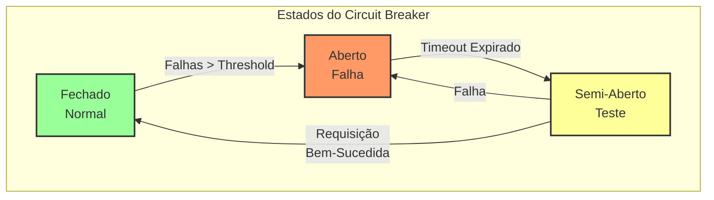
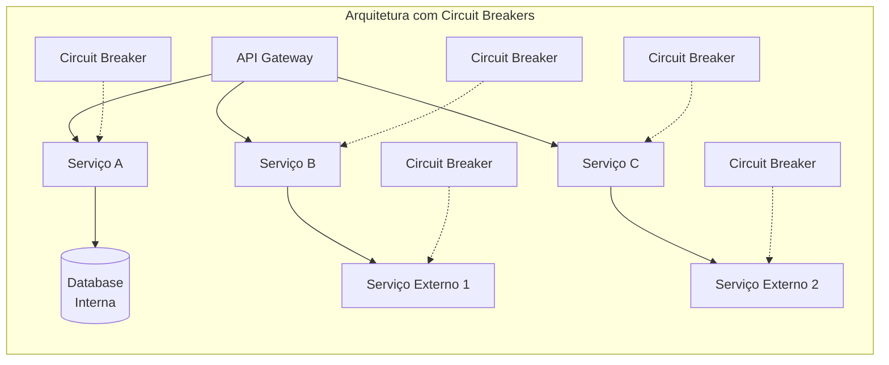
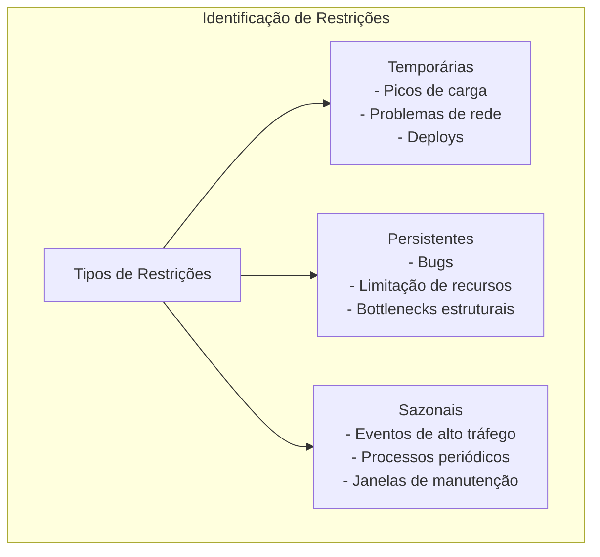
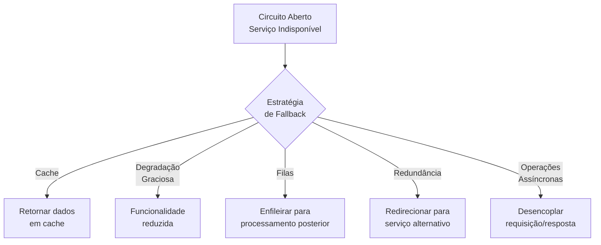
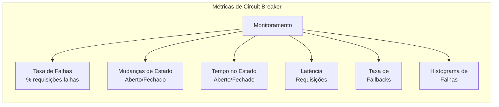
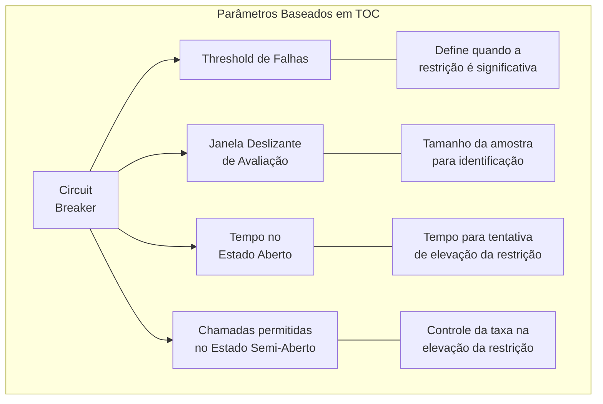
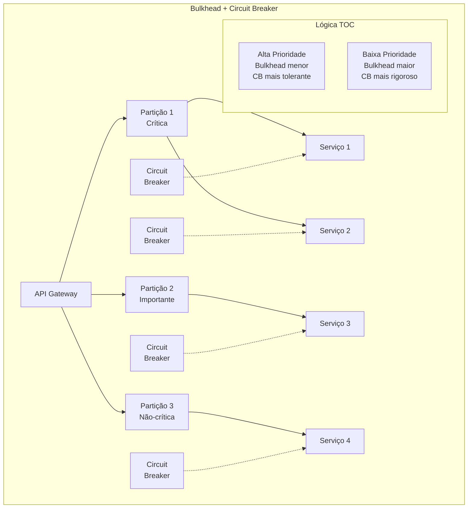
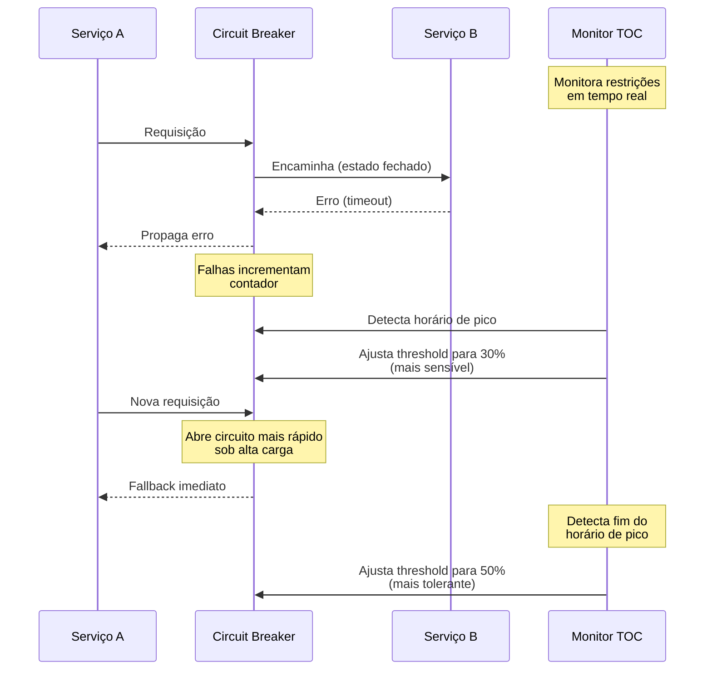
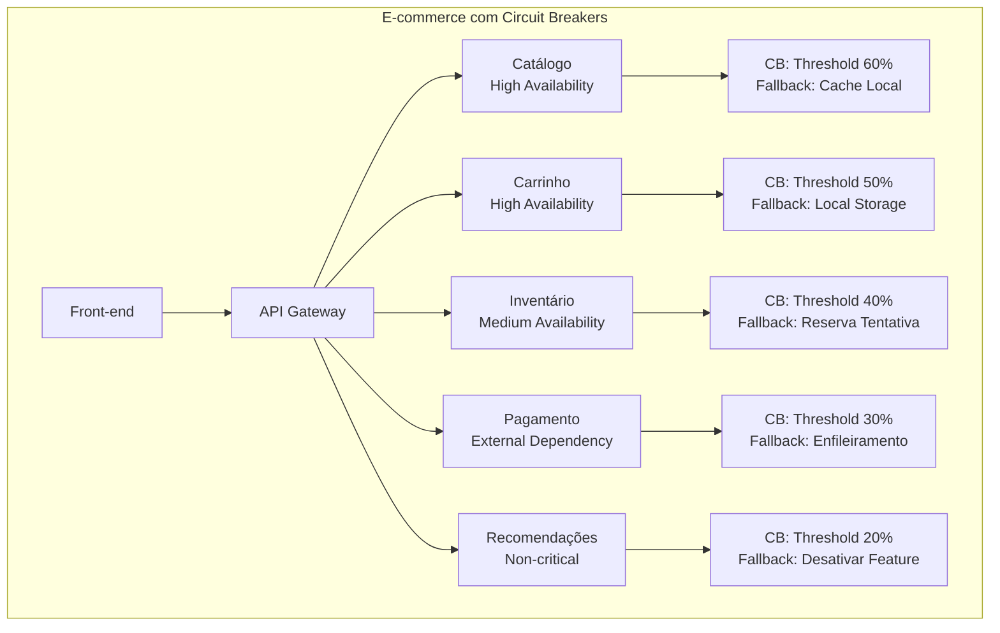

# Exemplo 3: Circuit Breaker Pattern e TOC

O Circuit Breaker (Disjuntor) é um padrão de design que exemplifica perfeitamente a aplicação da Teoria das Restrições em arquiteturas de software resilientes. Este padrão permite que sistemas distribuídos lidem elegantemente com falhas em componentes, evitando que restrições temporárias ou permanentes em um serviço comprometam todo o ecossistema.

## Conceito do Circuit Breaker



## Conexão com a Teoria das Restrições

O Circuit Breaker implementa diretamente os princípios da TOC:

1. **Identificação da Restrição**: Monitora falhas para identificar serviços comprometidos
2. **Exploração da Restrição**: No estado semi-aberto, permite tráfego limitado para testar recuperação
3. **Subordinação ao Gargalo**: Redireciona tráfego para evitar o componente com restrições
4. **Elevação da Restrição**: Tenta uso gradual do serviço para verificar se a restrição foi superada
5. **Repetição do Processo**: Monitora continuamente o estado do sistema e cicla entre estados

## Implementação Prática 

Considere uma arquitetura de microsserviços com múltiplas dependências:



## Análise de Restrições em Sistema Distribuído



## Estratégias de Fallback

A TOC sugere sempre ter estratégias alternativas para lidar com a restrição:



## Código: Implementação de Circuit Breaker

Implementação usando a biblioteca Resilience4j:

```java
import io.github.resilience4j.circuitbreaker.CircuitBreaker;
import io.github.resilience4j.circuitbreaker.CircuitBreakerConfig;
import io.github.resilience4j.circuitbreaker.CircuitBreakerRegistry;
import io.vavr.control.Try;

import java.time.Duration;
import java.util.function.Supplier;

public class PaymentServiceWithCircuitBreaker {
    
    private final PaymentGatewayClient paymentClient;
    private final CircuitBreaker circuitBreaker;
    private final PaymentCache paymentCache;
    
    public PaymentServiceWithCircuitBreaker(PaymentGatewayClient paymentClient, PaymentCache paymentCache) {
        this.paymentClient = paymentClient;
        this.paymentCache = paymentCache;
        
        // Configuração baseada em análise de restrições
        CircuitBreakerConfig config = CircuitBreakerConfig.custom()
            .failureRateThreshold(50)                           // 50% de falhas para abrir
            .waitDurationInOpenState(Duration.ofSeconds(30))    // 30s no estado aberto
            .permittedNumberOfCallsInHalfOpenState(5)           // 5 chamadas de teste
            .slidingWindowSize(20)                              // Avalia as últimas 20 requisições
            .recordExceptions(
                PaymentGatewayException.class,
                TimeoutException.class
            )
            .build();
        
        CircuitBreakerRegistry registry = CircuitBreakerRegistry.of(config);
        this.circuitBreaker = registry.circuitBreaker("paymentService");
        
        // Registra listeners para ações em mudanças de estado
        circuitBreaker.getEventPublisher()
            .onStateTransition(event -> {
                if (event.getStateTransition() == StateTransition.CLOSED_TO_OPEN) {
                    notifyOperations("Serviço de pagamento indisponível!");
                } else if (event.getStateTransition() == StateTransition.OPEN_TO_CLOSED) {
                    notifyOperations("Serviço de pagamento restaurado.");
                }
            });
    }
    
    public PaymentResult processPayment(PaymentRequest request) {
        // Decorando a chamada com circuit breaker
        Supplier<PaymentResult> paymentSupplier = CircuitBreaker
            .decorateSupplier(circuitBreaker, () -> paymentClient.processPayment(request));
        
        // Tentativa com fallback para cache
        return Try.ofSupplier(paymentSupplier)
            .recover(throwable -> {
                if (circuitBreaker.getState() == CircuitBreaker.State.OPEN) {
                    log.warn("Circuit breaker aberto. Usando dados em cache ou processo alternativo.");
                    return getPaymentResultFallback(request);
                }
                throw new RuntimeException("Falha no processamento do pagamento", throwable);
            })
            .get();
    }
    
    private PaymentResult getPaymentResultFallback(PaymentRequest request) {
        // Implementação da TOC: Usando recurso alternativo quando o gargalo está indisponível
        
        // 1. Tentar obter do cache
        Optional<PaymentResult> cachedResult = paymentCache.getRecentPaymentResult(request.getCustomerId());
        if (cachedResult.isPresent()) {
            return cachedResult.get().markAsCached();
        }
        
        // 2. Fallback: Enfileirar para processamento posterior
        queuePaymentForLaterProcessing(request);
        
        // 3. Retornar resultado parcial/pendente
        return PaymentResult.builder()
                .status(PaymentStatus.PENDING)
                .message("Pagamento enfileirado para processamento posterior")
                .timestamp(System.currentTimeMillis())
                .build();
    }
    
    private void queuePaymentForLaterProcessing(PaymentRequest request) {
        // Implementação da subordinação: adaptar-se à restrição atual
        paymentQueue.send(request);
        log.info("Pagamento enfileirado para processamento posterior: {}", request.getId());
    }
}
```

## Monitoramento de Circuit Breakers

A efetividade dos circuit breakers deve ser constantemente monitorada:



## Configuração Baseada em TOC



## Padrões Avançados

### Bulkhead Pattern com Circuit Breaker

Combinando isolamento com circuit breaker:



### Circuit Breaker Adaptativo



## Caso de Estudo: Microsserviços de E-commerce

Um sistema de e-commerce que utiliza circuit breakers seguindo TOC:



## Considerações e Best Practices

1. **Configuração Específica por Contexto**: Cada serviço tem suas próprias características e necessidades
2. **Granularidade Adequada**: Circuit breakers muito amplos ou muito específicos podem ser contraproducentes
3. **Testes sob Falha**: Simular cenários de falha regularmente (Chaos Engineering)
4. **Alertas e Monitoramento**: Notificações sobre mudanças de estado permitem intervenção proativa
5. **Reconfiguração Dinâmica**: Ajustar parâmetros do circuit breaker baseado em padrões observados

## Conclusão

O Circuit Breaker Pattern é uma aplicação direta da Teoria das Restrições em sistemas distribuídos que:

1. **Identifica Restrições**: Detecta componentes falhos ou sobrecarregados
2. **Protege Recursos**: Evita sobrecarga de componentes já comprometidos
3. **Falha Rapidamente**: Economiza recursos retornando erros imediatos quando apropriado
4. **Testa Recuperação**: Verifica periodicamente se a restrição foi superada
5. **Adapta-se Dinamicamente**: Ajusta o comportamento do sistema baseado no estado das restrições

Como resultado, sistemas que implementam corretamente este padrão conseguem manter-se operacionais mesmo quando componentes individuais falham, demonstrando resiliência e estabilidade mesmo sob condições adversas - um exemplo perfeito da TOC aplicada à arquitetura de software moderna.
