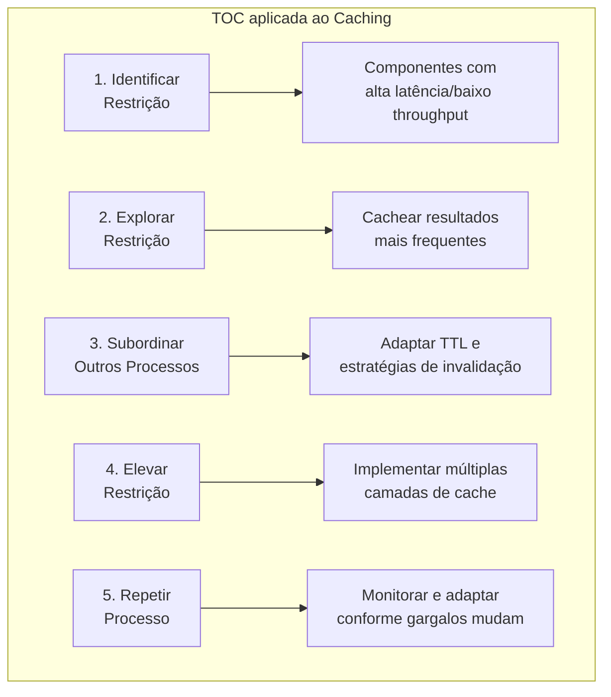
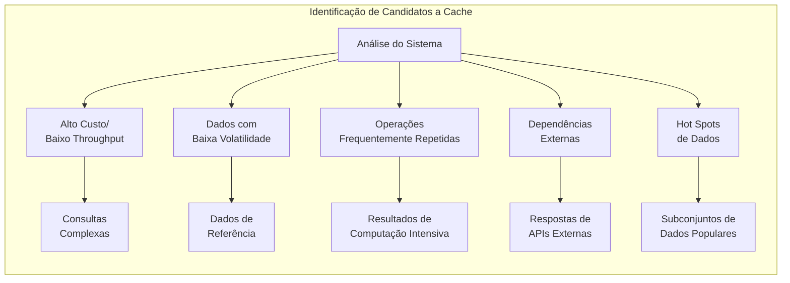
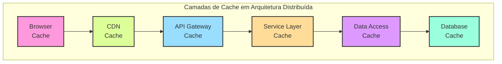
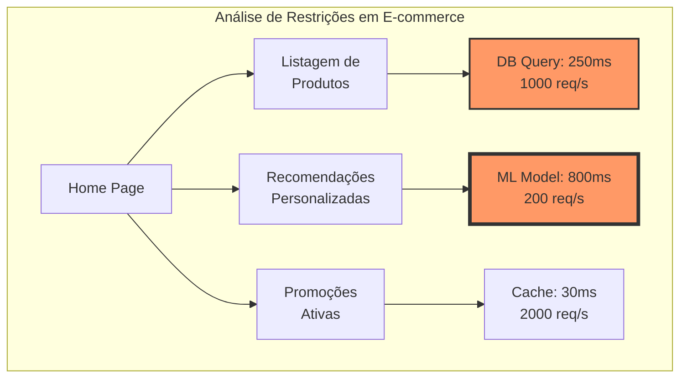
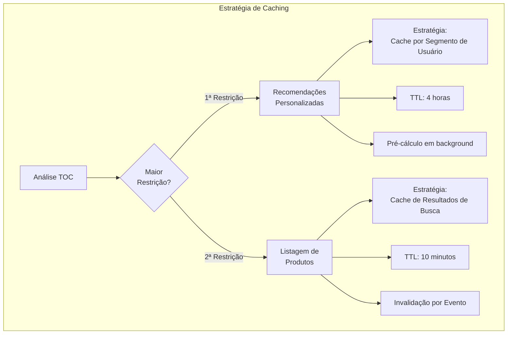
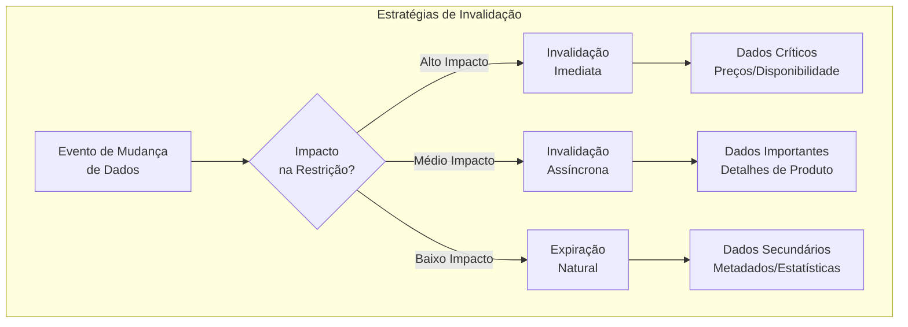
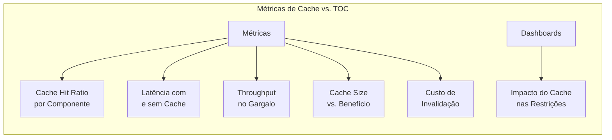
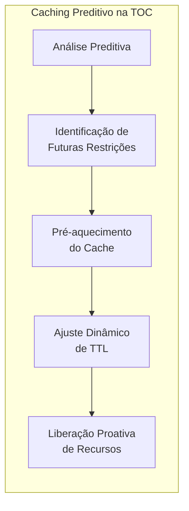
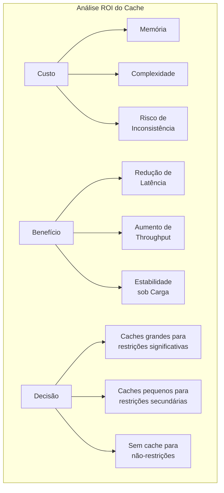
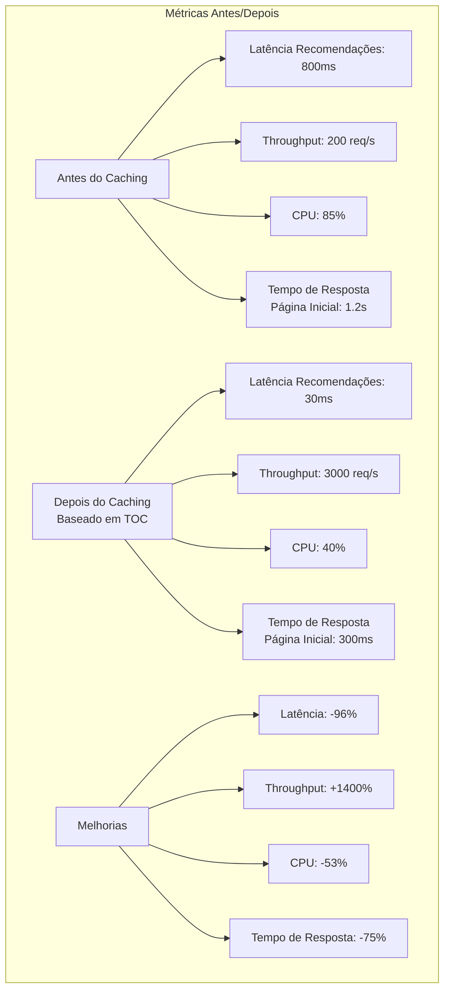

# Exemplo 4: Estratégias de Caching Baseadas em Restrições

O caching é uma das técnicas mais poderosas para otimizar sistemas de software. Quando implementado com base nos princípios da Teoria das Restrições (TOC), torna-se uma ferramenta estratégica para elevar a capacidade dos componentes que são gargalos do sistema, maximizando o throughput global.

## Relação com a Teoria das Restrições

O caching estratégico implementa diretamente os princípios da TOC:



## Identificação de Oportunidades de Caching

Para aplicar caching baseado em TOC, primeiro identifique as restrições:



## Estratégias de Caching por Camada

O caching efetivo em arquiteturas modernas envolve múltiplas camadas:



## Caso de Estudo: Aplicação de Caching em E-commerce

Considere um sistema de e-commerce com diversos gargalos:



### Aplicação da TOC para Caching



## Implementação Prática

### Código: Estratégia de Caching para o Gargalo de Recomendações

```java
@Service
public class RecommendationService {
    
    private final RecommendationEngine engine;
    private final CacheManager cacheManager;
    private final UserSegmentationService segmentationService;
    
    // TTLs otimizados com base na análise TOC
    private static final Duration SEGMENT_CACHE_TTL = Duration.ofHours(4);
    private static final Duration PERSONAL_CACHE_TTL = Duration.ofMinutes(30);
    
    @Scheduled(fixedRate = 3600000) // 1 hora
    public void precomputeSegmentRecommendations() {
        // Pré-cálculo para elevar a capacidade da restrição
        List<UserSegment> activeSegments = segmentationService.getAllActiveSegments();
        
        // Processa em paralelo, mas limitado para não sobrecarregar
        activeSegments.parallelStream()
            .limit(10) // Processa os 10 segmentos mais importantes
            .forEach(segment -> {
                List<ProductRecommendation> recommendations = 
                    engine.computeRecommendationsForSegment(segment);
                
                // Armazena no cache
                String cacheKey = "segment_recs_" + segment.getId();
                cacheManager.getCache("recommendations")
                    .put(cacheKey, recommendations);
                
                log.info("Precomputed recommendations for segment: {}", segment.getName());
            });
    }
    
    public List<ProductRecommendation> getRecommendationsForUser(Long userId) {
        // Estratégia baseada em TOC:
        // 1. Tenta cache específico do usuário (mais preciso, TTL menor)
        // 2. Cai para cache do segmento (menos preciso, TTL maior)
        // 3. Computa em tempo real apenas se necessário
        
        String userCacheKey = "user_recs_" + userId;
        Cache.ValueWrapper cachedValue = 
            cacheManager.getCache("recommendations").get(userCacheKey);
        
        if (cachedValue != null) {
            log.debug("User cache hit for user: {}", userId);
            return (List<ProductRecommendation>) cachedValue.get();
        }
        
        // Identifica o segmento do usuário
        UserSegment segment = segmentationService.getUserSegment(userId);
        String segmentCacheKey = "segment_recs_" + segment.getId();
        
        cachedValue = cacheManager.getCache("recommendations").get(segmentCacheKey);
        if (cachedValue != null) {
            List<ProductRecommendation> recs = (List<ProductRecommendation>) cachedValue.get();
            log.debug("Segment cache hit for user: {} (segment: {})", userId, segment.getName());
            
            // Bonus: Armazena em cache específico do usuário para próximos acessos
            // TTL menor para garantir personalização eventual
            cacheManager.getCache("recommendations")
                .put(userCacheKey, recs, PERSONAL_CACHE_TTL);
            
            return recs;
        }
        
        // Cache miss - computação em tempo real (caso raro após implementação do pré-cálculo)
        log.info("Cache miss for user: {} - computing recommendations", userId);
        List<ProductRecommendation> freshRecs = engine.computeRecommendationsForUser(userId);
        
        // Armazena no cache de usuário com TTL apropriado
        cacheManager.getCache("recommendations")
            .put(userCacheKey, freshRecs, PERSONAL_CACHE_TTL);
        
        // E também contribui para o cache de segmento (se vazio)
        if (cacheManager.getCache("recommendations").get(segmentCacheKey) == null) {
            cacheManager.getCache("recommendations")
                .put(segmentCacheKey, engine.computeRecommendationsForSegment(segment), SEGMENT_CACHE_TTL);
        }
        
        return freshRecs;
    }
}
```

### Configuração de Cache Multi-nível

```java
@Configuration
@EnableCaching
public class CacheConfig {
    
    @Bean
    public CacheManager cacheManager(RedisConnectionFactory redisConnectionFactory) {
        // Configuração de TTLs específicos por tipo de cache,
        // baseado na análise TOC de cada restrição
        
        RedisCacheConfiguration defaultConfig = RedisCacheConfiguration.defaultCacheConfig()
                .entryTtl(Duration.ofMinutes(10))  // TTL padrão
                .serializeKeysWith(RedisSerializationContext.SerializationPair
                        .fromSerializer(new StringRedisSerializer()))
                .serializeValuesWith(RedisSerializationContext.SerializationPair
                        .fromSerializer(new GenericJackson2JsonRedisSerializer()));
        
        // Configura TTLs específicos baseados na análise de restrições
        Map<String, RedisCacheConfiguration> cacheConfigs = new HashMap<>();
        
        // Cache da principal restrição - Recomendações (com TTL mais longo)
        cacheConfigs.put("recommendations", defaultConfig.entryTtl(Duration.ofHours(4)));
        
        // Cache da segunda restrição - Pesquisa de Produtos
        cacheConfigs.put("productSearch", defaultConfig.entryTtl(Duration.ofMinutes(10)));
        
        // Cache de dados menos críticos/restritivos
        cacheConfigs.put("productDetails", defaultConfig.entryTtl(Duration.ofHours(1)));
        cacheConfigs.put("categoryLists", defaultConfig.entryTtl(Duration.ofHours(2)));
        
        // Dois níveis de cache: L1 (local, in-memory) e L2 (Redis, distribuído)
        return new CachingConfigurerSupport() {
            @Override
            public CacheManager cacheManager() {
                CompositeCacheManager compositeCacheManager = new CompositeCacheManager();
                
                // L1: Cache local de alta performance para hot-spots extremos
                CaffeineCacheManager caffeineCacheManager = new CaffeineCacheManager();
                caffeineCacheManager.setCaffeine(Caffeine.newBuilder()
                        .maximumSize(1000)
                        .expireAfterWrite(1, TimeUnit.MINUTES));
                
                // L2: Redis distribuído para cache principal
                RedisCacheManager redisCacheManager = RedisCacheManager.builder(redisConnectionFactory)
                        .cacheDefaults(defaultConfig)
                        .withInitialCacheConfigurations(cacheConfigs)
                        .build();
                
                compositeCacheManager.setCacheManagers(Arrays.asList(
                        caffeineCacheManager, 
                        redisCacheManager));
                
                return compositeCacheManager;
            }
        }.cacheManager();
    }
}
```

## Estratégias de Invalidação Seletiva

A invalidação seletiva baseada em TOC concentra-se nas áreas mais críticas:



## Monitoramento de Eficácia do Cache



## Considerações Avançadas

### Caching Preditivo



### Custo x Benefício



## Padrões de Caching Alinhados à TOC

1. **Cache-Aside / Lazy Loading**: Carrega dados no cache apenas quando solicitados
   - **Alinhamento TOC**: Evita overhead em itens não-gargalo, foca nos acessados frequentemente

2. **Write-Through**: Atualiza cache e fonte de dados em uma única operação
   - **Alinhamento TOC**: Mantém consistência nos dados críticos das restrições

3. **Write-Behind / Write-Back**: Atualiza cache imediatamente e posterga escrita na fonte
   - **Alinhamento TOC**: Otimiza throughput reduzindo operações síncronas em gargalos de escrita

4. **Refresh-Ahead**: Recarrega proativamente itens no cache antes de expirarem
   - **Alinhamento TOC**: Previne uso direto da restrição (fonte de dados) para itens frequentes

## Implementação de Eventos para Invalidação

```java
@Service
public class CacheInvalidationService {
    
    private final CacheManager cacheManager;
    private final EventBus eventBus;
    
    // Mapa que relaciona tipos de eventos a estratégias de invalidação
    private final Map<Class<?>, InvalidationStrategy> invalidationMap;
    
    public CacheInvalidationService(CacheManager cacheManager, EventBus eventBus) {
        this.cacheManager = cacheManager;
        this.eventBus = eventBus;
        
        // Configuração baseada na análise TOC de restrições
        this.invalidationMap = new HashMap<>();
        
        // Eventos de alto impacto (invalidação imediata)
        invalidationMap.put(PriceChangedEvent.class, 
                             new ImmediateInvalidationStrategy("productDetails", "searchResults", "recommendations"));
        invalidationMap.put(InventoryChangedEvent.class, 
                             new ImmediateInvalidationStrategy("productDetails", "searchResults"));
        
        // Eventos de médio impacto (invalidação assíncrona)
        invalidationMap.put(ProductDetailsUpdatedEvent.class, 
                             new AsyncInvalidationStrategy("productDetails"));
        invalidationMap.put(CategoryUpdatedEvent.class, 
                             new AsyncInvalidationStrategy("categoryLists", "searchResults"));
        
        // Eventos de baixo impacto (sem invalidação específica, usa TTL natural)
        invalidationMap.put(ProductViewedEvent.class, new NoOpInvalidationStrategy());
        invalidationMap.put(SearchQueryPerformedEvent.class, new NoOpInvalidationStrategy());
        
        // Registra handler para processar eventos
        eventBus.register(this);
    }
    
    @Subscribe
    public void handleDomainEvent(DomainEvent event) {
        // Obtém estratégia adequada para o tipo de evento
        InvalidationStrategy strategy = invalidationMap.getOrDefault(
                event.getClass(), new NoOpInvalidationStrategy());
        
        // Executa invalidação conforme estratégia
        strategy.invalidate(cacheManager, event);
        
        log.debug("Processed cache invalidation for event: {}", event.getClass().getSimpleName());
    }
    
    // Estratégias de invalidação baseadas em TOC
    interface InvalidationStrategy {
        void invalidate(CacheManager cacheManager, DomainEvent event);
    }
    
    // Invalidação imediata para restrições mais críticas
    class ImmediateInvalidationStrategy implements InvalidationStrategy {
        private final String[] cacheNames;
        
        ImmediateInvalidationStrategy(String... cacheNames) {
            this.cacheNames = cacheNames;
        }
        
        @Override
        public void invalidate(CacheManager cacheManager, DomainEvent event) {
            // Extrai chave(s) da entidade afetada
            List<String> keysToInvalidate = extractKeysFromEvent(event);
            
            // Invalidação imediata de todos os caches afetados
            for (String cacheName : cacheNames) {
                Cache cache = cacheManager.getCache(cacheName);
                for (String key : keysToInvalidate) {
                    cache.evict(key);
                    log.debug("Immediately evicted key '{}' from cache '{}'", key, cacheName);
                }
            }
        }
    }
    
    // Invalidação assíncrona para restrições de médio impacto
    class AsyncInvalidationStrategy implements InvalidationStrategy {
        private final String[] cacheNames;
        private final ScheduledExecutorService executor = 
            Executors.newScheduledThreadPool(2);
        
        AsyncInvalidationStrategy(String... cacheNames) {
            this.cacheNames = cacheNames;
        }
        
        @Override
        public void invalidate(CacheManager cacheManager, DomainEvent event) {
            // Programa invalidação para execução posterior (baixa prioridade)
            executor.schedule(() -> {
                List<String> keysToInvalidate = extractKeysFromEvent(event);
                
                for (String cacheName : cacheNames) {
                    Cache cache = cacheManager.getCache(cacheName);
                    for (String key : keysToInvalidate) {
                        cache.evict(key);
                        log.debug("Async evicted key '{}' from cache '{}'", key, cacheName);
                    }
                }
            }, 5, TimeUnit.SECONDS);
        }
    }
    
    // Para eventos de baixo impacto - deixa a expiração natural do TTL funcionar
    class NoOpInvalidationStrategy implements InvalidationStrategy {
        @Override
        public void invalidate(CacheManager cacheManager, DomainEvent event) {
            // Não faz invalidação explícita - usa TTL
            log.debug("No explicit invalidation for event: {}", event.getClass().getSimpleName());
        }
    }
    
    // Extração de chaves conforme tipo de evento
    private List<String> extractKeysFromEvent(DomainEvent event) {
        // Lógica de extração de chaves específica por tipo de evento
        if (event instanceof ProductEvent) {
            ProductEvent productEvent = (ProductEvent) event;
            Long productId = productEvent.getProductId();
            
            List<String> keys = new ArrayList<>();
            keys.add("product_" + productId);
            
            // Se for mudança de preço, invalida também caches relacionados
            if (event instanceof PriceChangedEvent) {
                keys.add("category_" + ((ProductEvent) event).getCategoryId());
                // Potencialmente mais chaves...
            }
            
            return keys;
        }
        
        // Outros tipos de evento...
        return Collections.emptyList();
    }
}
```

## Resultados e Métricas

Aplicando caching baseado em TOC, é possível alcançar resultados significativos:



## Conclusão

A aplicação estratégica de caching baseado nos princípios da Teoria das Restrições oferece uma abordagem sistemática para otimizar sistemas de software:

1. **Foco nos Gargalos**: Aplica recursos limitados de cache onde geram maior impacto
2. **Estratégia Multinível**: Utiliza diferentes abordagens de caching conforme a criticidade da restrição
3. **Decisões Baseadas em Dados**: Fundamenta políticas de cache em métricas reais de restrições
4. **Adaptação Contínua**: Evolui estratégias conforme as restrições mudam
5. **Maximização do Throughput**: Prioriza sempre o desempenho global do sistema

Quando implementadas corretamente, estratégias de caching baseadas em TOC não apenas melhoram performance, mas também aumentam a resiliência, reduzem custos operacionais e proporcionam uma melhor experiência do usuário, tudo com uma abordagem metodológica em vez de otimizações ad-hoc.
