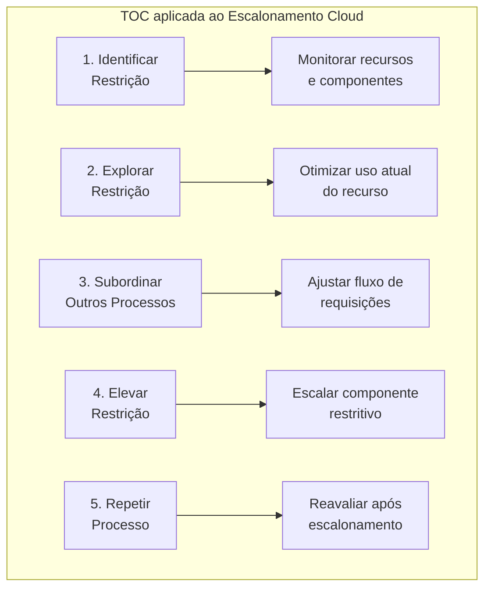
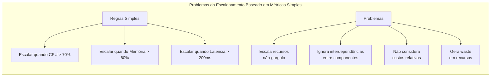
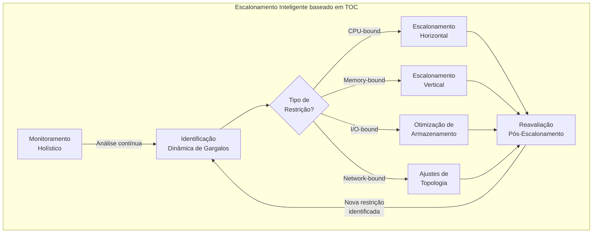
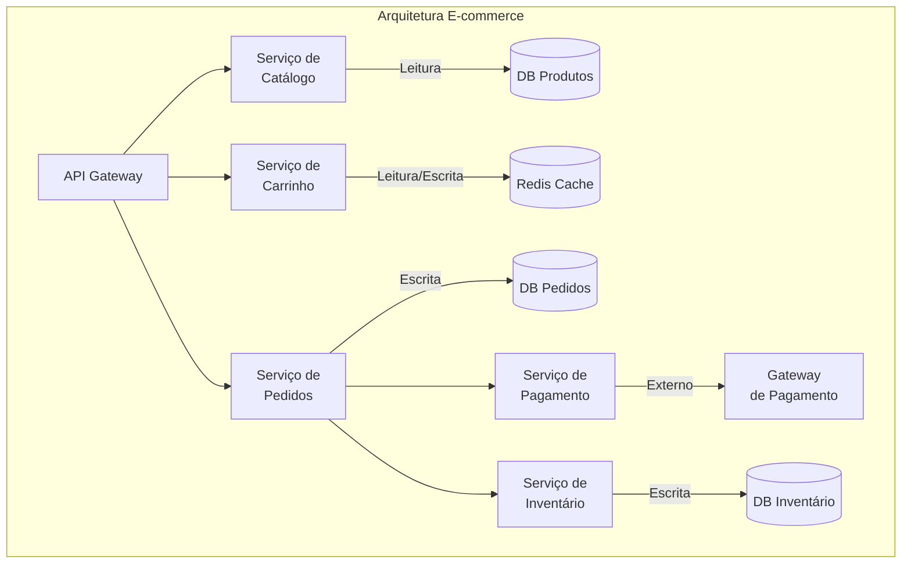
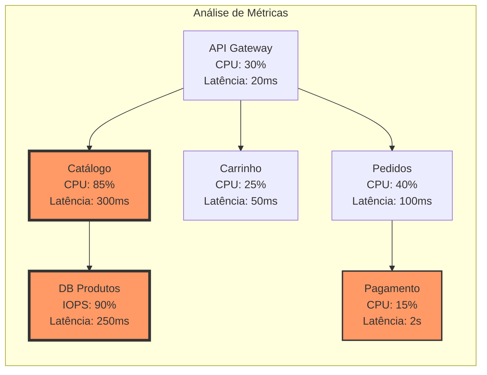
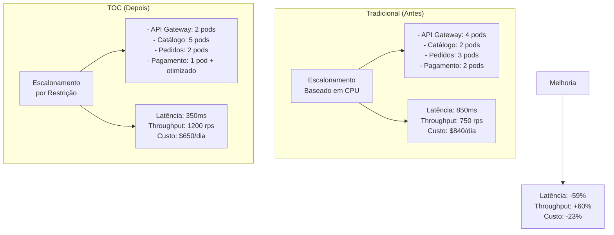

# Exemplo 5: Escalonamento Eficiente de Recursos Cloud

O escalonamento eficiente de recursos na nuvem é um dos desafios mais complexos da arquitetura de software moderna. A Teoria das Restrições (TOC) oferece um framework valioso para abordar este desafio, permitindo decisões mais precisas sobre quando, onde e como escalar recursos.

## Princípios da TOC no Escalonamento Cloud



## Desafios do Escalonamento Tradicional

Abordagens tradicionais frequentemente falham em identificar corretamente onde escalar:



## Abordagem TOC para Cloud



## Caso de Estudo: Arquitetura de Microserviços E-commerce

Considere uma aplicação de e-commerce com múltiplos microserviços:



### Análise TOC dos Componentes



## Implementação da Estratégia TOC

### 1. Identificar as Restrições

```java
@Service
public class TOCScalingAnalyzer {
    
    private final MetricsCollector metricsCollector;
    private final DependencyGraphService dependencyGraph;
    
    @Scheduled(fixedRate = 60000) // A cada minuto
    public void identifySystemConstraints() {
        // Coleta métricas de todos os componentes
        Map<String, ComponentMetrics> currentMetrics = metricsCollector.collectSystemMetrics();
        
        // Análise holística considerando dependências
        Map<String, ConstraintInfo> constraints = new HashMap<>();
        
        // Calcula capacidade relativa e utilização
        for (Map.Entry<String, ComponentMetrics> entry : currentMetrics.entrySet()) {
            String componentId = entry.getKey();
            ComponentMetrics metrics = entry.getValue();
            
            // Capacidade teórica vs. throughput atual
            double theoreticalCapacity = calculateTheoreticalCapacity(componentId, metrics);
            double currentThroughput = metrics.getRequestsPerSecond();
            double utilization = currentThroughput / theoreticalCapacity;
            
            // Análise de bottleneck considerando latência e dependências
            List<String> downstreamDependencies = dependencyGraph.getDownstreamDependencies(componentId);
            double downstreamBackpressure = calculateBackpressure(componentId, downstreamDependencies, currentMetrics);
            
            // Fator de restrição combinado
            double constraintFactor = calculateConstraintFactor(
                utilization, 
                metrics.getErrorRate(), 
                metrics.getP95Latency(), 
                downstreamBackpressure
            );
            
            constraints.put(componentId, new ConstraintInfo(
                componentId,
                constraintFactor,
                metrics.getResourceType(),
                utilization,
                downstreamBackpressure,
                metrics.getCost()
            ));
        }
        
        // Ordena para identificar o principal gargalo
        List<ConstraintInfo> orderedConstraints = constraints.values().stream()
            .sorted(Comparator.comparing(ConstraintInfo::getConstraintFactor).reversed())
            .collect(Collectors.toList());
        
        // Publica os resultados para o sistema de decisão de escalonamento
        publishConstraintAnalysis(orderedConstraints);
        
        log.info("TOC Analysis completed. Primary constraint: {}", 
                orderedConstraints.isEmpty() ? "none" : orderedConstraints.get(0));
    }
    
    private double calculateConstraintFactor(
            double utilization, 
            double errorRate, 
            double latency, 
            double backpressure) {
        
        // Pesos configuráveis para diferentes fatores
        double utilizationWeight = 0.5;
        double errorRateWeight = 0.2;
        double latencyWeight = 0.2;
        double backpressureWeight = 0.1;
        
        // Fórmula combinada que prioriza recursos mais utilizados
        // e com maior impacto no sistema
        return (utilization * utilizationWeight) +
               (errorRate * errorRateWeight) +
               (latency / SLA_TARGET_LATENCY * latencyWeight) +
               (backpressure * backpressureWeight);
    }
}
```

### 2. Explorar a Restrição Antes de Escalar

```java
@Service
public class ConstraintOptimizer {

    private final ConfigurationService configService;
    private final MetricsCollector metricsCollector;
    
    public OptimizationResult optimizeBeforeScaling(String componentId, ResourceType resourceType) {
        OptimizationResult result = new OptimizationResult();
        
        log.info("Attempting to optimize component {} before scaling", componentId);
        
        switch(resourceType) {
            case CPU:
                result = optimizeCPUBound(componentId);
                break;
            case MEMORY:
                result = optimizeMemoryBound(componentId);
                break;
            case IO:
                result = optimizeIOBound(componentId);
                break;
            case NETWORK:
                result = optimizeNetworkBound(componentId);
                break;
        }
        
        return result;
    }
    
    private OptimizationResult optimizeCPUBound(String componentId) {
        OptimizationResult result = new OptimizationResult();
        ComponentConfiguration config = configService.getComponentConfig(componentId);
        
        // TOC: Explorar a restrição significa maximizar sua eficiência atual
        
        // 1. Ajustar configurações de JVM/runtime
        Map<String, Object> jvmOptimizations = new HashMap<>();
        jvmOptimizations.put("GC_TYPE", "G1GC");
        jvmOptimizations.put("HEAP_SIZE", calculateOptimalHeapSize(componentId));
        
        // 2. Ajustar thread pools para evitar context switching excessivo
        int optimalThreads = calculateOptimalThreads(componentId);
        jvmOptimizations.put("THREAD_POOL_SIZE", optimalThreads);
        
        // 3. Verificar possibilidade de caching
        boolean cachingApplicable = analyzeForCachingOpportunity(componentId);
        if (cachingApplicable) {
            jvmOptimizations.put("ENABLE_METHOD_CACHING", true);
            result.getOptimizationActions().add("Habilitado cache de métodos frequentes");
        }
        
        // Aplica otimizações
        configService.updateComponentConfig(componentId, jvmOptimizations);
        
        // Mede impacto
        ComponentMetrics beforeMetrics = metricsCollector.getBaselineMetrics(componentId);
        
        // Aguarda efeito das mudanças (período de estabilização)
        try {
            Thread.sleep(60000); // 1 minuto
        } catch (InterruptedException e) {
            Thread.currentThread().interrupt();
        }
        
        ComponentMetrics afterMetrics = metricsCollector.getCurrentMetrics(componentId);
        double improvementPercentage = calculateImprovement(beforeMetrics, afterMetrics);
        
        result.setOptimizationImpact(improvementPercentage);
        result.setSuccessful(improvementPercentage > 5.0); // Considera sucesso se melhorou mais de 5%
        
        return result;
    }
    
    // Métodos similares para outros tipos de recursos (Memory, I/O, Network)...
}
```

### 3. Subordinar o Sistema ao Gargalo

```java
@Service
public class SystemSubordinator {

    private final TrafficShapingService trafficShaper;
    private final ComponentConfigService configService;
    
    public void subordinateToConstraint(String constraintComponentId) {
        log.info("Subordinating system to constraint: {}", constraintComponentId);
        
        // 1. Ajusta taxas de entrada para não sobrecarregar o gargalo
        adjustInboundRates(constraintComponentId);
        
        // 2. Configura timeouts e retries apropriadamente
        optimizeTimeoutsAndRetries(constraintComponentId);
        
        // 3. Configura circuit breakers em componentes dependentes
        setupCircuitBreakers(constraintComponentId);
    }
    
    private void adjustInboundRates(String constraintComponentId) {
        // Calcula a capacidade máxima do componente restritivo
        double maxCapacity = getComponentMaxCapacity(constraintComponentId);
        
        // Ajusta limitadores de taxa em componentes upstream
        List<String> upstreamComponents = getDependencyGraph().getUpstreamComponents(constraintComponentId);
        
        for (String component : upstreamComponents) {
            // TOC: Subordinar significa limitar entrada ao ritmo do gargalo
            double safeMaxRate = maxCapacity * 0.9; // 90% da capacidade para segurança
            
            trafficShaper.setRateLimit(component, safeMaxRate);
            log.info("Set rate limit on {} to {} req/s based on constraint {}", 
                    component, safeMaxRate, constraintComponentId);
        }
    }
    
    private void optimizeTimeoutsAndRetries(String constraintComponentId) {
        // Obtém a latência atual do componente restritivo
        ComponentMetrics metrics = metricsCollector.getCurrentMetrics(constraintComponentId);
        double p99Latency = metrics.getP99Latency();
        
        // Configura timeouts de clientes que chamam este componente
        List<String> callers = getDependencyGraph().getCallers(constraintComponentId);
        
        for (String caller : callers) {
            // TOC: Ajustar expectativas para evitar timeout prematuros ou muito longos
            double recommendedTimeout = p99Latency * 1.5; // 50% acima do P99
            
            configService.setClientTimeout(caller, constraintComponentId, recommendedTimeout);
            
            // Configura retries apropriados
            RetryConfig retryConfig = calculateOptimalRetryConfig(caller, constraintComponentId, metrics);
            configService.setRetryConfig(caller, constraintComponentId, retryConfig);
            
            log.info("Updated timeout for {} -> {} to {} ms", caller, constraintComponentId, recommendedTimeout);
        }
    }
    
    private void setupCircuitBreakers(String constraintComponentId) {
        // Configura circuit breakers em componentes que dependem do gargalo
        ComponentMetrics metrics = metricsCollector.getCurrentMetrics(constraintComponentId);
        List<String> dependents = getDependencyGraph().getDependents(constraintComponentId);
        
        for (String dependent : dependents) {
            // TOC: Preparar sistema para funcionar mesmo com restrição
            CircuitBreakerConfig cbConfig = new CircuitBreakerConfig();
            
            // Baseado em métricas do componente com restrição
            cbConfig.setFailureThreshold(calculateOptimalFailureThreshold(metrics));
            cbConfig.setResetTimeout(calculateOptimalResetTimeout(metrics));
            
            configService.setCircuitBreakerConfig(dependent, constraintComponentId, cbConfig);
            
            log.info("Configured circuit breaker for {} -> {}", dependent, constraintComponentId);
        }
    }
}
```

### 4. Elevar a Restrição (Escalar)

```java
@Service
public class ConstraintElevator {

    private final CloudResourceManager cloudManager;
    private final CostAnalyzer costAnalyzer;
    
    public ScalingResult elevateConstraint(ConstraintInfo constraint) {
        log.info("Planning to elevate constraint: {}", constraint.getComponentId());
        
        // Estratégia de escalonamento específica para o tipo de recurso
        ScalingStrategy strategy = determineOptimalScalingStrategy(constraint);
        
        // Analise de custos e benefícios
        ResourceScalingOptions options = generateScalingOptions(constraint, strategy);
        CostBenefitAnalysis analysis = costAnalyzer.analyzeCostBenefit(options);
        
        // Seleciona a melhor opção de escalonamento
        ResourceScalingOption selectedOption = selectBestOption(analysis);
        
        // Executa o escalonamento
        ScalingResult result = executeScaling(constraint.getComponentId(), selectedOption);
        
        // Registra a ação e programa verificação de eficácia
        schedulePostScalingEvaluation(constraint.getComponentId(), result);
        
        return result;
    }
    
    private ScalingStrategy determineOptimalScalingStrategy(ConstraintInfo constraint) {
        // Seleciona estratégia com base no tipo de recurso restritivo
        ScalingStrategy strategy = new ScalingStrategy();
        
        switch (constraint.getResourceType()) {
            case CPU:
                // CPUs são geralmente melhor escalonadas horizontalmente
                if (isStateless(constraint.getComponentId())) {
                    strategy.setType(ScalingType.HORIZONTAL);
                    strategy.setIncrement(calculateOptimalInstanceIncrement(constraint));
                } else {
                    strategy.setType(ScalingType.VERTICAL);
                    strategy.setIncrement(2); // Ex: dobrar a capacidade de CPU
                }
                break;
                
            case MEMORY:
                // Memória é frequentemente melhor escalonada verticalmente
                strategy.setType(ScalingType.VERTICAL);
                strategy.setIncrement(calculateOptimalMemoryIncrement(constraint));
                break;
                
            case IO:
                // I/O pode precisar de mudança de tier de armazenamento
                strategy.setType(ScalingType.STORAGE_TIER_UPGRADE);
                strategy.setStorageTier(determineNextStorageTier(constraint));
                break;
                
            case NETWORK:
                // Rede pode precisar de ajustes de topologia
                strategy.setType(ScalingType.NETWORK_OPTIMIZATION);
                strategy.setNetworkOptimization(determineNetworkOptimization(constraint));
                break;
        }
        
        return strategy;
    }
    
    private ResourceScalingOptions generateScalingOptions(ConstraintInfo constraint, ScalingStrategy strategy) {
        ResourceScalingOptions options = new ResourceScalingOptions();
        String componentId = constraint.getComponentId();
        
        if (strategy.getType() == ScalingType.HORIZONTAL) {
            // Gera opções de escalonamento horizontal com diferentes incrementos
            options.addOption(new ResourceScalingOption(
                componentId, 
                ScalingType.HORIZONTAL,
                1, // Adicionar 1 instância
                calculateCost(componentId, ScalingType.HORIZONTAL, 1),
                calculateBenefit(componentId, ScalingType.HORIZONTAL, 1)
            ));
            
            options.addOption(new ResourceScalingOption(
                componentId, 
                ScalingType.HORIZONTAL,
                2, // Adicionar 2 instâncias
                calculateCost(componentId, ScalingType.HORIZONTAL, 2),
                calculateBenefit(componentId, ScalingType.HORIZONTAL, 2)
            ));
            
            // Adiciona também opção vertical para comparação
            options.addOption(new ResourceScalingOption(
                componentId, 
                ScalingType.VERTICAL,
                1, // Subir um tier de instância
                calculateCost(componentId, ScalingType.VERTICAL, 1),
                calculateBenefit(componentId, ScalingType.VERTICAL, 1)
            ));
        } else if (strategy.getType() == ScalingType.VERTICAL) {
            // Opções similares para escalonamento vertical
            // ...
        }
        
        return options;
    }
    
    private ResourceScalingOption selectBestOption(CostBenefitAnalysis analysis) {
        // Seleciona a opção com melhor relação custo/benefício
        return analysis.getOptions().stream()
            .max(Comparator.comparing(option -> option.getBenefit() / option.getCost()))
            .orElseThrow(() -> new IllegalStateException("No scaling options available"));
    }
    
    private ScalingResult executeScaling(String componentId, ResourceScalingOption option) {
        ScalingResult result = new ScalingResult();
        result.setComponentId(componentId);
        result.setScalingType(option.getType());
        result.setStartTime(System.currentTimeMillis());
        
        try {
            switch (option.getType()) {
                case HORIZONTAL:
                    int currentInstances = cloudManager.getCurrentInstanceCount(componentId);
                    int targetInstances = currentInstances + option.getIncrement();
                    
                    cloudManager.scaleHorizontally(componentId, targetInstances);
                    result.setSuccess(true);
                    result.setDetails("Scaled from " + currentInstances + " to " + targetInstances + " instances");
                    break;
                    
                case VERTICAL:
                    String currentSize = cloudManager.getCurrentInstanceSize(componentId);
                    String targetSize = cloudManager.getNextInstanceSize(currentSize, option.getIncrement());
                    
                    cloudManager.scaleVertically(componentId, targetSize);
                    result.setSuccess(true);
                    result.setDetails("Scaled from " + currentSize + " to " + targetSize);
                    break;
                    
                // Outros casos de escalonamento...
            }
        } catch (Exception e) {
            result.setSuccess(false);
            result.setDetails("Scaling failed: " + e.getMessage());
            log.error("Failed to scale component {}: {}", componentId, e.getMessage(), e);
        }
        
        result.setEndTime(System.currentTimeMillis());
        return result;
    }
}
```

## Implementação como Serviço de Decisão Kubernetes

A implementação dos princípios da TOC também pode ser feita como um serviço customizado para Kubernetes:

```yaml
apiVersion: apps/v1
kind: Deployment
metadata:
  name: toc-scaler
  namespace: kube-system
spec:
  replicas: 1
  selector:
    matchLabels:
      app: toc-scaler
  template:
    metadata:
      labels:
        app: toc-scaler
    spec:
      serviceAccountName: toc-scaler
      containers:
      - name: toc-scaler
        image: example/toc-scaler:v1.0
        resources:
          limits:
            cpu: "1"
            memory: "1Gi"
          requests:
            cpu: "200m"
            memory: "256Mi"
        env:
        - name: PROMETHEUS_URL
          value: "http://prometheus-server.monitoring:9090"
        - name: ANALYSIS_INTERVAL
          value: "60"  # Intervalo em segundos
        - name: MIN_SCALING_INTERVAL
          value: "300"  # Tempo mínimo entre escalas do mesmo componente
        ports:
        - containerPort: 8080
          name: metrics
        - containerPort: 8081
          name: api
```

### Configuração de regras TOC

```yaml
apiVersion: toc.example.com/v1
kind: TOCScalingPolicy
metadata:
  name: e-commerce-policy
spec:
  applicationGraph:
    # Define o grafo de dependências para cálculo holístico
    services:
      - name: api-gateway
        dependencies: []
      - name: catalog-service
        dependencies:
          - api-gateway
      - name: cart-service
        dependencies:
          - api-gateway
      - name: order-service
        dependencies:
          - api-gateway
          - cart-service
      - name: payment-service
        dependencies:
          - order-service
  
  # Configurações de análise
  analysis:
    constraintFactors:
      utilizationWeight: 0.5
      errorRateWeight: 0.2
      latencyWeight: 0.2
      backpressureWeight: 0.1
    
    # SLOs para determinar restrições
    serviceTargets:
      - service: api-gateway
        latencyTarget: 50
        availabilityTarget: 99.9
      - service: catalog-service
        latencyTarget: 200
        availabilityTarget: 99.5
      # Outras configurações...
  
  # Configurações de escalonamento
  scaling:
    # Regras globais
    optimizeBeforeScaling: true
    evaluationPeriod: 5m
    cooldownPeriod: 10m
    
    # Regras específicas por serviço
    services:
      - service: catalog-service
        scalingType: HORIZONTAL
        minReplicas: 2
        maxReplicas: 10
        optimalUtilization: 0.7
        
      - service: order-service
        scalingType: VERTICAL
        minResources:
          cpu: "250m"
          memory: "512Mi"
        maxResources:
          cpu: "2"
          memory: "4Gi"
        # ...
```

## Análise de Resultados: Antes vs. Depois



## Considerações para Implementação TOC na Nuvem

1. **Monitoramento Holístico**: Implementar observabilidade end-to-end para visualizar restrições
2. **Automação Inteligente**: Escalar apenas onde realmente necessário
3. **Feedback Loop**: Avaliar continuamente os resultados das ações de escalonamento
4. **Consideração Multi-Dimensão**: Equilibrar performance, custo e confiabilidade
5. **Elasticidade Adaptativa**: Ajustar políticas de escalonamento conforme uso muda

## Conclusão

A aplicação da Teoria das Restrições para escalonamento de recursos na nuvem oferece uma abordagem transformadora:

1. **Foco Preciso**: Concentrar recursos onde realmente fazem diferença
2. **Eficiência Econômica**: Reduzir waste e otimizar custos
3. **Performance Superior**: Aumentar throughput do sistema como um todo
4. **Adaptabilidade**: Responder às mudanças nas restrições do sistema
5. **Visão Sistêmica**: Considerar o impacto holístico das decisões de escalonamento

Ao implementar um sistema de escalonamento baseado em TOC, as organizações podem maximizar o valor de seus investimentos em nuvem, garantindo que recursos computacionais sejam adicionados de forma estratégica e eficiente nos pontos que realmente limitam a capacidade do sistema.
